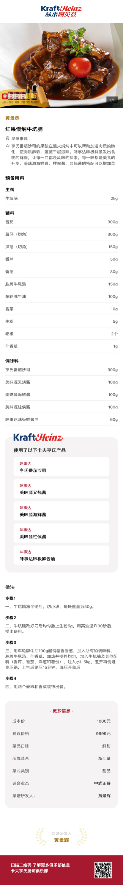
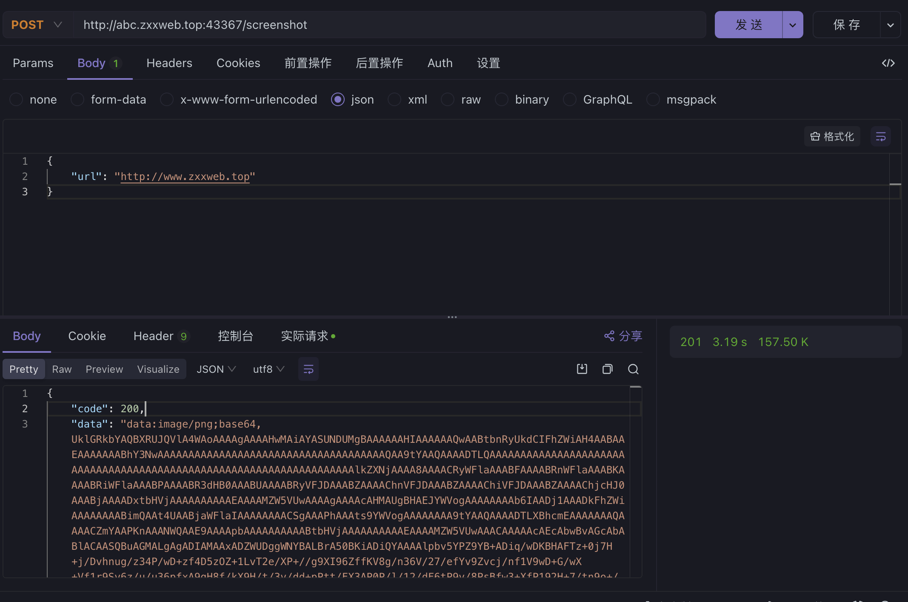
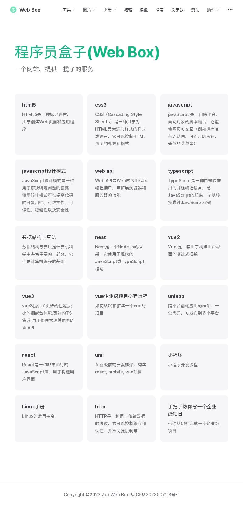

# 一、前端截图方案(html2canvas)

## 运行原理

该脚本遍历其加载页面的 DOM。它收集所有元素的信息，然后使用这些信息构建页面的表示。换句话说，它实际上并不截取页面的屏幕截图，而是根据从 DOM 读取的属性构建页面的表示。

1. 获取 DOM 元素和样式信息：首先获取需要转换的 HTML 元素及其子元素，同时收集元素的样式信息。这些信息包括元素的大小、位置、颜色、边距等。
2. 创建 canvas 元素: 接下来，html2canvas 会创建一个新的 canvas 元素，并将其大小设置为与要转换的 HTML 元素相同
3. 绘制元素: 对于每个 HTML 元素，html2canvas 会根据其样式信息绘制相应的图形。
4. 处理图片和背景图片: html2canvas 会处理元素中的图像和背景图像，将它们绘制到 canvas 元素上。这需要加载图像，然后将其绘制到 canvas 上，同时处理图像的大小和位置。
5. 处理边距和阴影：对于有边距和阴影的元素，html2canvas 会处理这些样式，将它们绘制到 canvas 元素上。
6. 处理滚动条：如果元素包含滚动条，html2canvas 会处理滚动条的样式和位置，确保转换后元素位置的正确显示。
7. 处理兼容性: 处理不同浏览器之间的兼容性，例如透明度，渐变等。
8. 返回转换后的的 canvas 元素

## 存在问题

### 1、部分 css 功能不支持，点击[查看](https://html2canvas.hertzen.com/features/)

- background-blend-mode
- border-image
- box-decoration-break
- box-shadow
- filter
- font-variant-ligatures
- mix-blend-mode
- object-fit
- repeating-linear-gradient()
- writing-mode
- zoom

### 2、图片有同源限制,点击[查看](https://zh.wikipedia.org/wiki/%E5%90%8C%E6%BA%90%E7%AD%96%E7%95%A5)

### 3、在不同操作系统生成的图片像素不一致

## 跨域解决方案

将跨域的图片的 crossOrigin 设置为 \*，并且转为 base64 图片，因为 base64 不存在跨域问题，图片转 base64 示例代码如下：

```js
funvtion getBase64Image(img) {
  let canvas = document.createElement('canvas')
  canvas.width = img.width
  canvas.height = img.height
  let ctx = canvas.getContext('2d')
  ctx.drawImage(img, 0, 0, canvas.width, canvas.height)
  let dataURL = canvas.toDataURL('image/png')
  return dataURL
}
```

## 使用步骤

1、安装

```bash
pnpm install html2canvas --save-dev
```

2、使用

```js
import html2canvas from "html2canvas";

const dom = document.getElementById("");

html2canvas(dom, {
  width: '', //宽度
  height: '', //高度
  backgroundColor: "#fff", //背景色，设置null为透明
  allowTaint: false, //是否允许跨域图片
  useCORS: true, //是否尝试使用CORS从服务器加载图像
  scale: 2, //渲染的比例，默认为浏览器设备像素比例
  logging: false //启用日志进行调试
  foreignObjectrendering: false, //如果浏览器支持，使用ForeignObject渲染
} as any).then((canvas) => {
  let base64 = canvas.toDataURL("image/png");

  console.log("====base64===", base64);
});
```

3、避免头部闪烁

因为头部是固定不变的，先把头部生成 base64，然后等待下面部分也生成 base64 时进行合并成一张图片.

4、截图效果如下



## 浏览器兼容性

- Firefox 3.5+
- Google Chrome
- Opera 12+
- IE9+
- Edge
- Safari 6+

# 二、Puppeteer

## 官方介绍

Puppeteer 是一个 Node 库，它提供了一个高级 API 来通过 DevTools 协议控制 Chromium 或 Chrome。Puppeteer 默认以 headless 模式运行，但是可以通过修改配置文件运行“有头”模式。

## 中文文档

[Puppeteer](https://zhaoqize.github.io/puppeteer-api-zh_CN/#?product=Puppeteer&version=puppeteer-v21.3.5&show=api-class-puppeteer)

## 简单案例

```js
const puppeteer = require("puppeteer");

//创建一个无头浏览器
puppeteer.launch().then(async (browser) => {
  const page = await browser.newPage(); //打开tab页
  await page.goto("https://example.com"); //打开页面
  await page.screenshot({ path: "example.png" }); //截图
  await browser.close(); //关闭浏览器
});
```

## 存在问题

Q1、可能存在页面未加载完成就开始截图，导致截图空白

方案一：使用`Page.waitForSelector() method`,等待指定的元素加载完成开始截图

方案二：使用`WaitForOptions interface`

- timeout 跳转等待时间，默认 30s
- waitUntil 满足什么条件，认为跳转完成
  - load 页面 load 事件触发
  - domcontentloaded 页面的 DOMcontentloaded 事件触发
  - networkidle0 500ms 后不再有网络链接触发
  - networkidle2 500ms 后只有两个网络链接触发

Q2:内存问题

当服务量大，导出 url 多时，你会遇到性能瓶颈，cpu 会爆满，默认会挂在到主 cpu 上，我们可以使用 pm2 + 浏览器连接池来解决这个问题。

1、pm2 配置

我们可以使用 pm2 配置多 cpu 处理，达到负载均衡，并且可以配置内存占用过多自动重启服务。

参考：[配置文件](https://pm2.keymetrics.io/docs/usage/application-declaration/), [环境变量](https://pm2.keymetrics.io/docs/usage/environment/),

```js
module.exports = {
  apps: [
    {
      name: "", //项目名称
      script: "./main.js", //入口文件
      watch: true,
      instances: 4, //分配到4个cpu上 取决于cpu数量 可设置max,所有cpu
      exec_mode: "cluster", //个实例之间进行负载平衡
      max_memory_restart: "30720M", //堆内存30G自动重启，不会中断服务，已测试
      env: {
        //dev环境
        PORT: 43367,
        NODE_ENV: "dev",
      },
      env_test: {
        //测试环境
        PORT: 43367,
        NODE_ENV: "test",
      },
      env_uat: {
        //uat环境
        PORT: 43367,
        NODE_ENV: "uat",
      },
      env_prod: {
        //生产环境
        PORT: 43367,
        NODE_ENV: "prod",
      },
    },
  ],
};
```

2、浏览器连接池配置

```js
const puppeteer = require("puppeteer");

export class globalService {
  static WSE_LIST: any; //存储browserWSEndpoint列表
  static MAX_WSE: number; //启动几个浏览器
  static ENV: any; //端口号
}

export class creatBrowser {
  constructor() {
    const WSE_LIST = []; //存储browserWSEndpoint列表
    let browserWSEndpoint = null; //浏览器对象
    (async () => {
      for (let i = 0; i < globalService.MAX_WSE; i++) {
        const browser = await puppeteer.launch({
          headless: true,
          args: [
            "--disable-gpu",
            "--disable-dev-shm-usage",
            "--disable-setuid-sandbox",
            "--no-first-run",
            "--no-sandbox",
            "--no-zygote",
            "--single-process",
          ],
        });
        browserWSEndpoint = await browser.wsEndpoint();
        WSE_LIST[i] = browserWSEndpoint;
      }
      globalService.WSE_LIST = WSE_LIST;
      console.log("创建浏览器成功:" + WSE_LIST);
      console.log("端口号:" + globalService.ENV);
    })();
  }
}
```

打开浏览器时，我们会随机从连接池中取一个浏览器

```js
const tmp = Math.floor(Math.random() * globalService.MAX_WSE);
const browserWSEndpoint = globalService.WSE_LIST[tmp];

//连接浏览器
const browser = await puppeteer.connect({ browserWSEndpoint });

// 打开浏览器页面tab
const page = await browser.newPage();
```

## 部署问题

1. 跨域问题，使用 cors 解决
2. linux 服务器部署需要安装浏览器，相关依赖及字体。
3. 使用 pm2 守护进程

## demo 实现结果



截图如下



# 三、dom-to-image

### 介绍

dom-to-image 是一个用 JavaScript 编写的库，可以将任意 DOM 节点转换为矢量（SVG）或光栅（PNG 或 JPEG）图像。它基于 Paul Bakaus 的 domvas ，并已完全重写，修复了一些错误并添加了一些新功能（如网络字体和图像支持）。

### 运行原理

- 递归地拷贝原始 dom 节点和后代节点；
- 把原始节点以及后代节点的样式递归的应用到对应的拷贝后的节点和后代节点上；
- 字体处理；
- 图片处理；
- 序列化拷贝后的节点，把它插入到 foreignObject 里面，然后组成一个 svg，然后生成一个 data URL；
- 如果想得到 PNG 内容或原始像素值，可以先使用 data URL 创建一个图片，使用一个离屏 canvas 渲染这张图片，然后从 canvas 中获取想要的数据。

### github

https://github.com/tsayen/dom-to-image

### api

1、toPng

```js
var node = document.getElementById("my-node");

domtoimage
  .toPng(node)
  .then(function (dataUrl) {
    var img = new Image();
    img.src = dataUrl;
    document.body.appendChild(img);
  })
  .catch(function (error) {
    console.error("oops, something went wrong!", error);
  });
```

2、toBlob

```js
domtoimage.toBlob(document.getElementById("my-node")).then(function (blob) {
  window.saveAs(blob, "my-node.png");
});
```

3、toJpeg

```js
domtoimage
  .toJpeg(document.getElementById("my-node"), { quality: 0.95 })
  .then(function (dataUrl) {
    var link = document.createElement("a");
    link.download = "my-image-name.jpeg";
    link.href = dataUrl;
    link.click();
  });
```

4、toSvg

```js
function filter(node) {
  return node.tagName !== "i";
}

domtoimage
  .toSvg(document.getElementById("my-node"), { filter: filter })
  .then(function (dataUrl) {
    /* do something */
  });
```

5、toPixelData,获取原始像素值

```js
var node = document.getElementById("my-node");

domtoimage.toPixelData(node).then(function (pixels) {
  for (var y = 0; y < node.scrollHeight; ++y) {
    for (var x = 0; x < node.scrollWidth; ++x) {
      pixelAtXYOffset = 4 * y * node.scrollHeight + 4 * x;
      /* pixelAtXY is a Uint8Array[4] containing RGBA values of the pixel at (x, y) in the range 0..255 */
      pixelAtXY = pixels.slice(pixelAtXYOffset, pixelAtXYOffset + 4);
    }
  }
});
```
