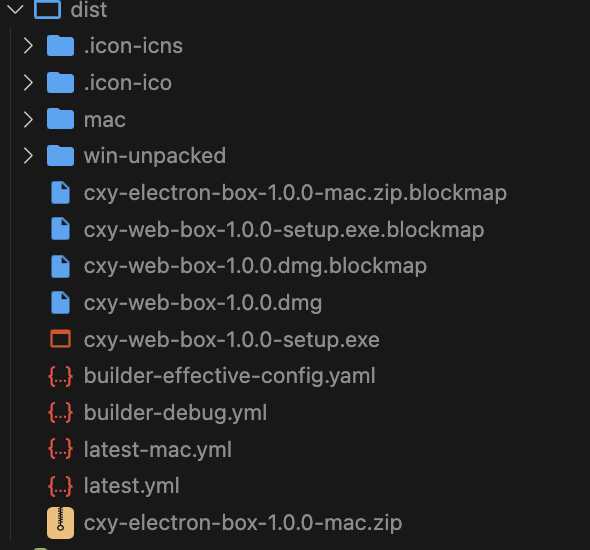

## 前言

Electron 是一个使用 JavaScript、HTML 和 CSS 构建桌面应用程序的框架。 嵌入 Chromium 和 Node.js 到 二进制的 Electron 允许您保持一个 JavaScript 代码代码库并创建 在 Windows 上运行的跨平台应用 macOS 和 Linux——不需要本地开发 经验。

## electron-vite

electron-vite 是一个新型构建工具，旨在为 Electron 提供更快、更精简的开发体验。它主要由五部分组成：

一套构建指令，它使用 Vite 打包你的代码，并且它能够处理 Electron 的独特环境，包括 Node.js 和浏览器环境。

集中配置主进程、渲染器和预加载脚本的 Vite 配置，并针对 Electron 的独特环境进行预配置。

为渲染器提供快速模块热替换（HMR）支持，为主进程和预加载脚本提供热重载支持，极大地提高了开发效率。

优化 Electron 主进程资源处理。

使用 V8 字节码保护源代码。

electron-vite 快速、简单且功能强大，旨在开箱即用。

## 安装

electron-vite 需要 Node.js 版本 `14.18+` 和 Vite 版本 `3.0+`

```bash
pnpm create @quick-start/electron
```

然后按照提示操作即可!

```bash
✔ Project name: … <electron-app>
✔ Select a framework: › vue
✔ Add TypeScript? … No / Yes
✔ Add Electron updater plugin? … No / Yes
✔ Enable Electron download mirror proxy? … No / Yes

Scaffolding project in ./<electron-app>...
Done.

```

你还可以通过附加的命令行选项直接指定项目名称和你想要使用的模板。例如，要构建一个 Electron + Vue 项目，运行:

```bash
# npm 6.x
npm create @quick-start/electron my-app --template vue

# npm 7+, extra double-dash is needed:
npm create @quick-start/electron my-app -- --template vue

# yarn
yarn create @quick-start/electron my-app --template vue

# pnpm
pnpm create @quick-start/electron my-app --template vue
```

目前支持的模板预设如下：

| JavaScript                                                                                                 | TypeScript                                                                                                       |
| ---------------------------------------------------------------------------------------------------------- | ---------------------------------------------------------------------------------------------------------------- |
| [vanilla](https://github.com/alex8088/quick-start/tree/master/packages/create-electron/playground/vanilla) | [vanilla-ts](https://github.com/alex8088/quick-start/tree/master/packages/create-electron/playground/vanilla-ts) |
| [vue](https://github.com/alex8088/quick-start/tree/master/packages/create-electron/playground/vue)         | [vue-ts](https://github.com/alex8088/quick-start/tree/master/packages/create-electron/playground/vue-ts)         |
| [react](https://github.com/alex8088/quick-start/tree/master/packages/create-electron/playground/react)     | [react-ts](https://github.com/alex8088/quick-start/tree/master/packages/create-electron/playground/react-ts)     |
| [svelte](https://github.com/alex8088/quick-start/tree/master/packages/create-electron/playground/svelte)   | [svelte-ts](https://github.com/alex8088/quick-start/tree/master/packages/create-electron/playground/svelte-ts)   |
| [solid](https://github.com/alex8088/quick-start/tree/master/packages/create-electron/playground/solid)     | [solid-ts](https://github.com/alex8088/quick-start/tree/master/packages/create-electron/playground/solid-ts)     |

## 目录

```js
├──.vscode
├──build
├──resources
├──src/
├──main
│  ├──index.ts
├──preload
│  ├──index.d.ts
│  └──index.ts
├──renderer
│  ├──src/
│  └──index.html
├──.editorconfig
├──.eslintignore
├──.eslintrc.cjs
├──.gitignore
├──.npmrc
├──.prettierignore
├──.prettierrc.yaml
├──package.json
├──tsconfig.json
├──tsconfig.node.json
├──tsconfig.web.json
├──README.md
├──electron.vite.config.ts
├──dev-app-update.yml
├──electron-builder.yml
```

当运行 electron-vite 时，它会自动寻找主进程、渲染器和预加载脚本的入口文件。默认的入口配置：

- 主进程： /src/main/index|main. js|ts|mjs|cjs
- 预加载脚本： /src/preload/index|preload.js|ts|mjs|cjs
- 渲染器： /src/renderer/index.html

如果找不到入口点，它将抛出一个错误。你可以通过设置 build.rollupOptions.input 选项来修复它。

## 命令行

```json
{
  "format": "prettier --write .",
  "lint": "eslint . --ext .js,.jsx,.cjs,.mjs,.ts,.tsx,.cts,.mts,.vue --fix",
  "typecheck:node": "tsc --noEmit -p tsconfig.node.json --composite false",
  "typecheck:web": "vue-tsc --noEmit -p tsconfig.web.json --composite false",
  "typecheck": "npm run typecheck:node && npm run typecheck:web",
  "start": "electron-vite preview",
  "dev": "electron-vite dev",
  "build": "npm run typecheck && electron-vite build",
  "postinstall": "electron-builder install-app-deps",
  "build:win": "npm run build && electron-builder --win --config",
  "build:mac": "npm run build && electron-builder --mac --config",
  "build:linux": "npm run build && electron-builder --linux --config"
}
```

### electron-vite

别名：electron-vite dev、 electron-vite serve。

该命令将构建主进程和预加载脚本源代码，并为渲染器启动一个开发服务器，最后启动 Electron 应用程序。

### electron-vite preview

该命令将构建主进程、渲染器和预加载脚本源代码，并启动 Electron 应用程序进行预览。

### electron-vite build

该命令将构建主进程、渲染器和预加载脚本源代码。通常在打包 Electron 应用程序之前，需要执行此命令。

### 通用选项

| 选项                     | 描述                                                       |
| ------------------------ | ---------------------------------------------------------- |
| `-c, --config <file>`    | 定义配置文件路径                                           |
| `-l, --logLevel <level>` | 设置日志级别 (optional: `info`, `warn`, `error`, `silent`) |
| `-m, --mode <mode>`      | 设置环境模式                                               |
| `-w, --watch`            | 用于热重载的监视模式 (default: `false`)                    |
| `--ignoreConfigWarning`  | 忽略配置缺失警告 (default: `false`)                        |
| `--sourcemap`            | 输出 source maps 支持 debug (default: `false`)             |
| `--outDir <dir>`         | 设置输出目录 (default: `out`)                              |
| `-v, --version`          | 显示版本号                                                 |
| `-h, --help`             | 显示可用的 CLI 选项                                        |

提示

`--ignoreConfigWarning`  选项允许你在配置缺失时忽略警告。例如，不需要使用预加载脚本。

## 内嵌 iframe

```js
<script setup>
import { ref, onMounted } from 'vue'

const w = ref()
const h = ref()

onMounted(() => {
  const setInner = () => {
    w.value = window.innerWidth
    h.value = window.innerHeight
  }
  window.onresize = () => {
    setInner()
  }
  setInner()
})
</script>

<template>
  <div class="IndexPage">
    <iframe id="iframe" src="http://www.alongweb.top" :width="w" :height="h"></iframe>
  </div>
</template>
```

## 打包

```bash
npm run build:mac
npm run build:win
```

打包结果如下，安装对应应用即可：


