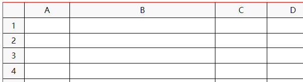

## Web 版 Excel 制作过程分享

由于项目需要制作一个 Web 版本 Excel 用于表单、报表在线绘制，网上搜了一圈没有找到合适的资源，根据搜到的一些零散信息决定自己动手做一个，本文分享这个制作过程，主要包含表格布局、表头固定、动态调整行高列宽、单元格选中、合并与拆分单元格等功能，供大家交流分享。废话少说先上个效果图如下：


## 技术选型

1. 本例基于 Jquery 库和 Vue 框架实现，其中 Vue 并不是必须，仅仅因为项目需要而已，读者只需稍作改造去掉对 Vue 的依赖即可。

2. 出于对简单直观的追求，笔者选择基于 table 元素而不是基于 div 组合，

## 先用 table 做个 Excel 表格的样子

本来觉得很容易，用框架动态生成一个 n 行 m 列的 table，并在第一行自动填充 ABC...Z 等作为列表头，在第一列自动填充 123...n 等作为行表头，使用 Vue 框架 v-for 循环生成 tr 和 td 元素即可，不熟悉 vue 的同学可以简单了解一下 vue 中 v-for 指令，当然也可以用原生 js 或 jquery 生成这个 table 的所有行列单元格，总体布局的思路如下：

1. 外层用一个 div 控制显示区域，让表格在这个区域内显示，超出该区域则滚动：overflow:scroll

2. 内层用 table 绘制表格，其中第一行和第一列单独绘制，填入表头字母和数字，每个单元格宽默认 100px，tr 行高默认 28px

```html
<!DOCTYPE html>
<html lang="zh" xmlns:v-bind="http://www.w3.org/1999/xhtml">
  <head>
    <meta charset="UTF-8" />
    <title>Title</title>
    <script src="https://cdn.staticfile.org/jquery/2.1.1/jquery.min.js"></script>
    <script src="https://cdn.jsdelivr.net/npm/vue/dist/vue.js"></script>
  </head>
  <body>
    <div id="app">
      <div class="form-frame">
        <table class="form-table">
          <tr class="form-row">
            <th class="form-header" width="40px"></th>
            <th class="form-header" v-for="col in 26" width="100px">
              {{String.fromCharCode(col+64)}}
            </th>
          </tr>
          <tr class="form-row" v-for="row in 40">
            <td class="form-header" width="40px">{{row}}</td>
            <td class="form-cell" v-for="col in 26"></td>
          </tr>
          <tr></tr>
        </table>
      </div>
    </div>
    <script>
      var vue = new Vue({
        el: "#app",
      });
    </script>
    <style>
      .form-frame {
        width: 700px;
        height: 350px;
        margin: 0 auto;
        overflow: scroll;
        border: 1px solid red;
      }
      .form-table {
        border-spacing: 0;
      }
      .form-header {
        font-weight: normal;
        text-align: center;
      }
      .form-row {
        height: 28px;
      }
      th,
      td {
        border-right: 1px solid;
        border-bottom: 1px solid;
      }
      .form-cell {
        width: 100px;
      }
    </style>
  </body>
</html>
```

结果如下图所示（红色是外层 div 的边框，为了调试方便），代码中我们给每个单元格设置了 100px 的宽度，一共生成了 27 列，按理说他应该把整个 table 撑开到至少 2700px；然而如图所示整个 table 的宽度并没有被撑开，而是自适应了外层 div 的宽度。这就是我们今天要解决的第一个问题，table 元素 td 标签宽度设置无效的问题。


## 解决 table 中 td 元素宽度设置无效的问题

网上有说给 table 添加 table-layout: fixed 样式，然而这种方法测试后并没效果；其实解决这个问题很简单，就是给 table 直接指定一个明确的宽度，不妨我们先设个 2700px 看看效果

```css
.form-table {
  border-spacing: 0;
  width: 2700px; /*先指定一个明确的宽度*/
}
```

这时候我们发现整个 table 确实变宽了，div 出现了横向滚动条（图下图所示），说明刚刚给 table 设置的 2700px 确实生效了；这也就是要求我们给 table 指定的宽度应该刚好是每一列的宽度之和，如果 table 宽度指定小了，那么他会从每一列中扣除多余的宽度，如果 table 宽度指定多了，他会给每一列加上相应的宽度，毕竟他要保证所有列不能超出 table 也不能填不满 table。总之每个 td 的实际宽度会受到整个 table 的宽度影响，并不完全由 td 自身的 width 属性决定。


然而很多时候我们并不能预判我们到底有多少列，每一列到底有多宽，因此我们很难一开始就给 table 设定一个准确的宽度，解决这个问题的办法也很简单，就是额外添加一个不指定宽度的列，这个列我们称之为自适应列，有了这一列后，table 就不需要指定一个准确的宽度，而是设置一个比预估宽度稍大一些的值，多出的这部分宽度都会由该列自适应，因此我们修改源码，添加一个自适应列:

```html
<tr class="form-row">
  <th class="form-header" width="40px"></th>
  <th class="form-header" v-for="col in 26" width="100px">
    {{String.fromCharCode(col+64)}}
  </th>
  <th></th>
  <!--自适应列-->
</tr>
<tr class="form-row" v-for="row in 40">
  <td class="form-header" width="40px">{{row}}</td>
  <td class="form-cell" v-for="col in 26"></td>
  <td></td>
  <!--自适应列-->
</tr>
```

同时把 table 宽的设置为 3000px:

```css
.form-table {
  border-spacing: 0;
  width: 3000px; /*设置一个稍大的宽度*/
}
```

效果如下图所示，最右侧这一列会自动适应多出的宽度，在不调整列宽的情况下这样就 OK 了。如果要调整列宽请看第五节内容。


关于 table 中 td 宽度的更多说明可以参考链接：http://www.cnblogs.com/mqingqing123/p/6163140.html

## 解决 table 表头固定的问题

本例中 table 第一行和第一列都属于 Excel 表格的表头，需要固定不动。网上有解决方案就是使用两个 table，一个做表头，一个做表身，这种方案只能解决列表头的问题，如果要同时解决固定行表头和列表头的问题，可能需要三个 table，这样的方案会让页面布局变得十分复杂，难以维护，违背我们简单直观的初衷。

为了让代码尽量简洁而优雅，有没有基于当前这一个 table 的办法呢？当然有，网上已经有人介绍过了，那就是将表头采用 relative 布局，并通过滚轮事件实时更新表头位置：

1. 给第一行表头添加 col-header 类，给第一列表头添加 row-header 类，注意：左上角第一个单元格，既是行表头又是列表头

2. 给所有表头单元格设置样式 position: relative，并加上底色（表头得看上去像表头的样子）

3. 监听外层 div 的滚动事件，实时更新列表头的 top 值为 div 的 scrollTop 值，实时更新行表头的 left 值为 div 的 scrollLeft 值，这一步是关键，主要是保持表头的位置，让表头单元格不随着滚动条的滚动而移动。

```html
<tr class="form-row">
  <th class="form-header col-header row-header" width="40px"></th>
  <th class="form-header col-header" v-for="col in 26" width="100px">
    {{String.fromCharCode(col+64)}}
  </th>
  <th class="form-header col-header"></th>
</tr>
<tr class="form-row" v-for="row in 40">
  <td class="form-header row-header" width="40px">{{row}}</td>
  <td class="form-cell" v-for="col in 26"></td>
  <td></td>
</tr>
```

```css
.form-header {
  font-weight: normal;
  text-align: center;
  position: relative; /*设置相对定位*/
  background-color: #f7f7f7; /*表头背景色*/
}
```

```js
$(".form-frame").scroll(function () {
  $(".col-header").css("top", $(".form-frame").scrollTop()); //实时更新第一行表头的位置，让他不随滚动条滚动而移动
  $(".row-header").css("left", $(".form-frame").scrollLeft()); //实时更新第一列表头的位置，让他不随滚动条滚动而移动
});
```

效果如下图所示，可以实现内容滚动，而横竖表头都不动。


然而如图所示还有一点问题，就是左上角压盖的问题，这个问题也很简单，我们只需要把第一行第一列的单元的 z-index 值设置为 1 即可，让它始终在其他单元格上面就不会被覆盖了。


这种方案在 chrome 上表现十分完美，但是在 ie 会出现表头闪烁的问题，估计与 ie 触发滚动事件的频率或机制有关，如果对浏览器没有要求，那么十分推荐这种方式，如果无法容忍 ie 上的表头闪烁问题，那就只能另想办法了。

## table 动态调整列宽和行高

所谓动态调整列宽和行高，就是通过鼠标拖动表头单元格之间的分割线来实现行高和列宽的调整，可以参考这一片文章：https://blog.csdn.net/zanychou/article/details/46988529，基本思路如下：

1. 监听表头单元格的 mousedown、mousemove 和 mouseup 事件，

2. 通过鼠标坐标位置来判断是否处于可拖动区域，可以定义表头单元格分割线及其左右（上下）两边 5px 范围内为可拖动区域，如下图所示，

3. mousedown 记录要调整的 td 及其原始宽度和坐标，mousemove 实时计算新的宽度，mouseup 结束拖动，


上述参考文章的基础上，笔者稍做了些调整，基本思路不变，调整点有如下几项：

1. 让行表头和列表头都能动态调整列宽，但是第一列和第一行固定不动（表头本身的宽高要固定）

2. 两个单元格分割线的的两侧都可以拖动（原文只能拖动分割线的左侧区域）

3. 让整个 table 的宽度随着列宽的调整一起调整（保证其他列宽度不变，此处衔接上面第三节留下的疑问，原因参考上面的第三节）

4. 监听了整个 table 的 mousemove 和 mouseup 事件，让鼠标拖动操作不至于必须保持在表头单元格上，这样交互体验会更好。

关键代码如下黄色背景标记：

html:监听相关事件，同时为了让调整行高列宽的 js 能够生效，必须把第一行的单元格的宽度和第一列单元格的高度定义在 html 中，而不是在 css 中，如下：

```html
<table class="form-table" @mousemove="table_mousemove" @mouseup="table_mouseup">
  <tr class="form-row">
    <th class="form-header col-header row-header all-header"></th>
    <th
      class="form-header col-header"
      v-for="col in 26"
      width="100px"
      @mousedown="col_header_mousedown"
      @mousemove="col_header_mousemove"
    >
      {{String.fromCharCode(col+64)}}
    </th>
    <th class="col-header"></th>
  </tr>
  <tr class="form-row" v-for="row in 40">
    <td
      class="form-header row-header"
      height="28px"
      @mousedown="row_header_mousedown"
      @mousemove="row_header_mousemove"
    >
      {{row}}
    </td>
    <td class="form-cell" v-for="col in 26"></td>
    <td></td>
  </tr>
</table>
```

css：为了保证第一行第一列即表头本身的行高列宽不变，因此把第一个单元格的高宽放到 css 中而不是放在 html，这样动态调整行高列宽的 js 就对第一行第一列不生效了。

```css
/*第一行第一列单元格*/
.all-header {
  z-index: 1;
  height: 28px;
  width: 40px;
}
```

js 代码:仅列了列宽的动态调整，行高的逻辑与之相似

```js
var vue = new Vue({
  el: "#app",
  data: {
    //记录当前正在调整行高和列宽表头单元格
    resize_header: {
      row_header: null,
      col_header: null,
    },
  },
  //初始化固定表头
  mounted: function () {
    $(".form-frame").scroll(function () {
      $(".col-header").css("top", $(".form-frame").scrollTop());
      $(".row-header").css("left", $(".form-frame").scrollLeft());
    });
  },
  methods: {
    //鼠标点击列表头（第一行）
    col_header_mousedown: function (event) {
      //判断有效区域，单元格分割线前后5个像素
      if (event.offsetX >= event.target.offsetWidth - 5 && event.buttons == 1) {
        this.resize_header.col_header = event.target; //当前单元格
      } else if (event.offsetX < 5 && event.buttons == 1) {
        this.resize_header.col_header = $(event.target).prev()[0]; //左侧单元格
      }
      //记录表头原始属性
      if (this.resize_header.col_header != null) {
        this.resize_header.col_header.oldX = event.clientX;
        this.resize_header.col_header.oldWidth =
          this.resize_header.col_header.offsetWidth;
        $(".form-table")[0].oldWidth = $(".form-table").width(); //记录整表宽度
      }
    },
    //鼠标在第一行移动，改变光标符号
    col_header_mousemove: function (event) {
      //改变光标样式
      if (event.offsetX >= event.target.offsetWidth - 5 || event.offsetX < 5)
        event.target.style.cursor = "col-resize";
      else event.target.style.cursor = "default";
    },
    //鼠标拖动中，实时计算新的宽高
    table_mousemove: function (event) {
      //调整列宽
      var c_header = this.resize_header.col_header;
      if (c_header != null) {
        if (c_header.oldWidth + event.clientX - c_header.oldX > 10) {
          c_header.width = c_header.oldWidth + event.clientX - c_header.oldX;
          c_header.style.width = c_header.width;
          $(".form-table").width(
            $(".form-table")[0].oldWidth + event.clientX - c_header.oldX
          ); //同步调整表格宽度
        }
      }
    },
    //表格鼠标抬起，清空记录
    table_mouseup: function (event) {
      this.resize_header.col_header = null;
    },
  },
});
```

效果图如下：



## table 中 td 单元格单选和多选(鼠标拖动选中或叫拉框选中)

单元格的选中是一个非常重要的功能，很多 Excel 其他功能都是针对当前选中单元格的，这里我们主要讨论通过鼠标交互的单元格单选和多选，因此我们需要给每个单元格监听三个鼠标事件：mousedown、mouseover 和 mouseup。

1、通过 mousedown 实现单选和确定当前激活单元格，而不使用 mouseclick，因为 click 需要等鼠标按键抬起才会触发，而我们要求鼠标点下立即触发（可以参考 MS Excel 的交互机制）；

2、使用 mouseover 实现鼠标拖动时触发区域多选，而不使用 mousemove，因为 mouseover 只会在一个单元格内触发一次，而 mousemove 在鼠标移动过程中会不停的触发，影响性能而且没有必要；

3、mouseup 中做状态清除工作。

### 6.1 样式分析

首先我们来分析一下选中区域的样式，有一个焦点单元格背景为白色，其他选中单元格背景为浅绿色，最外围单元格存在绿色加粗边框线：


通过简单的分析我们可以用以下 6 个 class 来拆分这些样式，最后将这些 class 分别叠加到相应的单元格上即可：

- .cell-select: 浅绿色背景，应用到所有选中单元格上，后面可以通过该 class 一次性获取所有选中单元格
- .cell-focus: 白色背景，应用到焦点单元格上，覆盖第一个 class
- .cell-select-top: 带有上边框，应用在最上面的单元格上
- .cell-select-right: 带有右边框，应用在最右边的单元格
- .cell-select-bottom: 带有下边框，应用在最下边单元格
- .cell-select-left: 带有左边框，应用在最左边单元格

将以上 6 个 class 用到对应的单元格上即可呈现上图所示的选中效果，例如上图中第一个单元格同时拥有：.cell-select、.cell-focus、.cell-select-left、.cell-select-top 四个样式。

### 6.2 位置分析

所谓位置分析即，根据鼠标点击和移动的位置提取出所有选中的单元格，然后才能给他们设置相应的样式，为了方便处理位置信息，我们给所有单元格添加一个 row 和 col 属性，用于标记该单元格的行列坐标位置：

```html
<table class="form-table" @mousemove="table_mousemove" @mouseup="table_mouseup">
  <tr class="form-row">
    <th class="form-header col-header row-header all-header"></th>
    <th
      class="form-header col-header"
      v-for="col in 26"
      width="100px"
      @mousedown="col_header_mousedown"
      @mousemove="col_header_mousemove"
    >
      {{String.fromCharCode(col+64)}}
    </th>
    <th class="col-header"></th>
  </tr>
  <tr class="form-row" v-for="row in 40">
    <td
      class="form-header row-header"
      height="28px"
      @mousedown="row_header_mousedown"
      @mousemove="row_header_mousemove"
    >
      {{row}}
    </td>
    <td
      class="form-cell"
      v-for="col in 26"
      v-bind:row="row"
      v-bind:col="col"
      @mousedown="cell_mousedown"
      @mouseover="cell_mousemove"
      @mouseup="cell_mouseup"
    ></td>
    <td></td>
  </tr>
</table>
```

1. 监听所有单元格 mousedown 事件，触发该事件的单元格即为起始单元格，也是焦点单元格，记录到全局变量 focus_td 中，代码略

2. 监听所有单元格 mouseover 事件，触发该事件的单元格即为当前单元格，起始单元格和当前单元格之间的位置关系根据鼠标移动方向不同有以下四种：


不论是哪一种方向，我都转换为第一种类型，即转换为通过左上角坐标和右下角坐标定位的方式，设 fromTd 为起始单元格，toTd 为当前单元格，那么设置选中区域核心代码如下：

js 代码（在 mouseover 事件中调用）：

```js
//选中指定两个单元格之间的所有单元格
region_select:function (fromTd, toTd) {
    //清除之前的选区
    this.remove_select();

    //获取两个单元格的坐标数据
    var f_row = Number(fromTd.attr("row"));
    var f_col = Number(fromTd.attr("col"));
    var t_row = Number(toTd.attr("row"));
    var t_col = Number(toTd.attr("col"));

    //提取左上角坐标和右下角坐标
    var ltRow = f_row <= t_row ? f_row : t_row; //左上角对应行
    var ltCol = f_col <= t_col ? f_col : t_col; //左上角对应列
    var rbRow = f_row >= t_row ? f_row : t_row; //右下角对应行
    var rbCol = f_col >= t_col ? f_col : t_col; //右上角对应列

    //根据坐标范围遍历单元格，设置相应的样式
    var table = fromTd[0].offsetParent;
    for(var r=ltRow; r<=rbRow; r++){
        for(var c=ltCol; c<=rbCol; c++){
            table.rows[r].cells[c].classList.add("cell-select");
            if(r==ltRow) table.rows[r].cells[c].classList.add("cell-select-top");
            if(r==rbRow) table.rows[r].cells[c].classList.add("cell-select-bottom");
            if(c==ltCol) table.rows[r].cells[c].classList.add("cell-select-left");
            if(c==rbCol) table.rows[r].cells[c].classList.add("cell-select-right");
        }
    }
},
//清除所有选中效果
remove_select:function () {
    $(".cell-select").removeClass("cell-select");
    $(".cell-select-top").removeClass("cell-select-top");
    $(".cell-select-right").removeClass("cell-select-right");
    $(".cell-select-bottom").removeClass("cell-select-bottom");
    $(".cell-select-left").removeClass("cell-select-left");
}
```

## table 中合并单元格与拆分单元格

在上一步完成后，就可以开始做单元格合并与拆分了，即将当前选中区域的所有单元格合并，或将已经合并的单元格拆分。

### 合并单元格

table 标签本身就支持合并单元格，这也是一开始技术选型使用 table 而不是 div 的好处之一，具体方法看图分析如下：


1. 选区中第一个单元称之为扩展单元格，本例中只需要设置该单元格的 colspan=3，rowspan=4，即可达到扩展的效果，即合并单元格效果

2. 选区中其他单元格称之为被合并单元格，被合并单元格如果不做任何处理，会被扩展单元格挤开而向两边顺延导致整个 table 不规则；如果直接把这些被合并的单元格 remove 掉，那么后面做拆分单元格的时候又需要重新 create 出来；因此最好的处理办法是将他们设置为 display:none，拆分单元格的时候去掉 display 样式即可。

3. 为了后面做拆分单元格更加方便，我们需要把这一次合并的单元做一个统一的标记，例如统一添加一个 merged-by 属性，属性值为扩展单元格的行列坐标。

```js
//合并当前选中的所有单元格
merge:function () {
    var first = $(".cell-select:first");
    var last = $(".cell-select:last");
    if(!first.is(last)){
        var ltRow = Number(first.attr('row'));
        var ltCol = Number(first.attr('col'));
        var rbRow = Number(last.attr('row'));
        var rbCol = Number(last.attr('col'));

        var rest_cells = $(".cell-select:gt(0)");
        rest_cells.addClass("cell-removed"); //即display:none
        rest_cells.attr("merged-by", ltRow + '_' + ltCol); //添加merged-by标记，方便后期拆分单元格
        first.attr("colspan", rbCol - ltCol + 1);
        first.attr("rowspan", rbRow - ltRow + 1);

        this.region_select(first, first); //选中合并后的单元格
    }
}
```

### 拆分单元格

拆分单元格实际上就是合并单元格的逆过程：

1. 把当前要拆分单元格的 colspan 和 rowspan 属性去掉

2. 把之前被合并的单元格根据 merged-by 属性一次性选出来（此处是关键），去掉 display 属性，去掉 merged-by 标记

```js
//取消合并单元
demerge:function () {
    var colspan = Number(this.focus_td.attr("colspan"));
    var rowspan = Number(this.focus_td.attr("rowspan"));
    if(colspan > 1 || rowspan > 1) {
        //去掉colspan、rowspan
        this.focus_td.removeAttr("colspan");
        this.focus_td.removeAttr("rowspan");
        //根据merged-by找到被合并的单元格
        var flagAttr = this.focus_td.attr("row") + '_' + this.focus_td.attr("col")
        var merged_cells = $(".cell-removed[merged-by="+flagAttr+"]");
        merged_cells.removeClass("cell-removed"); //去掉display：none
        merged_cells.removeAttr("merged-by"); //去掉merged-by标记
        this.region_select(this.focus_td, merged_cells.last()); //选中拆分后的区域
    }
}
```

效果如图所示


## 针对单元格选中的重构

当有了合并单元格后，第六节中的单元格选中功能就存在 bug 了，可能存在如下情况：


因此一旦选区中包含了合并的单元格，那么整个选区范围的计算就不一样了，此时我们需要把所有相关的合并单元格都要纳入到选区范围计算中来。如果整个表格中存在多个合并单元格，情况会变得更加复杂：每次纳入一个合并单元格后，选区范围可能会扩大，选区范围扩大后可能会再与另一个合并单元格相交，这时就需要继续扩大选区，直到再没有与其他合并单元格相交为止，已经变成一个递归问题了，考虑性能问题，还是转换为循环问题处理。

本文采用边缘扫描法来实现循环扩展选区：

    1. 给定一个初始的左上角和右下角单元格坐标；

    2. 扫描初始坐标构成的矩形边缘单元格，寻找是否存在合并单元格（有merged-by属性或colspan属性）；

        2.1. 如果找到了合并单元格，获取该合并单元格左上角和右下角坐标，并与初始坐标范围对比；

            2.1.1 如果超出了初始坐标，则扩大初始坐标至可以包含该合并单元格，返回到第1步；

            2.1.2 没有超出坐标则继续；

        2.2. 如果没有找到则继续；

    3. 最终得到的坐标范围即为当前完整的选区。

下图说明了整个边缘扫描算法的选区扩大过程：


改之前的 region_select 方法如下：

```js
//选中指定两个单元格之间的所有单元格
region_select:function (fromTd, toTd) {
    this.remove_select();

    var f_row = Number(fromTd.attr("row"));
    var f_col = Number(fromTd.attr("col"));
    var t_row = Number(toTd.attr("row"));
    var t_col = Number(toTd.attr("col"));

    var ltRow = f_row <= t_row ? f_row : t_row; //左上角对应行
    var ltCol = f_col <= t_col ? f_col : t_col; //左上角对应列
    var rbRow = f_row >= t_row ? f_row : t_row; //右下角对应行
    var rbCol = f_col >= t_col ? f_col : t_col; //右上角对应列

    var table = fromTd[0].offsetParent;

    //从这里开始进行边缘扫描扩展选区
    do {
        var extend = false; //标记是否扩展了选区
        outer:for (var r = ltRow; r <= rbRow; r++) {
            inner:for (var c = ltCol; c <= rbCol; c++) {
                if (r == ltRow || r == rbRow || c == ltCol || c == rbCol) {//只取边缘单元格
                    var edgeTd = $(table.rows[r].cells[c]);
                    var mergeTd = null;

                    if (edgeTd[0].hasAttribute("merged-by")) {  //判断是否合并单元格
                        var cordinate = edgeTd.attr("merged-by").split("_");
                        var rowNum = Number(cordinate[0]);
                        var colNum = Number(cordinate[1]);
                        mergeTd = $(table.rows[rowNum].cells[colNum]);
                    } else if (edgeTd[0].hasAttribute("colspan")) {  //判断是否合并单元格
                        mergeTd = edgeTd;
                    }

                    if (mergeTd != null) { //如果是合并单元格
                        var m_ltRow = Number(mergeTd.attr("row"));
                        var m_ltCol = Number(mergeTd.attr("col"));
                        var m_rbRow = m_ltRow + Number(mergeTd.attr("rowspan")) - 1;
                        var m_rbCol = m_ltCol + Number(mergeTd.attr("colspan")) - 1;

                        //将合并单元格坐标范围与初始范围对比，一旦超出则扩展初始范围，标记extend=true
                        if (m_ltRow < ltRow) {
                            ltRow = m_ltRow;
                            extend = true;
                        }
                        if (m_ltCol < ltCol) {
                            ltCol = m_ltCol;
                            extend = true;
                        }
                        if (m_rbRow > rbRow) {
                            rbRow = m_rbRow;
                            extend = true;
                        }
                        if (m_rbCol > rbCol) {
                            rbCol = m_rbCol;
                            extend = true;
                        }
                    }
                    if(extend)break outer; //如果范围扩展了，则重新扫描新的边缘
                }
            }
        }
    }while(extend); //直到不再扩展，边缘扫描结束

    //给选区单元格添加样式
    for(var r=ltRow; r<=rbRow; r++){
        for(var c=ltCol; c<=rbCol; c++){
            //先确定该单元格要添加的样式
            var classArray = ["cell-select"];
            if(r==ltRow) classArray.push("cell-select-top");
            if(r==rbRow) classArray.push("cell-select-bottom");
            if(c==ltCol) classArray.push("cell-select-left");
            if(c==rbCol) classArray.push("cell-select-right");
            //如果该单元格是个被合并的单元格，则将其样式应用到合并它的单元格上
            var tmpTd = $(table.rows[r].cells[c]);
            if (tmpTd[0].hasAttribute("merged-by")) {
                var cordinate = tmpTd.attr("merged-by").split("_");
                var rowNum = Number(cordinate[0]);
                var colNum = Number(cordinate[1]);
                var tmpTd = $(table.rows[rowNum].cells[colNum]);
            }
            for(var i=0; i<classArray.length; i++){
                tmpTd.addClass(classArray[i]);
            }
        }
    }
}
```

效果图如下，图中“起”表示鼠标开始位置，“止”表示鼠标结束位置，由于受图中三个合并单元格的影响，整个选取扩大至刚好能包含三个合并单元格的范围：


