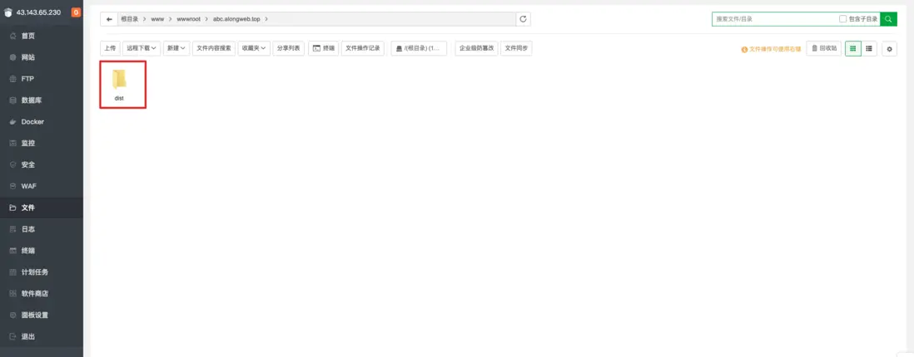

## 前言

如上图，这是一个图片库，支持上传、下载、预览、复制在线地址、传送门[Web Box Image Upload](http://xyz.alongweb.top/upload)，就是一个纯玩具，写着玩的，代码查看请点击[cxy-web-imges](https://github.com/YangWenLong123/cxy-web-imges/tree/master),实现起来也很简单

## 创建项目

请确保您的操作系统上安装了 Node.js（>= 12, v13 版本除外）。

使用 Nest CLI 建立项目。 在安装好 npm 后，使用下面命令在终端中创建 Nest 项目：

```bash
$ npm i -g @nestjs/cli
$ nest new project-name
```

初始化目录如下图所示：


## 配置存储桶

什么是存储桶，可以查看这篇文章[什么是对象存储 COS?](https://blog.csdn.net/zdc1228/article/details/125868215)

1、新建存储桶


2、创建成功后，我们复制下红色框的数据，后面会用到


3、查看密钥，保存 SecretKey，SecretId


## 接口实现

在 app.controller.ts 文件编写接口代码

```ts
import {
  Controller,
  Post,
  UseInterceptors,
  UploadedFile,
  Req,
  Get,
} from "@nestjs/common";
import { FileInterceptor } from "@nestjs/platform-express";
import { cos, cosUpload } from "./cos.storage";
import * as querystring from "querystring";
const fs = require("fs");

@Controller("upload")
export class UploadController {
  @Post("single")
  @UseInterceptors(FileInterceptor("file", cosUpload("", "")))
  async uploadSingle(@UploadedFile() file, @Req() request) {
    const originalFilename = file.filename;

    const params = {
      Bucket: "",
      Region: "",
      Key: originalFilename,
      Body: fs.createReadStream(file.path),
    };

    try {
      await cos.putObject(params);

      return {
        code: 1,
        message: "success",
        url: `https://along-1254323745.cos.ap-nanjing.myqcloud.com/${originalFilename}`,
      };
    } catch (error) {
      return {
        code: 0,
        message: error,
      };
    }
  }

  @Get("get")
  async findAll() {
    try {
      const get = await cos.getBucket({
        Bucket: "", //存储桶名称
        Region: "", //所示地域
      });

      const Contents = get.Contents.reduce((c, n) => {
        c.push({
          size: n.Size,
          url: `https://along-1254323745.cos.ap-nanjing.myqcloud.com/${n.Key}`,
          name: n.Key.split("--")[1],
          create_time: n.LastModified,
        });
        return c;
      }, []);

      return {
        code: 1,
        message: "success",
        list: Contents,
      };
    } catch (error) {
      return {
        code: 0,
        message: error,
      };
    }
  }
}
```

cos.storage 文件配置

```ts
import * as COS from "cos-nodejs-sdk-v5";
import * as Multer from "multer";
import { v4 as uuidv4 } from "uuid";
import * as querystring from "querystring";

export const cos = new COS({
  SecretId: "",
  SecretKey: "",
  FileParallelLimit: 1,
});

export function cosUpload(bucket: string, region: string): Multer.Options {
  const storage = Multer.diskStorage({
    filename: (req, file, cb) => {
      const uniqueFileKey =
        uuidv4() + "--" + querystring.unescape(file.originalname);
      cb(null, uniqueFileKey);
    },
  });

  return {
    storage,
    fileFilter: (req, file, cb) => {
      if (file.mimetype.startsWith("image/")) {
        cb(null, true);
      } else {
        cb(null, false);
        return cb(new Error("Only .png, .jpg, .jpeg and .gif format allowed!"));
      }
    },
    limits: {
      fileSize: 50 * 1024 * 1024,
    },
  };
}
```

到此我们就已经实现了上传和查询的接口

上传: `/upload/single`
查询: `/upload/get`

## 跨域配置

安装`cors`,在 main.js 配置

```ts
import * as cors from "cors";

async function bootstrap() {
  const app = await NestFactory.create<NestExpressApplication>(AppModule);
  app.use(
    cors({
      origin: [
        //允许通过的域名
        "http://localhost:8888",
        "http://xyz.alongweb.top",
        "http://xyz.zxxweb.top",
      ],
      methods: ["GET", "POST"],
    })
  );

  await app.listen(3000);
}
```

## 部署

打包你的项目,执行`npm run build`,生成 dist 文件, 把 dist 文件丢到你的服务器。我用的是宝塔面板



首先确保你的服务器安装了 pm2，打开终端，执行命令：

```bash
cd dist
pnpm i
pnpm start main.js
```

查看是否启动成功,status 状态 online 代表启动成功.


到此大功告成！
