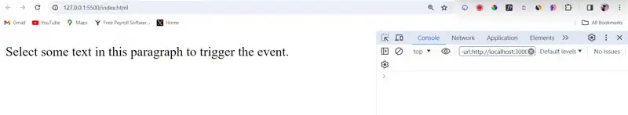
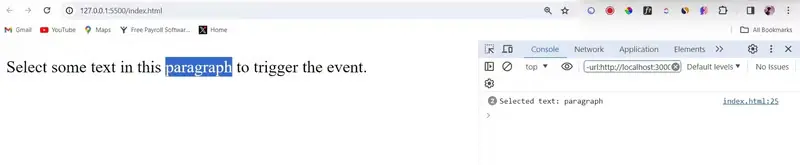

## 理解 JavaScript 中的事件

在深入研究自定义事件之前，我们首先了解 JavaScript 中事件的概念。事件是浏览器中发生的操作或事件，由用户交互（如单击、鼠标移动或键盘输入）或浏览器本身（如页面加载、调整大小等）触发。 JavaScript 提供了强大的事件处理机制来捕获和响应这些事件。

## 为什么要定制事件？

虽然内置事件处理常见交互，但自定义事件具有以下优点：

特异性：它们表示您的应用程序中的独特操作。想象一下购物车的“itemAdded”事件或游戏中的“levelCompleted”事件。

解耦：创建事件的代码（如表单提交）与侦听事件的代码（如更新进度条）是分开的。这提高了代码的可维护性。

数据传输：您可以使用详细属性将自定义数据附加到事件，从而允许传递信息性消息。

## 内置事件与自定义事件

JavaScript 附带了一组涵盖常见交互的内置事件。但是，在某些情况下，这些预定义事件可能还不够。这就是自定义事件发挥作用的地方。自定义事件使开发人员能够定义自己的事件类型，从而扩展了 JavaScript 中事件驱动编程的功能。

## 创建自定义事件涉及几个关键步骤

- `事件初始化`：首先，我们需要使用 CustomEvent 构造函数初始化一个新的自定义事件。此构造函数采用两个参数：事件类型和一个可选对象，其中包含要与事件一起传递的任何其他数据。

```js
// Create a new custom event
const customEvent = new CustomEvent("customEventType", {
  detail: { key: "value" }, // Optional additional data
});
```

- `调度事件`：自定义事件初始化后，我们可以使用 dispatchEvent()方法将其调度到特定的 DOM 元素上。

```js
// Dispatch the custom event on a DOM element
document.dispatchEvent(customEvent);
```

- `订阅自定义事件`： 为了响应自定义事件，我们需要向目标元素添加事件监听器。事件侦听器“侦听”特定事件类型并在该事件发生时执行函数。

```js
// Add an event listener for the custom event
document.addEventListener("customEventType", function (event) {
  // Event handling logic here
  console.log("Custom event triggered with data:", event.detail);
});
```

## 实例：自定义 textSelect 事件

让我们用一个实际的例子来说明自定义事件的概念。假设我们的 Web 应用程序中有一个文本。我们可以创建自定义事件，每当用户在网络应用程序中选择文本时就会触发该事件。

```html
<!DOCTYPE html>
<html lang="en">
  <head>
    <meta charset="UTF-8" />
    <meta name="viewport" content="width=device-width, initial-scale=1.0" />
    <title>Text Selection Event</title>
  </head>
  <body>
    <p>Select some text in this paragraph to trigger the event.</p>

    <script>
      // Event Initialization: Listen for selection changes
      document.addEventListener("selectionchange", function () {
        const selection = window.getSelection().toString();
        if (selection) {
          // Dispatching the Event: Dispatch custom event with selected text
          document.dispatchEvent(
            new CustomEvent("textSelect", {
              detail: { selectedText: selection },
            })
          );
        }
      });

      // Subscribing to Custom Events: Subscribe to the textSelect event
      document.addEventListener("textSelect", function (event) {
        // Log the selected text to the console
        console.log("Selected text:", event.detail.selectedText);
      });
    </script>
  </body>
</html>
```

因此，复制此代码并在代码编辑器中运行实时服务器。在本地服务器中打开您的开发人员工具，它应该看起来像这样

因此，当我尝试通过双击此文本来选择文本时，我们的自定义事件被触发，您可以在开发人员工具右侧看到日志。



## 结论

虽然 JavaScript 本身并不支持 textSelect 事件，但我们可以通过组合现有事件和 JavaScript 逻辑来模拟它。通过创建自定义 textSelect 事件，我们为增强交互性并在网络上提供更丰富的用户体验提供了可能性。
