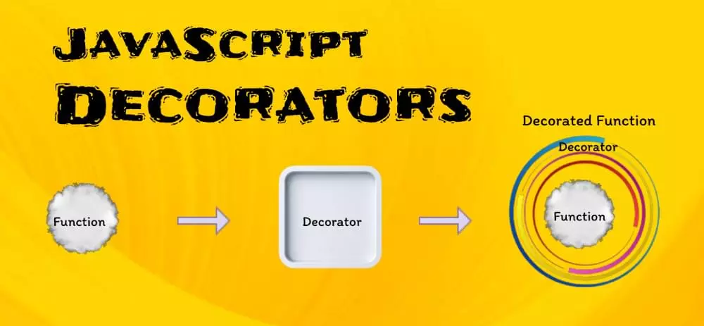

## JavaScript 中的装饰器是什么？

装饰器是一个为现有方法添加一些超能力的函数。它允许修改对象的行为——无需更改其原始代码，但扩展其功能。



装饰器非常适合增强代码的可读性、可维护性和可重用性。在 JavaScript 中，装饰器是可以修改类、方法、属性甚至参数的函数。它们提供了一种在不更改源代码的情况下向代码的各个部分添加行为或元数据的方法。

装饰器通常与类一起使用，并以 @符号为前缀：

```js
// A simple decorator
function log(target, key, descriptor) {
  console.log(`Logging ${key} function`);
  return descriptor;
}

class Example {
  @log
  greet() {
    console.log("Hello, world!");
  }
}

const example = new Example();
example.greet(); // Logs "Logging greet function" and "Hello, world!"
```

上面的代码演示了装饰器如何通过在方法执行之前记录消息来修改类方法的行为。

## 参数装饰器的示例

下面是一个参数装饰器的示例，它确保函数参数在指定的范围内：

```js
function validateParam(min, max) {
  return function (target, key, index) {
    const originalMethod = target[key];
    target[key] = function (...args) {
      const arg = args[index];
      if (arg < min || arg > max) {
        throw new Error(`Argument at index ${index} is out of range.`);
      }
      return originalMethod.apply(this, args);
    };
  };
}

class MathOperations {
  @validateParam(0, 10)
  multiply(a, b) {
    return a * b;
  }
}

const math = new MathOperations();
math.multiply(5, 12); // Throws an error
```

该代码定义了一个名为 apply 的装饰器，应用于类中 validateParam 调用的方法。装饰器检查 multiply 方法的参数是否落在指定的范围内（0 到 10）。当使用参数和调用 multip 方法时，装饰器检测到超出范围并抛出错误。multiplyMathOperationsvalidateParam51212

## 异步装饰器

异步装饰器处理现代 JavaScript 应用程序中的异步操作。它们在处理异步/等待和承诺时很有帮助。

### 异步装饰器示例

考虑一个场景，我们想要限制特定方法的调用率。我们可以创建@throttle 装饰器：

```js
function throttle(delay) {
  let lastExecution = 0;
  return function (target, key, descriptor) {
    const originalMethod = descriptor.value;
    descriptor.value = async function (...args) {
      const now = Date.now();
      if (now - lastExecution >= delay) {
        lastExecution = now;
        return originalMethod.apply(this, args);
      } else {
        console.log(`Method ${key} throttled.`);
      }
    };
  };
}

class DataService {
  @throttle(1000)
  async fetchData() {
    // Fetch data from the server
  }
}

const dataService = new DataService();
dataService.fetchData(); // Executes only once per second
```

这里，定义的装饰器 throttle 适用于类 fetchData 中的方法 DataService。 Threat 装饰器确保该 fetchData 方法每秒只执行一次。如果更频繁地调用它，装饰器会记录一条消息，指示该方法已受到限制。

此代码演示了装饰器如何控制方法调用的速率，这在速率限制 API 请求等场景中非常有用。

## 创建自定义装饰器

虽然 JavaScript 提供了一些内置装饰器，例如@deprecated 或@readonly，但在某些情况下，我们需要创建适合我们特定项目需求的自定义装饰器。

自定义装饰器是用户定义的函数，用于修改 JavaScript 代码中的类、方法、属性或参数的行为或属性。这些装饰器封装并重用特定的功能，或者在我们的代码库中一致地强制执行某些约定。

### 自定义装饰器的示例

装饰器带有@符号。让我们创建一个自定义装饰器，用于在方法执行之前和之后记录消息。该装饰器将有助于说明自定义装饰器的基本结构：

```js
function logMethod(target, key, descriptor) {
  const originalMethod = descriptor.value; // Save the original method

  // Redefine the method with custom behavior
  descriptor.value = function (...args) {
    console.log(`Before ${key} is called`);
    const result = originalMethod.apply(this, args);
    console.log(`After ${key} is called`);
    return result;
  };

  return descriptor;
}

class Example {
  @logMethod
  greet() {
    console.log("Hello, world!");
  }
}

const example = new Example();
example.greet();
```

在这个例子中，我们定义了 logMethod 装饰器，它包装了类的 greet 方法 Example。装饰器在方法执行之前和之后记录一条消息，从而增强了 greet 方法的行为，而无需修改其源代码。

让我们再举一个例子——@measureTime 记录方法执行时间的自定义装饰器：

```js
function measureTime(target, key, descriptor) {
  const originalMethod = descriptor.value;
  descriptor.value = function (...args) {
    const start = performance.now();
    const result = originalMethod.apply(this, args);
    const end = performance.now();
    console.log(`Execution time for ${key}: ${end - start} milliseconds`);
    return result;
  };
  return descriptor;
}

class Timer {
  @measureTime
  heavyComputation() {
    // Simulate a heavy computation
    for (let i = 0; i < 1000000000; i++) {}
  }
}

const timer = new Timer();
timer.heavyComputation(); // Logs execution time
```

上面的代码定义了一个名为的自定义装饰器 measureTime，并将其应用于 Timer 类中的方法。该装饰器测量装饰方法的执行时间。当我们调用该 heavyComputation 方法时，装饰器会记录开始时间，运行计算，记录结束时间，计算经过的时间，并将其记录到控制台。

此代码演示了装饰器如何向方法添加性能监视和计时功能，这对于优化代码和识别瓶颈非常有价值。

## Vue.js：带有装饰器的组件选项

Vue.js 是另一个用于构建用户界面的流行 JavaScript 框架。虽然 Vue.js 本身不支持装饰器，但某些项目和库允许我们使用装饰器来定义组件选项。

下面是使用带装饰器的库定义 Vue 组件的示例 vue-class-component：

```js
javascriptCopy code
import { Component, Prop, Vue } from 'vue-class-component';

@Component
class MyComponent extends Vue {
  @Prop() title: string;
  data() {
    return { message: 'Hello, world!' };
  }
}
```
