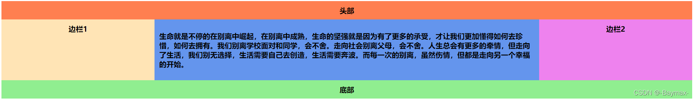
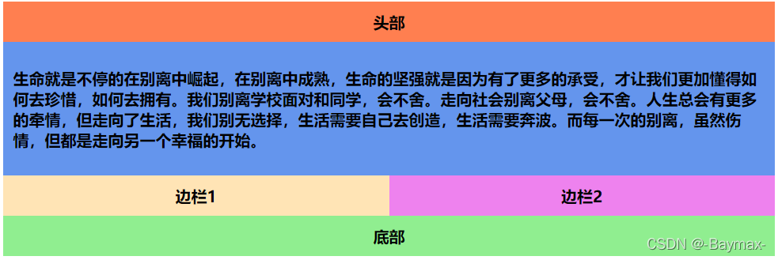
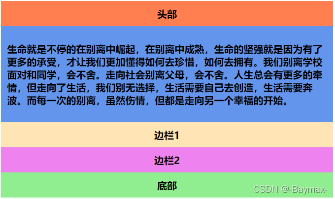

## 什么是多媒体查询？

目前很多针对苹果手机，Android 手机，平板等设备都会使用到多媒体查询。

媒体查询可用于检测很多事情，例如：

- viewport(视窗) 的宽度与高度
- 设备的宽度与高度
- 朝向 (智能手机横屏，竖屏) 。
- 分辨率

## 多媒体查询语法

媒体查询由多种媒体组成，可以包含一个或多个表达式，表达式根据条件是否成立返回 true 或 false。

```css
@media not|only mediatype and (expressions) {
  CSS 代码...;
}
```

媒体类型(mediatype)

- not: not 是用来排除掉某些特定的设备的，比如 @media not print（非打印设备）。
- only: 用来定某种特别的媒体类型。对于支持 Media Queries 的移动设备来说，如果存在 only 关键字，移动设备的 Web 浏览器会忽略 only 关键字并直接根据后面的表达式应用样式文件。对于不支持 Media Queries 的设备但能够读取 Media Type 类型的 Web 浏览器，遇到 only 关键字时会忽略这个样式文件。
- all: 所有设备，这个应该经常看到。
- speech：用于屏幕阅读器

## 多媒体查询示例

1.  最大宽度 max-width：媒体类型小于或等于指定的宽度时，样式生效（很常用）。

```css
// 当屏幕小于或等于 400px 时,页面中的 .box 都将被隐藏。
@media screen and (max-width: 400px) {
  .box {
    display: none;
  }
}
```

2.最小宽度 min-width：媒体类型大于或等于指定宽度时，样式生效。

```css
// 当屏幕大于或等于 1000px 时，容器 .box 的宽度为 400px。
@media screen and (min-width: 1000px) {
  .box {
    width: 400px;
  }
}
```

3.多个媒体特性使用：关键词 and 将多个媒体特性结合在一起。

```css
//当屏幕大于 700px 小于 1000px 时，.box 的宽度为 500px。
@media screen and (min-width: 700px) and (max-width: 1000px) {
  .box {
    width: 500px;
  }
}
```

4.not 关键字：用来排除某种制定的媒体类型，也就是用来排除符合表达式的设备。ot 关键词表示对后面的表达式执行取反操作。

```css
//在除打印设备和设备宽度小于 1200px 下所有设备中，容器 .box 的宽度为 500px。
@media not print and (max-width: 1200px) {
  .box {
    width: 500px;
  }
}
```

## DEMO

大于 800px


600px - 800px



小于 600px


