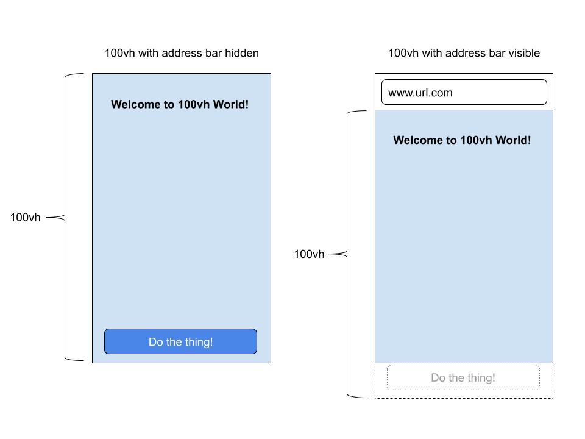
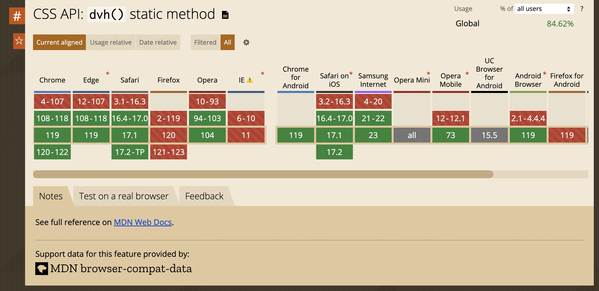

## 一、100vh bug

什么是移动视口错误？

你是否曾经在网页上创建过全屏元素？只需添加一行 CSS 并不难：

```css
.my-page {
  height: 100vh;
}
```

1vh 是视口高度的 1% ，正是我们所需要的。但当我们在移动设备上测试时，就会出现问题。移动浏览器的视口可以动态改变，但值保持不变。因此在移动浏览器中 vh 变成静态值并且不反映视口的实际高度。

在下图中，可以看到移动屏幕的两种状态：

带有隐藏的地址栏

具有可见的地址栏



核心问题是移动浏览器（Chrome 和 Safari）有一个 “有用” 的功能，地址栏有时可见，有时隐藏，从而改变视口的可见大小。这些浏览器并没有随着视口高度的变化而将高度调整 100vh 为屏幕的可见部分，而是将 100vh 地址栏设置为隐藏地址的浏览器高度。结果是，当地址栏可见时，屏幕的底部将被切断，从而违背了 100vh 最初的目的。

有什么方法可以解决这个问题？

## 二、常规修复

1. CSS + Javascript

使用的解决方案涉及使用 CSS 自定义属性和一些 Javascript。

简而言之，我们监听 resize 事件并在每次窗口大小更改时设置 --vh 自定义属性（窗口高度的 1% ）：

核心功能代码：

```js
//首先获得视口高度并将其乘以1%以获得1vh单位的值
let vh = window.innerHeight * 0.01;
// 然后，我们将——vh自定义属性中的值设置为文档的根
document.documentElement.style.setProperty("--vh", `${vh}px`);
// 监听resize事件 视图大小发生变化就重新计算1vh的值
window.addEventListener("resize", () => {
  // 执行与前面相同的脚本
  let vh = window.innerHeight * 0.01;
  document.documentElement.style.setProperty("--vh", `${vh}px`);
});
```

```html
<div class="module">
  <div class="module__item">20%</div>
  <div class="module__item">40%</div>
  <div class="module__item">60%</div>
  <div class="module__item">80%</div>
  <div class="module__item">100%</div>
</div>
```

```css
body {
  background-color: #333;
}

.module {
  height: 100vh; /* 不支持自定义属性时的回退操作*/
  height: calc(var(--vh, 1vh) * 100);
  margin: 0 auto;
  max-width: 30%;
}

.module__item {
  align-items: center;
  display: flex;
  height: 20%;
  justify-content: center;
}

.module__item:nth-child(odd) {
  background-color: #fff;
  color: #f73859;
}

.module__item:nth-child(even) {
  background-color: #f73859;
  color: #f1d08a;
}
```

2. 使用 -webkit-fill-available

```css
.my-page {
  background-color: #ffffff;
  min-height: 100vh;
  min-height: -webkit-fill-available;
  overflow-y: scroll;
  padding-bottom: 50px;
}
```

此方法 chrome 浏览器中在某些情况下使用会有问题。

因此引出下文第三种方法。

3. postcss-100vh-fix

当然，你也可以使用第三方库来进行修复，具体使用可查看其官网 [postcss-100vh-fix](https://github.com/postcss/postcss-100vh-fix)

它适用于 Chrome（ -webkit-fill-available 在某些情况下只会在 Chrome 中导致问题）、iOS/iPad/MacOS Safari 和 所有其他浏览器 。纯 CSS 解决方案，无需 JS。

```css
body {
  /* Footer will be hidden on iOS Safari because of bottom panel */
  height: 100vh;
}
```

```css
body {
  height: 100vh;
}

/* Avoid Chrome to see Safari hack */
@supports (-webkit-touch-callout: none) {
  body {
    /* The hack for Safari */
    height: -webkit-fill-available;
  }
}
```

此方法不适用于部分高度，例如 height: 90vh 或 height: calc(100vh - 60px)

## 三、更好的方法

根据 [CSS Values 4](https://www.w3.org/TR/css-values-4/#viewport-relative-lengths) 规范：视口相对长度，我们可以使用新的视口单位。

有一个 dvh 单位可以完成全部工作。它始终会适应视口大小。最后，浏览器支持如下：



有了这个很酷的功能，解决方案变得非常简单，只需要一行 CSS：

```css
.my-page {
  height: 100dvh;
}
```
