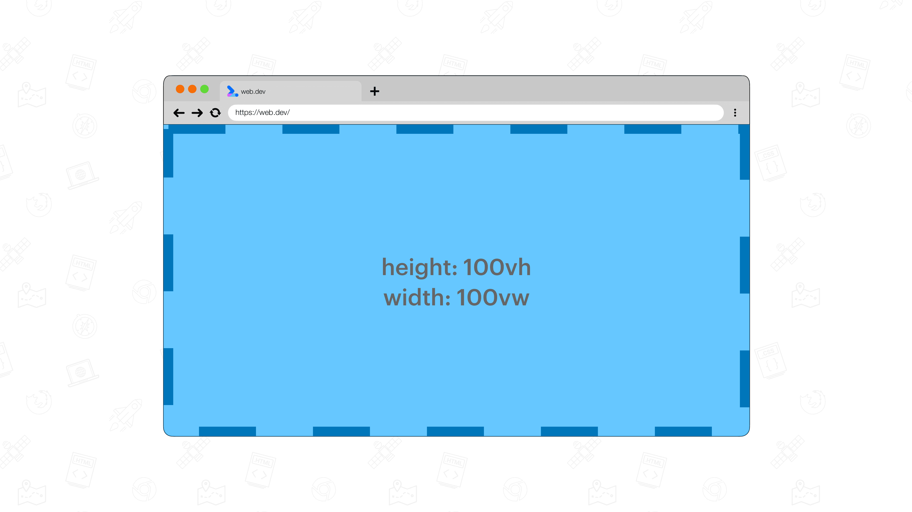
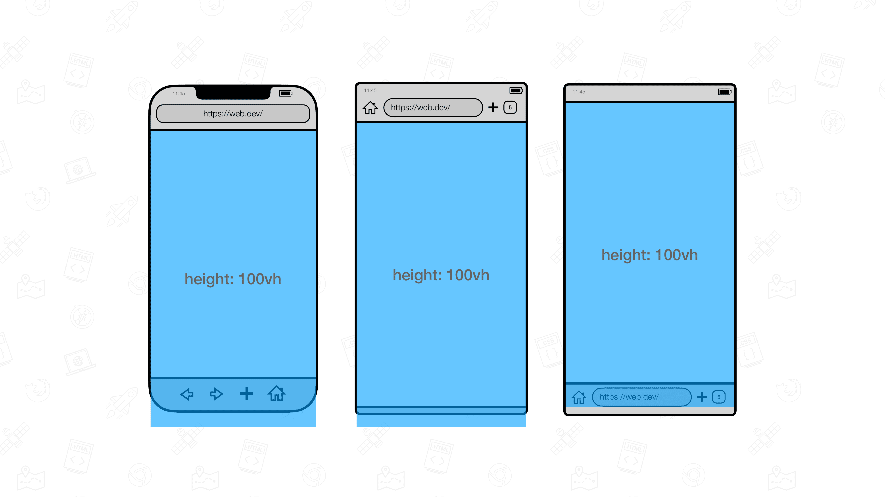
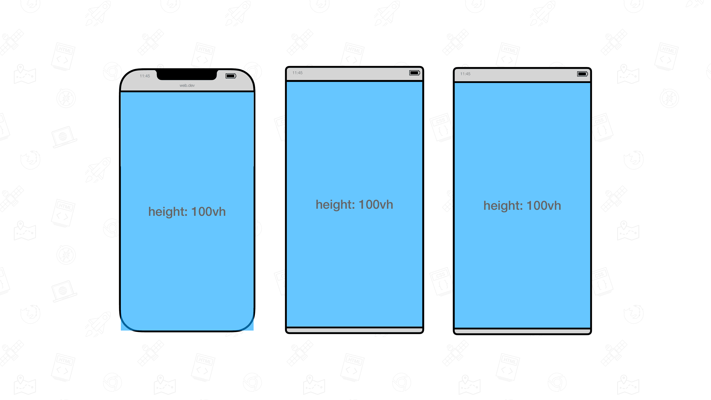
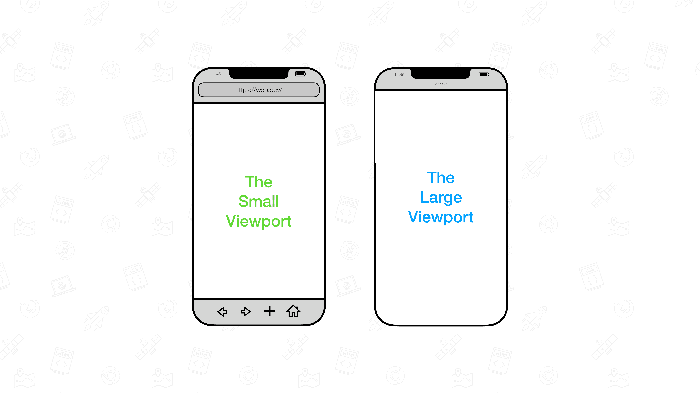
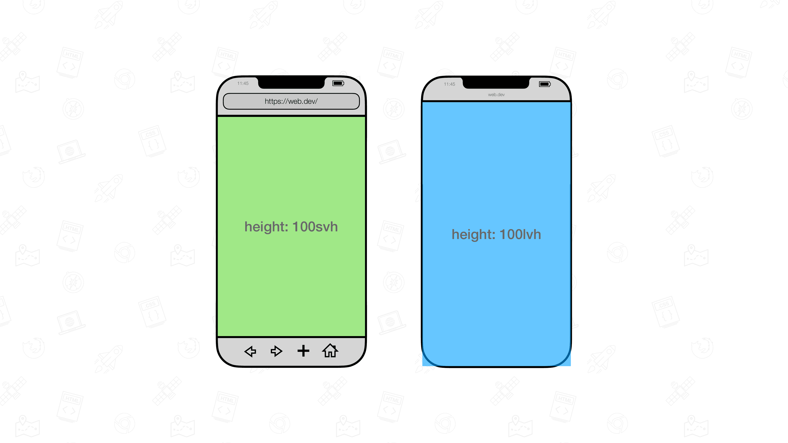

## 视口及其单位

若要设置为与视口一样高，您可以使用 vw 和 vh 单位。

- vw = 视口尺寸宽度的 1%。
- vh = 视口大小高度的 1%。

将元素的宽度设置为 100vw，高度设置为 100vh，它就会完全覆盖视口。

vw 和 vh 广告单元随这些额外的广告单元一起到达浏览器

- vi = 视口内嵌轴大小的 1%。
- vb = 视口块轴大小的 1%。
- vmin = vw 或 vh 中的较小者。
- vmax = vw 或 vh 中的较大者。

这些单元对浏览器有良好的支持。

浏览器支持: chrome:20 Opera:12 Fireox:19 Safari:6

## 需要新视口单元

虽然现有的广告单元在桌面设备上运行良好，但在移动设备上则要是另一回事。在该视图中，视口大小受是否存在动态工具栏的影响。地址栏和标签页栏等界面。

虽然视口尺寸可能会发生变化，但 vw 和 vh 尺寸不会发生变化。因此，高度为 100vh 的元素将从视口中溢出。

向下滚动时，这些动态工具栏会收起。在这种状态下，高度设为 100vh 的元素将覆盖整个视口。

为解决此问题，在 CSS 工作组指定了视口的各种状态。

- 大视口：假设所有 UA 界面会动态展开和收起而处于收起状态的视口。
- 小型视口：假设所有 UA 界面会动态展开和收起来展开的 UA 界面的尺寸。

系统也为新视口分配了单位：

- 表示大视口的单位带有 lv 前缀。单位包括 lvw、lvh、lvi、lvb、lvmin 和 lvmax。
- 表示小视口的单位带有 sv 前缀。单位包括 svw、svh、svi、svb、svmin 和 svmax。

除非视口本身调整大小，否则这些视口百分比单元的尺寸是固定的（因此是稳定的）。

除了大和小视口之外，还有一个动态视口，用于动态考虑 UA 界面：

- 当动态工具栏展开时，动态视口与小视口的大小相等。
- 当动态工具栏收起时，动态视口与大视口的大小相等。

附带的单元带有 dv 前缀：dvw、dvh、dvi、dvb、dvmin 和 dvmax。它们的尺寸介于对应的 lv* 和 sv* 对应项之间。

除了大和小视口之外，还有一个动态视口，用于动态考虑 UA 界面：

当动态工具栏展开时，动态视口与小视口的大小相等。
当动态工具栏收起时，动态视口与大视口的大小相等。
附带的单元带有 dv 前缀：dvw、dvh、dvi、dvb、dvmin 和 dvmax。它们的尺寸介于对应的 lv* 和 sv* 对应项之间。
