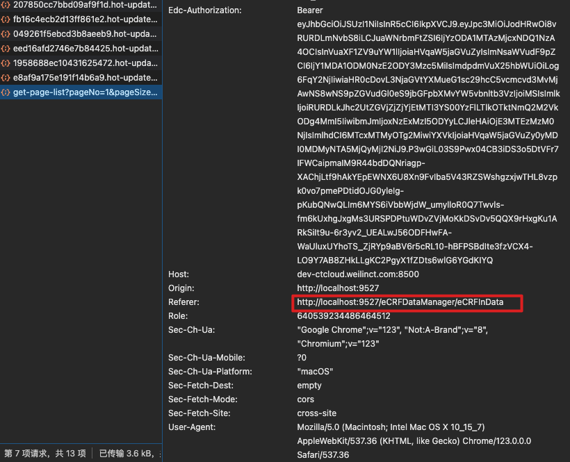

## 1、Referrer

Referer 是 HTTP 请求头的一个字段，包含了当前请求页面的来源页面的地址，通过该字段，我们可以检测访客是从哪里来的。Referer 有以下作用[[6]](https://juejin.cn/post/6844903892170309640)：

- 用户跟踪：Referer 字段可以告诉服务器用户在访问当前资源之前的位置，这对于用户跟踪非常有用。例如，通过分析 Referer 字段，网站可以了解用户是从哪个页面跳转过来的，从而进行用户行为分析和优化网站设计。
- 图片外链限制：有些网站不允许图片外链，只有自家的网站才能显示图片。这种情况下，网站可以通过检查 Referer 字段来判断请求是否来自自家网站，如果是，就放行请求，否则拒绝请求。这样可以防止图片被其他网站盗用。
- 隐私保护：由于涉及隐私，有些情况下不适合发送 Referer 字段。例如，功能 URL（如密码重置、邮件退订等功能）不要求登录就可以访问，直接完成功能，这样的 URL 不希望暴露。另外，内网 URL 也不希望外部用户知道内网有这样的地址，因此不适合暴露 Referer 字段。
- 定制 Referer 字段：在某些特殊情况下，需要定制 Referer 字段。例如，社交网站上，用户在对话中提到某个网址，不希望暴露用户所在的原始网址，但是可以暴露社交网站的域名，让对方知道是通过社交网站访问的。
- 安全防护：有的反爬虫机制使用了 Referer 字段，如果 Referer 不是本网站，那就不能爬取。这种方式可以防止网站资源被非法爬取。
- 搜索引擎关键词信息：早期，各大搜索引擎的 Referer 都是带有搜索词信息的，网站可以通过这些信息了解用户是通过哪些关键词搜索到站点的。但随着安全隐患的担忧，一些搜索引擎率先取消了 Referer 显示，这对网站获取搜索关键词信息造成了影响。

在 JavaScript 中，我们可以通过 Document.referrer 来获取当前页面的 Referer [[1]](https://developer.mozilla.org/zh-CN/docs/Web/API/Document/referrer)。例如：

```javascript
console.log(document.referrer);
```

## 2、Referrer-Policy

Referrer Policy 可以有多个值，每个值都有其自己的含义和使用场景。以下是一些常见的 Referrer Policy 值：[](https://developer.mozilla.org/zh-CN/docs/Web/HTTP/Headers/Referrer-Policy)

- no-referrer：请求不会包含 Referer 头部。
- no-referrer-when-downgrade：默认值。请求只会在从 HTTPS 网站到 HTTP 网站时省略 Referer 头部，其他情况都会包含。
- origin：请求只会包含当前页面的 origin，而不包含路径和查询参数。
- origin-when-cross-origin：如果请求和当前页面同源，则与 origin 相同，否则与完整的 URL 相同。
- same-origin：只会在请求同源资源时包含 Referer 头部。
- strict-origin：只会在请求同一站点的资源时包含完整的 URL，否则不包含 Referer 头部。
- strict-origin-when-cross-origin：如果请求和当前页面同源，则与 strict-origin 相同，否则只包含当前页面的 origin。
- unsafe-url：请求会包含完整的 URL，包括路径和查询参数。此值与不设置 Referrer Policy 的效果相同。

## 3、集成到 HTMl

```html
<meta name="referrer" content="origin" />
```

## 4、什么情况会丢失 Referrer

- 直接流量：访客是通过直接键入地址、点击收藏夹地址、以及点击即时通讯工具地址等，进入网页的，这种情况产生的流量属于直接流量，直接流量的请求中没有 Referrer 信息。
- 修改 Location 对象进行页面导航：Location 对象是一个用于页面导航的非常实用的对象，可以通过修改其中的一部分来实现页面的跳转。然而，通过修改 Location 对象进行页面导航的方法，会导致在 IE 下丢失 Referrer。
- window.open 方式打开新窗口：在 IE 下，通过 window.open 方式打开新窗口，会导致 Referrer 丢失。但是在 Chrome3.0+，Firefox3.5，Opera9.6，Safari3.2.2 等浏览器中，会正常返回来源网页。

对于上述场景中的某些情况，可以采取以下方法来解决 Referrer 丢失的问题：

- 直接流量：由于这种流量的请求中没有 Referrer 信息，因此无法通过任何手段获取到。开发者可以考虑在页面中添加额外的信息，例如通过问卷调查等方式，获取访客的来源信息。
- 修改 Location 对象进行页面导航：开发者可以使用其他方法实现页面的跳转，例如通过 window.location.href 来实现。这种方式可以避免在 IE 下丢失 Referrer 的问题。
- window.open 方式打开新窗口：开发者可以考虑在 window.open 的第三个参数中设置 ref 参数，将当前页面的 URL 作为 Referrer 传递给新开的窗口。

## 5、Referrer 应用场景

用户跟踪:Referer 字段可以告诉服务器用户在访问当前资源之前的位置，这对于用户跟踪非常有用.

在 html 文件中添加以下代码

```html
<meta name="referrer" content="no-referrer-when-downgrade"></meta>
```


