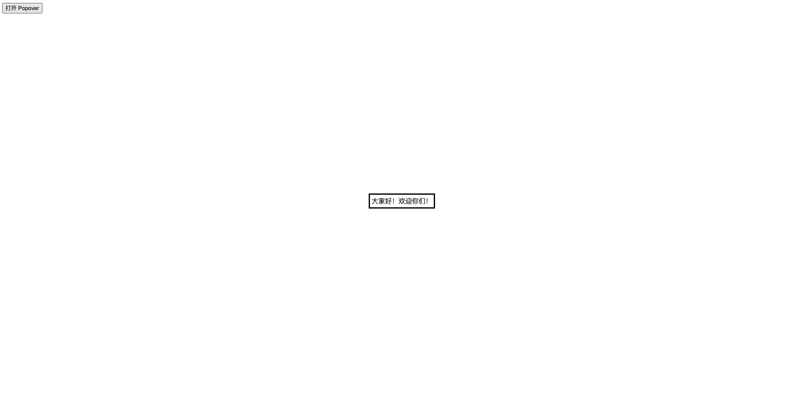

## autofocus

全局属性 `autofocus` 是一个布尔属性，表示元素应在页面加载时或其所属的 `dialog` 显示时被聚焦。在文档或对话框中，最多只能有一个元素具有 autofocus 属性。如果应用于多个元素，第一个元素将获得焦点。

```html
<input name="q" autofocus />
```

## class

全局属性 `class` 的值是一个以空格分隔的元素的类名（classes）列表，它允许 CSS 和 Javascript 通过类选择器 (class selectors) 或 DOM 方法 ( document.getElementsByClassName) 来选择和访问特定的元素。

## contenteditable

全局属性 `contenteditable` 是一个枚举属性，表示元素是否可被用户编辑。如果可以，浏览器会修改元素的组件以允许编辑。

- 该属性必须是下面的值之一：
  - true 或空字符串，表示元素是可编辑的。
  - false 表示元素不是可编辑的。
  - plaintext-only 表示元素的原始文本是可编辑的，但富文本格式会被禁用。

## data-\*

`data-*` 全局属性 是一类被称为自定义数据属性的属性，它赋予我们在所有 HTML 元素上嵌入自定义数据属性的能力，并可以通过脚本在 HTML 与 DOM 表现之间进行专有数据的交换。

## dir

全局属性 dir 是一个指示元素中文本方向的枚举属性。它的取值如下：

- ltr，指从左到右，用于那种从左向右书写的语言（比如英语）；
- rtl，指从右到左，用于那种从右向左书写的语言（比如阿拉伯语）；
- auto，指由用户代理决定方向。它在解析元素中字符时会运用一个基本算法，直到发现一个具有强方向性的字符，然后将这一方向应用于整个元素。

## draggable

全局属性 `draggable` 是一种枚举属性，用于标识元素是否允许使用浏览器原生行为或 HTML 拖放操作 API 拖动。

draggable 可以有如下取值：

- true：表示元素可以被拖动
- false：表示元素不可以被拖动

## id

`id` 全局属性定义了一个全文档唯一的标识符（ID）。它用于在链接（使用片段）、脚本和样式（通过 CSS）中辨识元素。

## inputmode

inputmode 全局属性 是一个枚举属性，它提供了用户在编辑元素或其内容时可能输入的数据类型的提示。它可以是以下值：

"none"
无虚拟键盘。在应用程序或者站点需要实现自己的键盘输入控件时很有用。

"text"
使用用户本地区域设置的标准文本输入键盘。

"decimal"
小数输入键盘，包含数字和分隔符（通常是“ . ”或者“ , ”），设备可能也可能不显示减号键。

"numeric"
数字输入键盘，所需要的就是 0 到 9 的数字，设备可能也可能不显示减号键。

"tel"
电话输入键盘，包含 0 到 9 的数字、星号（\*）和井号（#）键。表单输入里面的电话输入通常应该使用

"search"
为搜索输入优化的虚拟键盘，比如，返回键可能被重新标记为“搜索”，也可能还有其他的优化。

"email"
为邮件地址输入优化的虚拟键盘，通常包含"@"符号和其他优化。表单里面的邮件地址输入应该使用

"url"
为网址输入优化的虚拟键盘，比如，“/”键会更加明显、历史记录访问等。表单里面的网址输入通常应该使用

如果没有设置这个属性，它的默认值是 "text"，表明使用本地的标准文本输入键盘。

## lang

`lang` 全局属性 参与了元素语言的定义。这个语言是不可编辑元素写入的语言，或者可编辑元素应该写入的语言。标签包含单个条目，值的格式由 用于定义语言的标签 (BCP47) IETF 文档定义。如果标签的内容是空字符串，语言就设为未知。如果标签内容是无效的，根据 BCP47，它就设为无效。

## popover

全局属性 popover 用来指定一个元素为弹出式元素（popover element）。

```html
<button popovertarget="my-popover">打开 Popover</button>

<div popover id="my-popover">大家好！欢迎你们！</div>
```



## style

`style` 全局属性 包含应用到元素的 CSS 样式声明。要注意样式最好定义在单独的文件中。这个属性以及 `style`元素的主要目的是快速装饰。例如用于测试目的。

## tabindex

tabindex 全局属性 指示其元素是否可以聚焦，以及它是否/在何处参与顺序键盘导航（通常使用 Tab 键，因此得名）。

## title

全局属性 title 包含代表与它所属的元素有关的咨询信息的文本。
