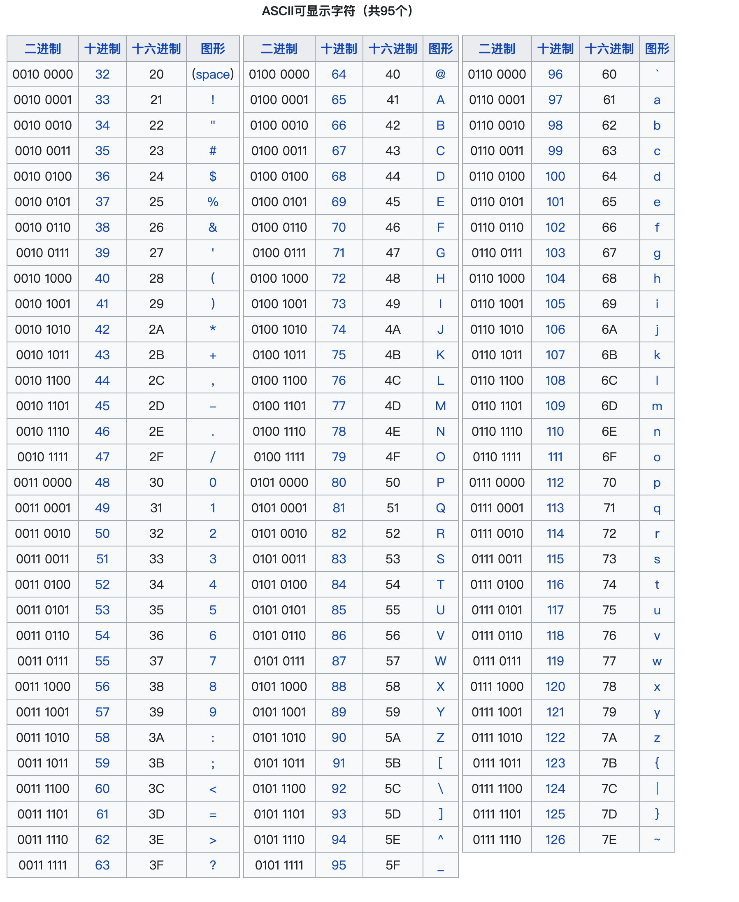
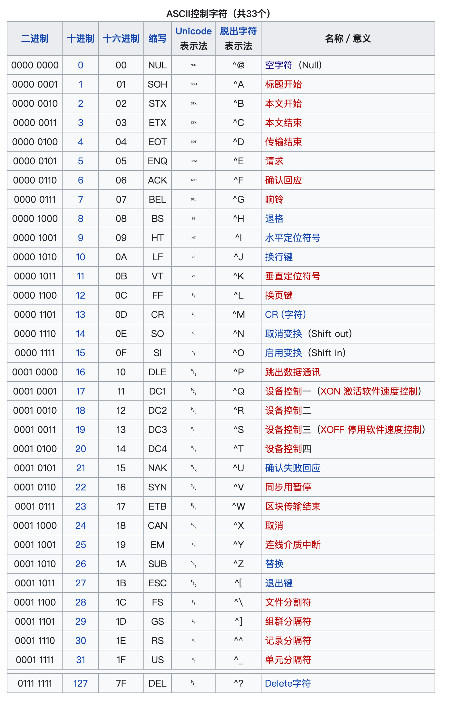

## 前言

HTML 编码是指在 HTML 文档中使用的字符集。常见的 HTML 编码包括 UTF-8、ISO-8859-1、ISO-8859-15、ISO-2022-JP、Shift_JIS、EUC-JP、GB2312、GBK、Big5、GB18030、UTF-16、UTF-32。

为了正确显示 HTML 页面，Web 浏览器必须知道要使用哪个字符集。

## ASCII



## 从 ASCII 到 UTF-8

ASCII 是第一个字符编码标准。ASCII 定义了 128 种可以在互联网上使用的字符：数字（0-9）、英文字母（A-Z）和一些特殊字符，比如：! $ + - ( ) @ < >。

ISO-8859-1 是 HTML 4 的默认字符集。此字符集支持 256 个不同的字符代码。HTML 4 同时支持 UTF-8。

ANSI（Windows-1252）是原始的 Windows 字符集。 ANSI 与 ISO-8859-1 相同，不同之处在于 ANSI 具有 32 个额外的字符。

HTML5 规范鼓励 Web 开发人员使用 UTF-8 字符集，该字符集涵盖了世界上几乎所有的字符和符号！

## 控制字符



## HTML charset 属性

为了正确显示 HTML 页面，Web 浏览器必须了解页面中使用的字符集。

这在 <meta> 标签中指定：

```html
<meta charset="UTF-8" />
```

## UTF-8 字符集

对于 0 到 127 的值，UTF-8 与 ASCII 相同。

UTF-8 不使用 12 8 到 159 之间的值。

对于 160 到 255 之间的值，UTF-8 与 ANSI 和 8859-1 相同。

UTF-8 从值 256 继续，包含超过 10000 个不同字符。
