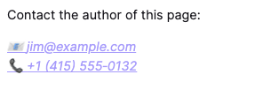

### a：锚元素

HTML `a` 元素（或称锚元素）可以通过它的 `href` 属性创建通向其他网页、文件、电子邮件地址、同一页面内的位置或任何其他 URL 的超链接。

`a` 中的内容应该指明链接的目标。如果存在 `href` 属性，当 `a` 元素聚焦时按下回车键就会激活它。

#### 属性

- download：浏览器将链接的 URL 视为下载资源，可以使用或不使用 `filename` 值,如果没有指定值，浏览器会从多个来源决定文件名和扩展名:
  - Content-Disposition HTTP 标头。
  - URL 路径的最后一段。
  - 媒体类型。来自 Content-Type 标头，data: URL 的开头，或 blob: URL 的 Blob.type。
- filename：决定文件名的值。/ 和 \ 被转化为下划线（\_）。文件系统可能会阻止文件名中其他的字符，因此浏览器会在必要时适当调整文件名。
- href： 超链接所指向的 URL。链接不限于基于 HTTP 的 URL——它们可以使用浏览器支持的任何 URL 协议
  - 使用文档片段链接到页面的某一段
  - 使用文本片段链接到某一段文字
  - 使用媒体片段链接到某个媒体文件
  - 使用 tel: URL 链接到一个电话号码
  - 使用 mailto: URL 链接到一个邮箱地址
  - 如果 web 浏览器不能支持其他 URL 协议，网站可以使用 registerProtocolHandler()
- target：该属性指定在何处显示链接的 URL
  - \_self：当前页面加载。（默认）
  - \_blank：通常在新标签页打开，但用户可以通过配置选择在新窗口打开。
  - \_parent：当前浏览环境的父级浏览上下文。如果没有父级框架，行为与 \_self 相同。
  - \_top：最顶级的浏览上下文（当前浏览上下文中最“高”的祖先）。如果没有祖先，行为与 \_self 相同。
- [hreflang](https://developer.mozilla.org/zh-CN/docs/Web/HTML/Element/a#hreflang)
- [ping](https://developer.mozilla.org/zh-CN/docs/Web/HTML/Element/a#ping)
- [referrerpolicy](https://developer.mozilla.org/zh-CN/docs/Web/HTML/Element/a#referrerpolicy)
- [rel](https://developer.mozilla.org/zh-CN/docs/Web/HTML/Element/a#rel)
- [type](https://developer.mozilla.org/zh-CN/docs/Web/HTML/Element/a#type)

### address

HTML `address` 元素 表示其中的 HTML 提供了某个人或某个组织（等等）的联系信息。



```html
<p>Contact the author of this page:</p>

<address>
  <a href="mailto:jim@example.com">jim@example.com</a><br />
  <a href="tel:+14155550132">+1 (415) 555‑0132</a>
</address>
```

```css
a[href^="mailto"]::before {
  content: "📧 ";
}

a[href^="tel"]::before {
  content: "📞 ";
}
```

### area

HTML `area` 元素 在图片上定义一个热点区域，可以关联一个超链接。`area`元素仅在`map`元素内部使用。

### article

HTML `article` 元素表示文档、页面、应用或网站中的独立结构，其意在成为可独立分配的或可复用的结构，如在发布中，它可能是论坛帖子、杂志或新闻文章、博客、用户提交的评论、交互式组件，或者其他独立的内容项目。

### aside

HTML `aside` 元素表示一个和其余页面内容几乎无关的部分，被认为是独立于该内容的一部分并且可以被单独的拆分出来而不会使整体受影响。其通常表现为侧边栏或者标注框（call-out boxes）。

更多元素标签请查看[MDN HTMl 元素...](https://developer.mozilla.org/zh-CN/docs/Web/HTML/Element/audio)
