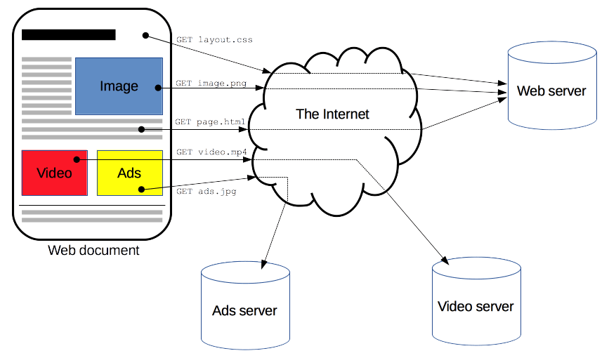
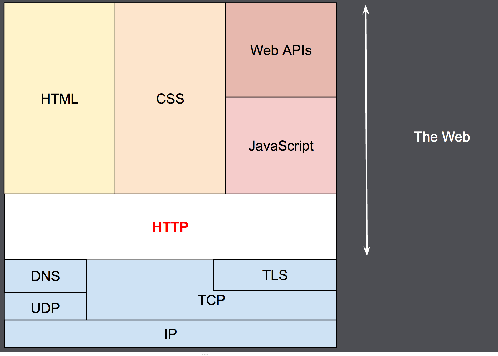

## HTTP 概述

HTTP 是一种用作获取诸如 HTML 文档这类资源的[协议](https://developer.mozilla.org/zh-CN/docs/Glossary/Protocol)。它是 Web 上进行任何数据交换的基础，同时，也是一种客户端—服务器（client-server）协议，也就是说，请求是由接受方——通常是浏览器——发起的。一个完整网页文档是由获取到的不同文档组件——像是文本、布局描述、图片、视频、脚本等——重新构建出来的。



客户端与服务端之间通过交换一个个独立的消息（而非数据流）进行通信。由客户端——通常是个浏览器——发出的消息被称作请求（request），由服务端发出的应答消息被称作响应（response）。



20 世纪 90 年代，HTTP 作为一套可扩展的协议被设计出来，并随时间不断演进。HTTP 是一种应用层的协议，通过 [TCP](https://developer.mozilla.org/zh-CN/docs/Glossary/TCP)，或者是 [TLS](https://developer.mozilla.org/zh-CN/docs/Glossary/TLS)——一种加密过的 [TCP](https://developer.mozilla.org/zh-CN/docs/Glossary/TCP) 连接——来发送，当然，理论上来说可以借助任何可靠的传输协议。受益于 HTTP 的可扩展性，时至今日，它不仅可以用来获取超文本文档，还可用来获取图片、视频或者向服务端发送信息，比如填写好的 HTML 表单。HTTP 还可以用来获取文档的部分内容，以便按需更新 Web 页面。

## 代理

在浏览器和服务器之间，有许多计算机和设备参与传递了 HTTP 消息。依靠 Web 技术栈的层次化的结构，传递过程中的多数操作都位于传输层、网络层或物理层，它们对于 HTTP 应用层而言就是透明的，并默默地对网络性能产生着重要影响。还有一部分实体在应用层参与消息传递，一般被称为代理（Proxy）。代理可以是透明的，即转发它们收到的请求并不做任何修改，也可以表现得不透明，将它传递给服务端之前使用一些手段修改这个请求。代理可以发挥很多种作用：

- 缓存（可以是公开的也可以是私有的，如浏览器的缓存）
- 过滤（如反病毒扫描、家长控制...）
- 负载均衡（让多个服务器服务不同的请求）
- 认证（控制对不同资源的访问）
- 日志（使得代理可以存储历史信息）

## HTTP 的基本性质

### HTTP 是简约的

大体上看，HTTP 被设计得简单且易读，尽管在 HTTP/2 中，HTTP 消息被封装进帧（frame）这点引入了额外的复杂度。HTTP 报文能够被人读懂并理解，向开发者提供了更简单的测试方式，也对初学者降低了门槛。

### HTTP 是可扩展的

在 HTTP/1.0 中引入的 HTTP 标头（header）让协议扩展变得非常容易。只要服务端客户端之间对新标头的语义经过简单协商，新功能就可以被加入进来。

### HTTP 无状态，但并非无会话

HTTP 是无状态的：在同一个连接中，两个执行成功的请求之间是没有关系的。这就带来了一个问题，用户没有办法在同一个网站中进行连贯的交互，比如在电商网站中使用购物车功能。尽管 HTTP 根本上来说是无状态的，但借助 HTTP Cookie 就可使用有状态的会话。利用标头的扩展性，HTTP Cookie 被加进了协议工作流程，每个请求之间就能够创建会话，让每个请求都能共享相同的上下文信息或相同的状态。

### HTTP 和网络连接

一个网络连接是由传输层来控制的，因此从根本上说不属于 HTTP 的范畴。HTTP 协议并不需要下面的传输层协议是面向连接的，仅仅需要它是可靠的，或不会丢失消息（至少，某个情况下告知错误）。在互联网两个最常用的传输层协议中，TCP 是可靠的而 UDP 不是。HTTP 因此而依靠于 TCP 的标准，即面向链接的。

在客户端与服务端能够传递请求、响应之前，这两者间必须建立一个 TCP 链接，这个过程需要多次往返交互。HTTP/1.0 默认为每一对 HTTP 请求/响应都打开一个单独的 TCP 连接。当需要接连发起多个请求时，工作效率相比于它们之间共享同一个 TCP 连接要低。

为了减轻这个缺陷，HTTP/1.1 引入了流水线（已被证明难以实现）和持久化连接：可以通过 Connection 标头来部分控制底层的 TCP 连接。HTTP/2 则更进一步，通过在一个连接中复合多个消息，让这个连接始终平缓并更加高效。

## HTTP 流

当客户端想要和服务端——不管是最终的服务端还是中间的代理——进行信息交互时，过程表现为下面几步：

1.  打开一个 TCP 连接：TCP 连接被用来发送一条或多条请求，以及接受响应消息。客户端可能打开一条新的连接，或重用一个已经存在的连接，或者也可能开几个新的 TCP 连接连向服务端。

1.  发送一个 HTTP 报文：HTTP 报文（在 HTTP/2 之前）是语义可读的。在 HTTP/2 中，这些简单的消息被封装在了帧中，这使得报文不能被直接读取，但是原理仍是相同的。

    HTTPCopy to Clipboard

    ```
    GET / HTTP/1.1
    Host: developer.mozilla.org
    Accept-Language: zh
    ```

1.  读取服务端返回的报文信息：

    HTTPCopy to Clipboard

    ```
    HTTP/1.1 200 OK
    Date: Sat, 09 Oct 2010 14:28:02 GMT
    Server: Apache
    Last-Modified: Tue, 01 Dec 2009 20:18:22 GMT
    ETag: "51142bc1-7449-479b075b2891b"
    Accept-Ranges: bytes
    Content-Length: 29769
    Content-Type: text/html

    <!DOCTYPE html>…（此处是所请求网页的 29769 字节）
    ```

1.  关闭连接或者为后续请求重用连接。

当启用 HTTP 流水线时，后续请求都可以直接发送，而不用等待第一个响应被全部接收。然而 HTTP 流水线已被证明很难在现有的网络中实现，因为现有网络中有老旧的软件与现代版本的软件同时存在。因此，HTTP 流水线已在 HTTP/2 中被更健壮、使用帧的多路复用请求所取代。

## 基于 HTTP 的 API

[`XMLHttpRequest`](https://developer.mozilla.org/zh-CN/docs/Web/API/XMLHttpRequest)  是基于 HTTP 的最常用 API，可用于在[用户代理](https://developer.mozilla.org/zh-CN/docs/Glossary/User_agent)和服务端之间交换数据。现代  [`Fetch API`](https://developer.mozilla.org/zh-CN/docs/Web/API/Fetch_API)  提供相同的功能，并具有更强大和灵活的功能集。

另一种 API，[server-sent 事件](https://developer.mozilla.org/zh-CN/docs/Web/API/Server-sent_events)，是一种单向服务，允许服务端借助作为 HTTP 传输机制向客户端发送事件。使用  [`EventSource`](https://developer.mozilla.org/zh-CN/docs/Web/API/EventSource)  接口，客户端可打开连接并创建事件处理器。客户端浏览器自动将 HTTP 流里到达的消息转换为适当的  [`Event`](https://developer.mozilla.org/zh-CN/docs/Web/API/Event)  对象。继而将已知[类型](https://developer.mozilla.org/zh-CN/docs/Web/API/Event/type "类型")的事件，传递给先前注册过的事件处理器，其他未指明类型的事件则传递给  [`onmessage`](https://developer.mozilla.org/zh-CN/docs/Web/API/EventSource/message_event "onmessage")  事件处理器。
