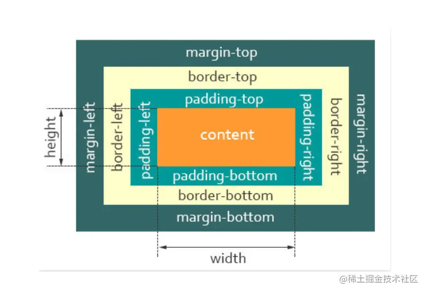
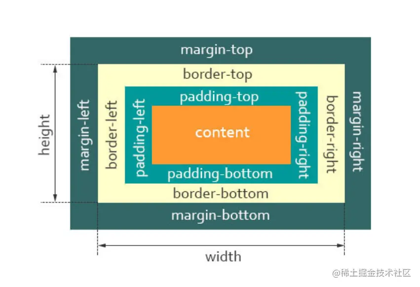

### 1、介绍一下标准的 CSS 的盒子模型？低版本 IE 的盒子模型有什么不同的？

有两种盒子模型：IE 盒模型（border-box）、W3C 标准盒模型（content-box）



- 盒模型：分为内容（content）、填充（padding）、边界（margin）、边框（border）四个部分
  

IE 盒模型和 W3C 标准盒模型的区别：

- W3C 标准盒模型：属性 width，height 只包含内容 content，不包含 border 和 padding
- IE 盒模型：属性 width，height 包含 content、border 和 padding，指的是 content
  +padding+border。

### 2、CSS 中的 "flex:1;" 是什么意思？

flex 是 flex-grow, flex-shrink 和 flex-basis 的简写。

除了 auto (1 1 auto) 和 none (0 0 auto)这两个快捷值外，还有以下设置方式：

- 当 flex 取值为一个非负数字，则该数字为 flex-grow 值，flex-shrink 取 1，flex-basis 取 0%，如下是等同的：

```css
.item {
  flex: 1;
}
.item {
  flex-grow: 1;
  flex-shrink: 1;
  flex-basis: 0%;
}
当 flex 取值为 0 时，对应的三个值分别为 0 1 0% .item {
  flex: 0;
}
.item {
  flex-grow: 0;
  flex-shrink: 1;
  flex-basis: 0%;
}
```

### 3、display 有哪些取值？

- none 元素不会显示
- block 此元素将显示为块级元素，此元素前后会带有换行符。
- inline 默认。此元素会被显示为内联元素，元素前后没有换行符。
- inline-block 行内块元素。可以设置宽高，同行显示。
- inline-table 此元素会作为内联表格来显示（类似 table），表格前后没有换行符。
- table 此元素会作为块级表格来显示（类似 table），表格前后带有换行符。
- inherit 规定应该从父元素继承 display 属性的值。
- grid 网格布局（Grid）是最强大的 CSS 布局方案。 它将网页划分成一个个网格，可以任意组合不同的网格，做出各种各样的布局。
- flex 弹性布局，用来为盒状模型提供最大的灵活性。

### 4、CSS 中，有哪些方式可以隐藏页面元素？有什么区别？

display:none：元素不可见，不占据空间，无法响应点击事件

visibility:hidden：元素不可见，占据页面空间，无法响应点击事件

opacity:0：改变元素透明度，元素不可见，占据页面空间，可以响应点击事件

设置 height、width 属性为 0：将元素的 margin，border，padding，height 和 width 等影响元素盒模型的属性设置成 0，如果元素内有子元素或内容，还应该设置其 overflow:hidden 来隐藏其子元素。特点：元素不可见，不占据页面空间，无法响应点击事件

position:absolute： 将元素移出可视区域，元素不可见，不影响页面布局

clip-path：通过裁剪的形式，元素不可见，占据页面空间，无法响应点击事件

```css
.hide {
  clip-path: polygon(0px 0px, 0px 0px, 0px 0px, 0px 0px);
}
```

### 5、怎么触发 BFC，BFC 有什么应用场景？

参考文章：https://juejin.cn/post/7149398890008018974/

### 6、怎么理解回流跟重绘？什么场景下会触发？

参考文章：https://juejin.cn/post/7150084386212610056

### 7、CSS 中 1 像素问题是什么？有哪些解决方案？

1px 边框问题由来： 苹果 iPhone4 首次提出了 Retina Display（视网膜屏幕）的概念，在 iPhone4 使用的视网膜屏幕中，把 2x2 个像素当 1 个物理像素使用，即使用 2x2 个像素显示原来 1 个物理像素显示的内容，从而让 UI 显示更精致清晰，这 2x2 个像素叫做逻辑像素。

像这种像素比（像素比（即 dpr）＝ 物理像素 / 逻辑像素）为 2 的视网膜屏幕也被称为二倍屏，目前市面上还有像素比更高的三倍屏、四倍屏。

而 CSS 中 1px 指的是物理像素，因此，设置为 1px 的边框在 dpr = 2 的视网膜屏幕中实际占用了 2 个逻辑像素的宽度，这就导致了界面边框变粗的视觉体验。

解决方案：使用 transform 解决

通过设置元素的 box-sizing 为 border-box，然后构建伪元素，再使用 CSS3 的 transform 缩放，这是目前市面上最受推崇的解决方法。这种方法可以满足所有的场景，而且修改灵活，唯一的缺陷是，对于已使用伪元素的元素要多嵌套一个无用元素。具体的实现如下：

```css
.one-pixel-border {
  position: relative;
  box-sizing: border-box;
}

.one-pixel-border::before {
  display: block;
  content: "";
  position: absolute;
  top: 50%;
  left: 50%;
  width: 200%;
  height: 200%;
  border: 1px solid red;
  transform: translate(-50%, -50%) scale(0.5, 0.5);
}
```

这样就可以得到 0.5px 的边框。

还可以结合媒体查询（@media）解决不同 dpr 值屏幕的边框问题，如下：

```css
@media screen and (-webkit-min-device-pixel-ratio: 2), (min-resolution: 2dppx) {
  ...;
}

@media screen and (-webkit-min-device-pixel-ratio: 3), (min-resolution: 3dppx) {
  ...;
}
```
