## 求和函数

```js
const sum = (arr) => arr.reduce((acc, cur) => acc + cur, 0);
//累计值为acc
//当前值为cur
//初始值为initialValue 为0
let arr = [1, 2, 3, 4, 5];
console.log("参数为：", arr);
console.log("总和为：", sum(arr));
```

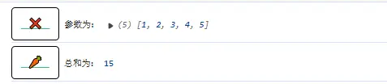

## 求积函数

```js
const product = (arr) => arr.reduce((acc, curr) => acc * curr, 1);
let arr1 = [1, 2, 3, 4, 5];
console.log("参数为：", arr1);
console.log("乘积为：", product(arr1));
```

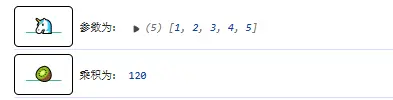

## 扁平化数组

```js
const flatten = (arr) => arr.reduce((acc, curr) => acc.concat(curr), []);
let arr = [[1, 2], [3, 4], [5]];
console.log("参数为：", arr);
console.log("结果为：", flatten(arr));
```

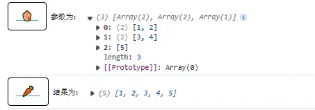

## 计算平均值（类似求和）

```js
const average = (arr) => arr.reduce((acc, curr) => acc + curr, 0) / arr.length;
let arr = [1, 2, 3, 4, 5];
console.log("参数为：", arr);
console.log("结果为：", average(arr));
```


## 最大值

```js
const max = (arr) =>
  arr.reduce((acc, curr) => Math.max(acc, curr), Number.NEGATIVE_INFINITY);
let arr = [1, 2, 3, 4, 5];
console.log("参数为：", arr);
console.log("结果为：", max(arr));
```

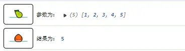

## 最小值

```js
const min = (arr) =>
  arr.reduce((acc, curr) => Math.min(acc, curr), Number.POSITIVE_INFINITY);
let arr = [1, 2, 3, 4, 5];
console.log("参数为：", arr);
console.log("结果为：", min(arr));
```

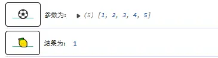

## 阶乘函数

```js
const factorial = (n) =>
  Array.from({ length: n }, (_, i) => i + 1).reduce(
    (acc, curr) => acc * curr,
    1
  );
//  Array.from({ length: n }, (_, i) => i + 1) 生成数组数据 [1,2,3,4,5]
console.log("参数为：", 5);
console.log("结果为：", factorial(5));
```

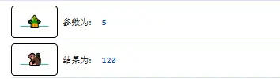

## 数组去重

```js
const unique = (arr) =>
  arr.reduce((acc, curr) => (acc.includes(curr) ? acc : [...acc, curr]), []);
let arr = [1, 2, 3, 4, 2, 3, 4, 5];
console.log("参数为：", arr);
console.log("结果为：", unique(arr));
```

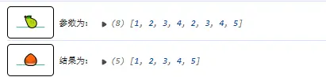

## 元素计数

```js
const countOccurrences = (arr) =>
  arr.reduce((acc, curr) => {
    acc[curr] = (acc[curr] || 0) + 1;
    return acc;
  }, {});

let arr = [1, 2, 3, 4, 2, 3, 4, 5];
console.log("参数为：", arr);
console.log("结果为：", countOccurrences(arr));
```

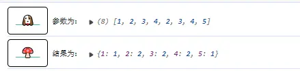

## 并集函数

```js
const union = (...arrays) =>
  arrays.reduce((acc, curr) => [...new Set([...acc, ...curr])], []);

let arr = [1, 2, 3, 4, 2, 3, 4, 5];
let arr1 = [1, 2, 3, 4, 5];
console.log("参数为：", arr, arr1);
console.log("结果为：", union(arr, arr1));
```

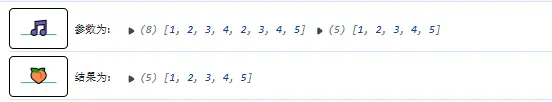

## 差集函数

```js
const difference = (arr1, arr2) =>
  arr1.reduce((acc, curr) => (arr2.includes(curr) ? acc : [...acc, curr]), []);

let arr = [1, 2, 3, 4, 2, 3, 4, 5, 9];
let arr1 = [1, 2, 3, 4, 5, 7, 8];
console.log("参数为：", arr, arr1);
console.log("结果为：", difference(arr, arr1));
```

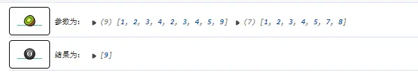

## 对称差集函数

```js
const difference = (arr1, arr2) =>
  arr1.reduce((acc, curr) => (arr2.includes(curr) ? acc : [...acc, curr]), []);
const symmetricDifference = (arr1, arr2) => [
  ...difference(arr1, arr2),
  ...difference(arr2, arr1),
];
let arr = [1, 2, 3, 4, 2, 3, 4, 5, 9];
let arr1 = [1, 2, 3, 4, 5, 7, 8];
console.log("参数为：", arr, arr1);
console.log("结果为：", symmetricDifference(arr, arr1));
```

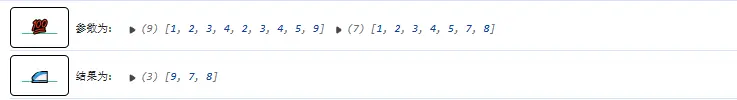

## 切片函数

```js
const chunk = (arr, size) =>
  arr.reduce(
    (acc, _, i) => (i % size === 0 ? [...acc, arr.slice(i, i + size)] : acc),
    []
  );

let arr = [1, 2, 3, 4, 2, 3, 4, 5, 9];
console.log("参数为：", arr);
console.log("结果为：", chunk(arr, 4));
```

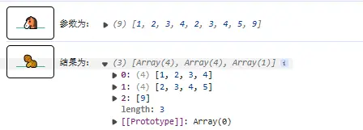

## 分组函数

```js
const groupBy = (arr, key) =>
  arr.reduce((acc, obj) => {
    const groupKey = obj[key];
    acc[groupKey] = [...(acc[groupKey] || []), obj];
    return acc;
  }, {});

let arr = [
  { id: 1, name: "微芒不朽" },
  { id: 2, name: "微芒" },
  { id: 1, name: "微芒不朽" },
];
console.log("参数为：", arr);
console.log("结果为：", groupBy(arr, "name"));
```

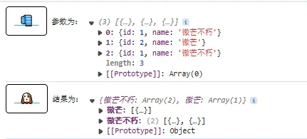

## 去除 falsy 值

```js
// 16. 数组去除假值
const compact = (arr) =>
  arr.reduce((acc, curr) => (curr ? [...acc, curr] : acc), []);
let arr = [0, 1, false, 2, "", 3];
console.log("参数为：", arr);
console.log("结果为：", compact(arr, "name"));
```


## 去除空元素

```js
const removeEmpty = (arr) =>
  arr.reduce((acc, curr) => (curr ? [...acc, curr] : acc), []);

let arr = [0, 1, null, 2, undefined, "", 3];
console.log("参数为：", arr);
console.log("结果为：", removeEmpty(arr, "name"));
```

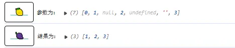

## 去除指定元素

```js
const removeItem = (arr, item) =>
  arr.reduce((acc, curr) => (curr === item ? acc : [...acc, curr]), []);
let arr = [1, 2, 3, 4, 2, 5];
console.log("参数为：", arr);
console.log("结果为：", removeItem(arr, 2));
```

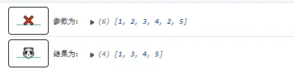

## 元素映射

```js
const mapArray = (arr, fn) => arr.reduce((acc, curr) => [...acc, fn(curr)], []);
let arr = [1, 2, 3, 4, 2, 5];
console.log("参数为：", arr, (x) => x + 2);
console.log(
  "结果为：",
  mapArray(arr, (x) => x + 2)
);
```

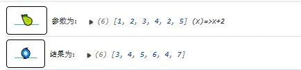

## 元素过滤

```js
const filterArray = (arr, fn) =>
  arr.reduce((acc, curr) => (fn(curr) ? [...acc, curr] : acc), []);
let arr = [1, 2, 3, 4, 2, 5];
console.log("参数为：", arr, (x) => x % 2 === 0);
console.log(
  "结果为：",
  filterArray(arr, (x) => x % 2 === 0)
);
```

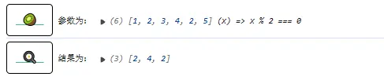

## console.log 样式函数【重写 console.log】

```js
function randomColor() {
  let r = Math.floor(Math.random() * 256);
  let g = Math.floor(Math.random() * 256);
  let b = Math.floor(Math.random() * 256);
  //返回随机生成的颜色
  return "rgb(" + r + "," + g + "," + b + ")";
}
console.log = (function (oriLogFunc) {
  return function (...data) {
    const icons = [
      "🌵",
      "🎍",
      "🐾",
      "🌀",
      "🐚",
      "🥝",
      "🥜",
      "🥕",
      "🥒",
      "🌽",
      "🍒",
      "🍅",
      "🍑",
      "🍋",
      "🍈",
      "🌶",
      "🌰",
      "🍠",
      "🍆",
      "🍄",
      "🍐",
      "🍌",
      "🍍",
      "🍇",
      "🍏",
      "🍓",
      "🍎",
      "🍊",
      "🐴",
      "🐗",
      "🦄",
      "🐑",
      "🐶",
      "🐔",
      "🐼",
      "🐒",
      "🌝",
      "💄",
      "💋",
      "👠",
      "👗",
      "👙",
      "🧣",
      "🍰",
      "🍭",
      "🍳",
      "🎄",
      "🎱",
      "⚽",
      "🏀",
      "🎵",
      "🚄",
      "⭕",
      "❌",
      "❓",
      "❗",
      "💯",
    ];
    const icon = icons[Math.floor(Math.random() * icons.length)];
    const bgColor = randomColor();
    const color = randomColor();
    oriLogFunc.call(
      console,
      `%c ${icon} `,
      `border-radius:5px;padding:12px;border:1px solid #000;color: #43bb88;font-size: 16px;font-weight: bold;text-decoration: underline;`,
      ...data
    );
  };
})(console.log);
```

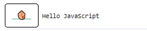
