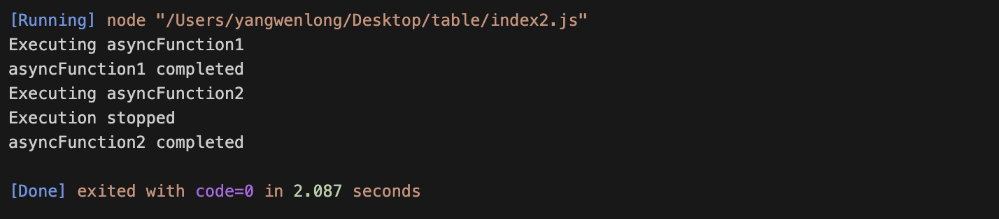

## 前言

在生命周期中，有十个异步函数执行，当离开当前页面时，我不希望异步函数继续执行，那么该怎么进行处理

## 实现

```js
function executeAsyncFunctions(asyncFunctions) {
  // 标志变量，用于控制是否停止执行剩余的异步函数
  let stopExecution = false;

  // 异步函数执行器
  async function executeAsyncFunction(asyncFunction) {
    if (!stopExecution) {
      try {
        await asyncFunction();
      } catch (error) {
        console.error(error);
      }
    }
  }

  // 执行异步函数的入口函数
  async function execute() {
    for (const asyncFunction of asyncFunctions) {
      await executeAsyncFunction(asyncFunction);
    }
  }

  // 停止执行剩余异步函数的函数
  function stopExecutionOfRemainingFunctions() {
    stopExecution = true;
  }

  return {
    execute,
    stopExecutionOfRemainingFunctions,
  };
}

// 异步函数1
async function asyncFunction1() {
  console.log("Executing asyncFunction1");
  await new Promise((resolve) => setTimeout(resolve, 1000));
  console.log("asyncFunction1 completed");
}

// 异步函数2
async function asyncFunction2() {
  console.log("Executing asyncFunction2");
  await new Promise((resolve) => setTimeout(resolve, 1000));
  console.log("asyncFunction2 completed");
}

// 异步函数3
async function asyncFunction3() {
  console.log("Executing asyncFunction3");
  await new Promise((resolve) => setTimeout(resolve, 1000));
  console.log("asyncFunction3 completed");
}

// 创建异步函数数组
const asyncFunctions = [asyncFunction1, asyncFunction2, asyncFunction3];

// 创建异步函数执行器
const executor = executeAsyncFunctions(asyncFunctions);

// 执行异步函数
executor.execute();

// 在某个指定时机停止执行剩余异步函数
setTimeout(() => {
  executor.stopExecutionOfRemainingFunctions();
  console.log("Execution stopped");
}, 2000);
```

执行结果


