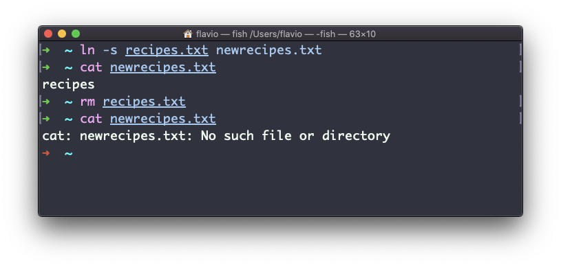

## Linux 中的  `ln`  命令

`ln`  命令是 Linux 诸多文件系统命令的一部分。

它的用途是创建链接。“链接”是什么？链接就像是指针，指向另一个文件，或者说是指向另一个文件的文件。你可能熟悉 Windows 上的快捷方式，二者是类似的。

我们有两种类型的链接：**硬链接**和**软链接**。

#### 硬链接

硬链接现在很少使用。它有一些弱点：你无法链接到目录，也无法链接到外部文件系统（磁盘驱动器）。

要创建一个硬链接，可以使用下面的语法：

```
ln <源文件路径> <链接路径>
```

例如，你有一个叫做 recipes.txt 的文件，你可以用下面的写法创建一个硬链接：

```
ln recipes.txt newrecipes.txt
```

这个新创建的硬链接和普通的文件没有什么区别：


现在，如果你编辑这对文件中的任何一个，另一个文件的内容也会随之更新。

即使你删除了源文件，链接文件仍然会包含源文件的内容。那是因为直到创建硬链接时，源文件还没有被删除。


#### 软链接

软链接则有所不同，它更为强大一些，你可以用它链接到其他的文件系统和目录。但请注意，当你删除源文件时，这个链接会断掉。

你可以使用  `ln`  命令的  `-s`  参数创建一个软链接：

```
ln -s <源文件路径> <链接路径>
```

例如，你有一个叫做 recipes.txt 的文件。你可以用下面的写法为它创建一个软链接：

```
ln -s recipes.txt newrecipes.txt
```

这种情况下，当你用  `ls -al`  列出文件时，你可以看见一个特殊的  `l`  标记。在文件名的末尾有一个  `@`  符号，如果你启用了终端的显色，文件名还会有不同的颜色：


现在，如果你删除源文件，链接就会断掉，如果你在终端里尝试访问它，Shell 会提示 "No such file or directory" （没有这个文件或目录）：


