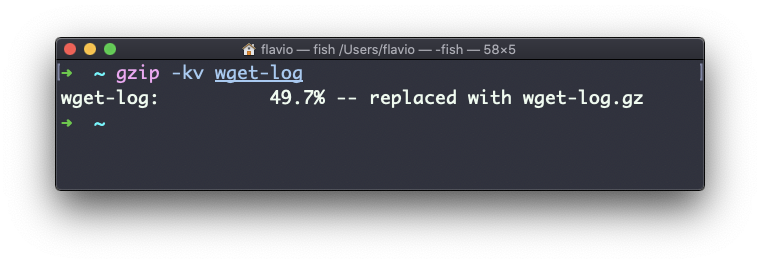

## Linux 中的  `gzip`  命令

你可以使用  `gzip`  命令，从而使用一种称为  [LZ77](https://en.wikipedia.org/wiki/LZ77_and_LZ78)  的 gzip 压缩协议，来压缩文件。

以下是最简单的用法：

```
gzip 文件名
```

这会压缩指定的文件，并为它加上  `.gz`  扩展名。源文件会被删除。

如果不想删除源文件，你可以加上  `-c`  参数，然后使用输出重定向，将输出文件写到  `filename.gz`  中。

```
gzip -c filename > filename.gz
```

> `-c`  参数用来指定输出文件进入标准输出流，同时保持原始文件的完整性。

或者使用  `-k`  参数：

```
gzip -k 文件名
```

文件有不同的压缩率。压缩率越高，压缩（或者解压）的时间就越长。压缩率等级一般从 1（速度最快，压缩效果最差）开始，直到 9 （速度最慢，压缩效果更好）结束。默认为 6 。

你可以用  `-<数字>`  参数指定使用的压缩率：

```
gzip -1 文件名
```

你可以压缩多个文件，只需要依次列出它们：

```
gzip file1 file2
```

你可以用递归的方式压缩某个目录包含的全部文件，只需要使用  `-r`  参数：

```
gzip -r 文件夹路径
```

`-v`  参数会输出文件压缩时的百分比信息。以下是它和  `-k` （Keep 的简写） 参数并用时的情形：



`gzip`  命令也可以用来解压文件，只需使用  `-d`  参数：

```
gzip -d filename.gz
```
