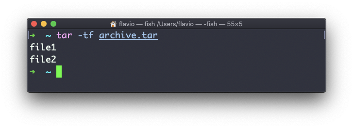

## Linux 中的  `tar`  命令

`tar`  命令可以用来创建档案包，将多个文件打包为一个文件。

它的名称来源于旧时，意思是  *tape archive（磁带档案）*  （很久以前档案都是用磁带存储的）。

下面的命令会将  `file1`  和  `file2`  打包成一个名为  `archive.tar`  的档案包文件：

```
tar -cf archive.tar file1 file2
```

> `c`  参数是  *create（创建）*   的简写。`f`  参数则用来将合成的档案包写入一个文件。

要在当前文件夹下的某个档案包中提取文件，可以使用如下命令：

```
tar -xf archive.tar
```

> 参数  `x`  是  *extract（提取）*   的简写。

如果要提取文件到指定目录，应该使用下面的命令：

```
tar -xf archive.tar -C 目录路径
```

你也可以不提取文件，只罗列某个档案包里含有的文件列表：



`tar`  常用来创建**压缩档案包**。

这可以用  `z`  参数来完成：

```
tar -czf archive.tar.gz file1 file2
```

这就像是先创建了一个 tar 档案包，再运行  `gzip`  来压缩它。

如果你要提取一个被压缩的档案包，可以先使用  `gunzip`  或  `gzip -d`  来解压，再提取里面的文件。除此之外  `tar -xf`  也可以直接识别压缩的档案包，然后为你完成解压提取操作：

```
tar -xf archive.tar.gz
```
