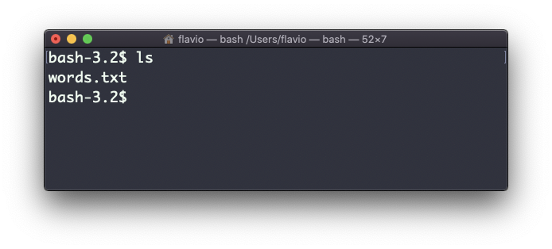
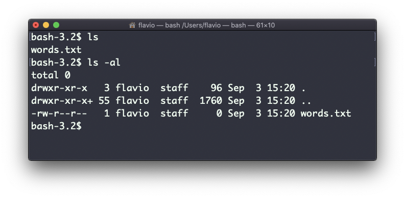
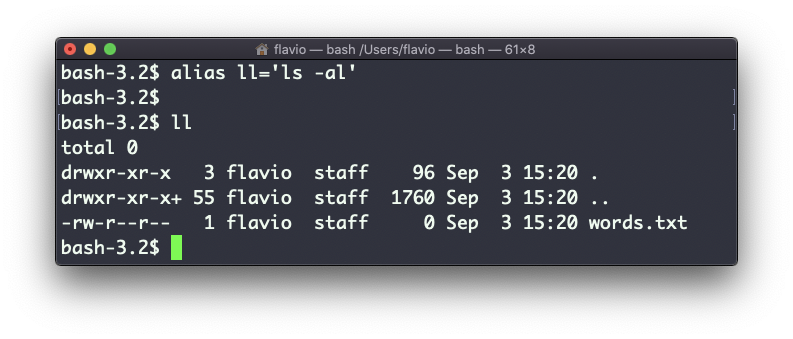
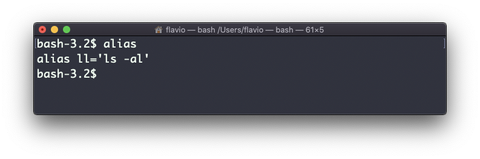

## Linux 中的  `alias`  命令

通常情况下，人们总会使用一组喜欢的参数去运行一个程序。

此处用  `ls`  命令举例。默认情况下，它只输出少量的信息：



但如果你带上了  `-al`  参数，它会输出一些更有用的信息，像是文件的修改日期、大小、所有者、权限之类。它也会同时列出隐藏的文件（文件名以英文句号`.`  开头的文件）：



你可以创建一个新的命令，比如我喜欢叫它  `ll`，它是  `ls -al`  命令的一个别名。

方法如下所示：

```
alias ll='ls -al'
```

只要这么做了，你就可以像使用普通的 UNIX 命令一样，调用  `ll` ：



当调用  `alias` ，但不加任何参数时，它会列出已经定义的所有别名：


用以上方法定义的别名，在终端会话关闭后就会失效。

如果要让别名永久有效，你必须将其添加到 Shell 的配置文件中。如果你正在使用 Bash shell，配置文件可能是  `~/.bashrc` 、`~/.profile`  或  `~/.bash_profile` ，依据实际用法而定。

如果你定义的命令中存在变量，那么请注意引号的用法：如果使用双引号，变量会在进行定义时解析；如果使用单引号，变量则会在命令被调用时解析。两者是不同的：

```
alias lsthis="ls $PWD"
alias lscurrent='ls $PWD'
```

$PWD 代表 Shell 当前所在的文件夹。如果你导航到新的文件夹，`lscurrent`  命令会列出新文件夹中的文件，而  `lsthis`  仍然会列出你首次定义变量时所在文件夹中的文件。
