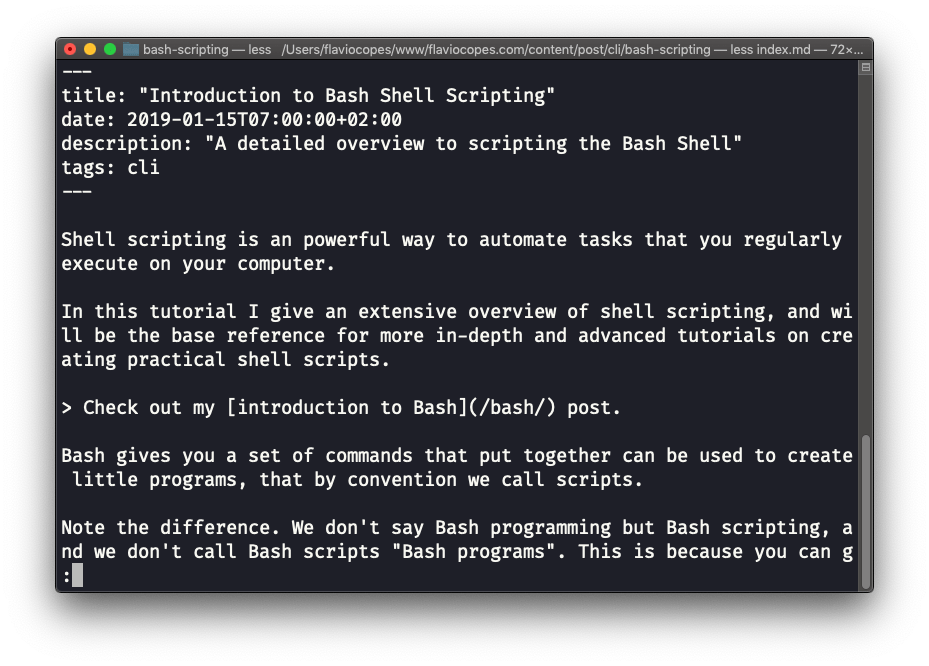

## Linux 中的  `less`  命令

`less`  是我经常使用的命令之一。它透过一个漂亮的交互用户界面向你展示任一文件中存储的内容：

用法： `less <文件名>`.

当你处于  `less`  会话时，按下  `q`  键即可离开。

你可以使用  `上`  键和  `下`  键浏览文件的内容，或者使用  `空格`  键和  `b`  键逐页浏览。按下  `G`  键（大写）可以跳转到文件的末尾，而按下  `g`  键（小写）则可以回到文件的开头。

按下左斜杠键  `/`  并输入文字，就可以在文件中进行搜索。这会  *向前*  搜索。如果要向后搜索，你需要使用问号  `?`  并输入文字。

这个命令只是将文件的内容可视化。你可以直接按  `v`  打开一个编辑器。它将使用系统编辑器，在大多数情况下是  `vim` 。

按  `F`  键即可进入  *跟踪模式*，也称  *观察模式*。当文件被别人修改时，比如从另一个程序中修改，你就可以  *实时*  看到修改的内容。

默认状态下不会出现这种情况，你只能看到你打开文件时的文件版本。你需要按  `ctrl-C`  来退出这个模式。在这种情况下，行为类似于运行  `tail -f <文件名>`  命令。

你可以打开多个文件，并使用  `:n` （next，转到下一个文件）和  `:p` （previous，转到上一个文件）浏览它们。
