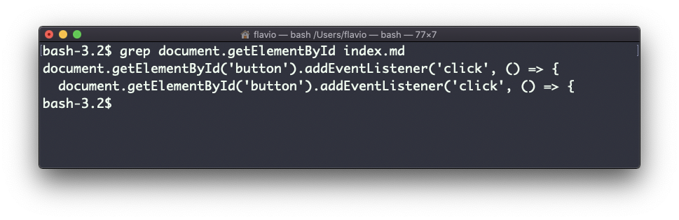
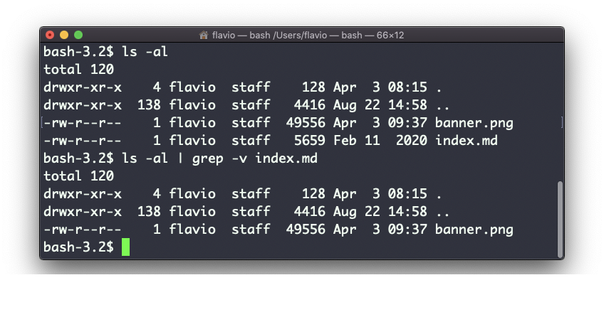
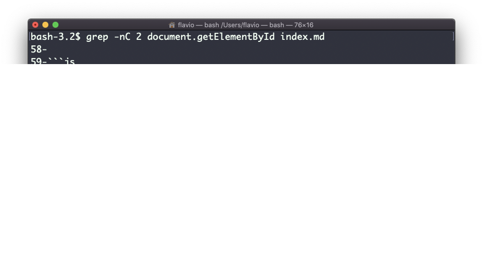
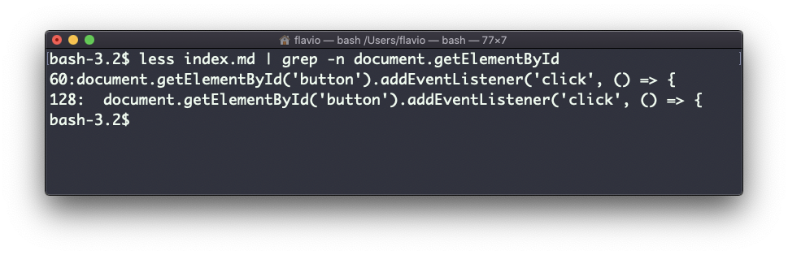
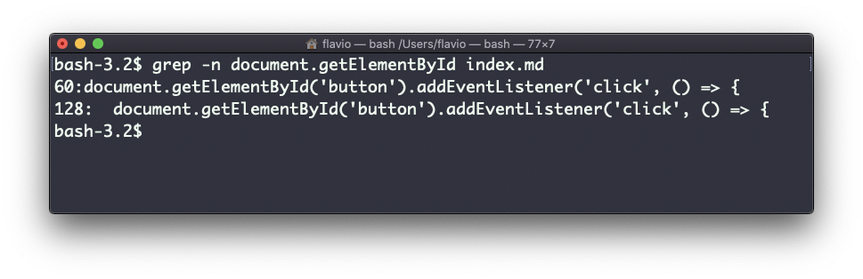

## Linux 中的  `grep`  命令

`grep`  命令是一个非常有用的工具。假若掌握了它，对日常的编码工作会有很大的帮助。

> 如果你比较好奇， `grep`  的全写是  *global regular expression print* （全局正则表达式打印）。

你可以使用  `grep`  在文件中进行搜索，或者与管道符配合使用，将输出结果传递到其他命令。

例如，可以用以下命令在  `index.md`  文件里搜寻  `document.getElementById`  这一行出现的次数：

```
grep -n document.getElementById index.md
```



使用  `-n`  参数可以显示行号：

```
grep -n document.getElementById index.md
```



一个非常有用的方法是告诉 grep 在相应行的前后各输出 2 行，以提供更多的上下文。这可以用参数  `-C`  来完成，它可以受取其后的若干行数：

```
grep -nC 2 document.getElementById index.md
```



搜索默认是区分大小写的。使用参数  `-i`  可以使其不再区分。

如上所述，你可以使用 grep 来过滤其他命令的输出。我们可以使用以下方法重现前述的功能：

```
less index.md | grep -n document.getElementById
```



搜索字符串中可以使用正则表达式，这让  `grep`  变得非常强大。

另一个你可能发现很有用的方法是——使用参数  `-v`  反转结果，排除与特定字符串匹配的行：



## Linux 中的  `sort`  命令
