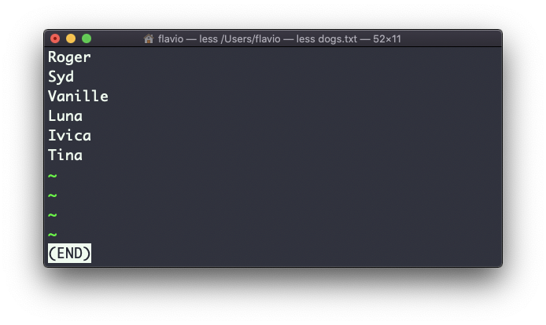
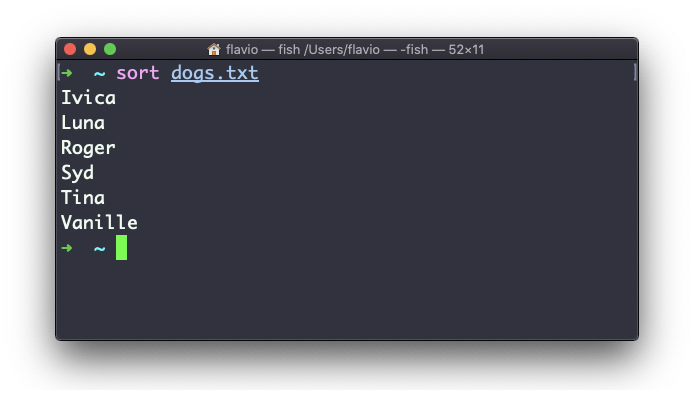
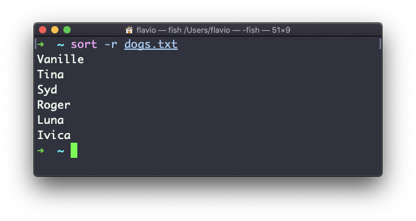
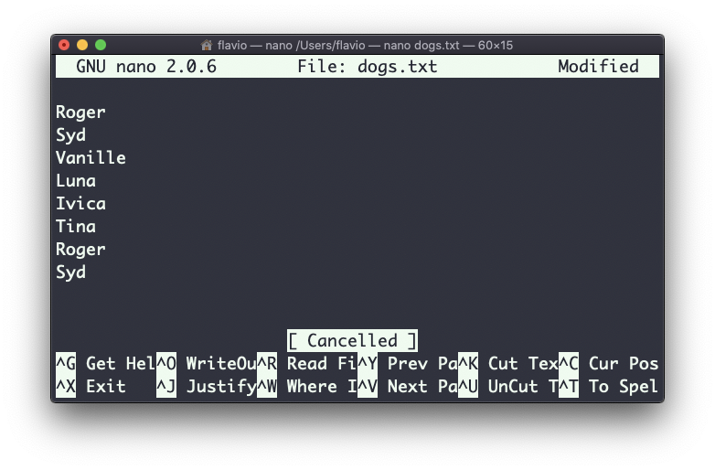
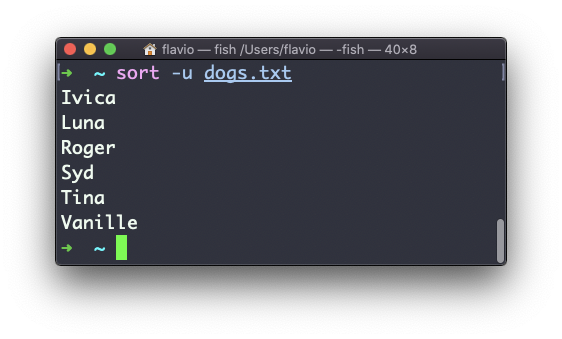
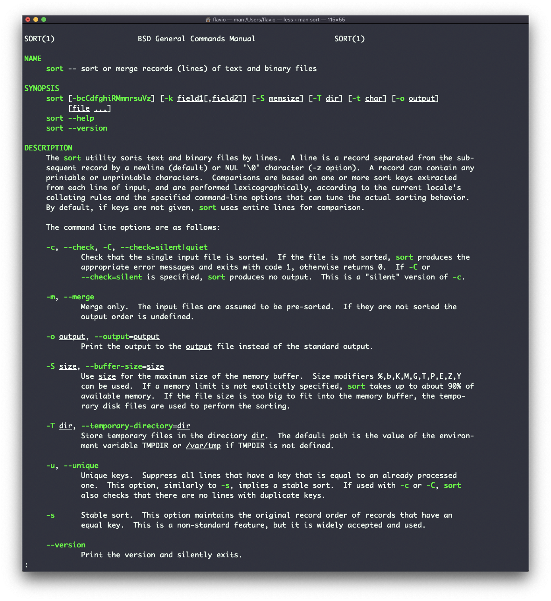

## Linux 中的  `sort`  命令

假定你有一份文本文件，里面包含一些狗狗的名字：



这串名字并没有进行排序。

而  `sort`  命令会帮你按照名称顺序排列它们：



使用  `r`  参数倒转排序结果：


默认情况下，排序区分大小写，并且遵循英文字母顺序。使用  `--ignore-case`  参数进行不区分大小写的排序，使用  `-n`  参数可按数值大小顺序进行排序。

如果文件包含重复的行：


你可以使用  `-u`  参数移除它们：



`sort`  命令不像多数 UNIX 命令那样，只是用于操作文件，它还可以与管道符配合使用。因此你可以将它用在其他命令的输出上。例如，你可以用它排序  `ls`  命令传回的文件列表：

```
ls | sort
```

`sort`  的功能非常强大，它还支持更多的参数，你可以输入  `man sort`  来探索：


