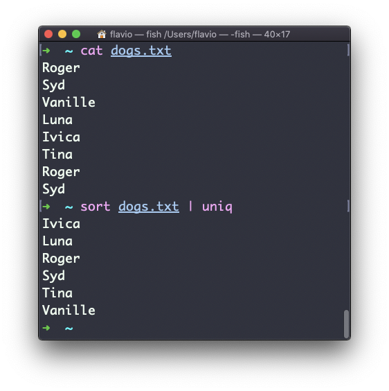
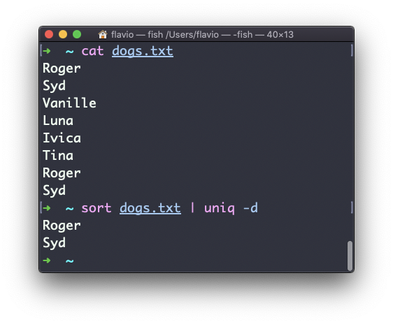
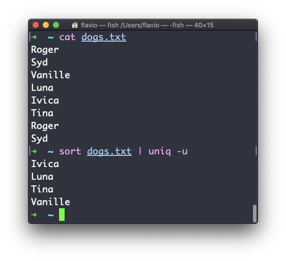
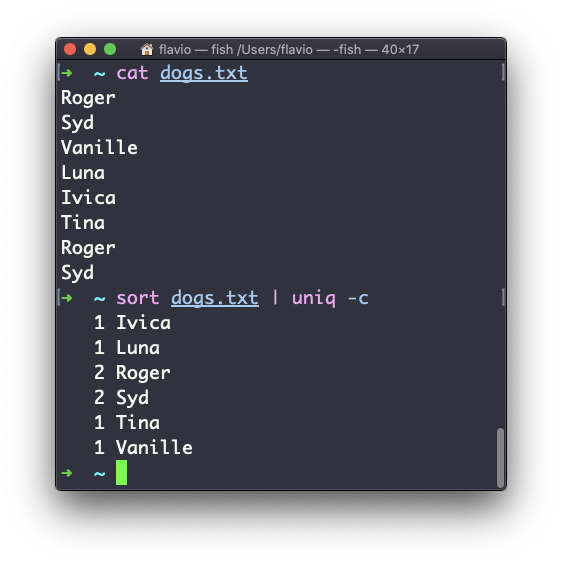
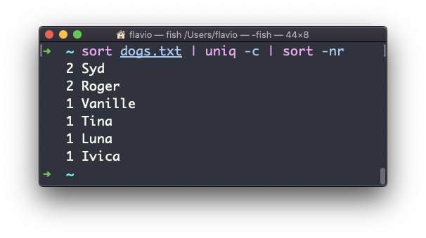

## Linux 中的  `uniq`  命令

`uniq`  命令可以帮助你排序文本文件中的行。

这些行可以通过文件获取，或用管道符从另一个命令的输出中得到：

```
uniq dogs.txt
ls | uniq
```

此处需要考虑一个关键点： `uniq`  只会检测相邻的重复行。

这意味着你可能会将它与  `sort`  配合使用：

```
sort dogs.txt | uniq
```

`sort`  命令拥有自己的参数—— `-u` (_unique_) 来移除重复的行。但  `uniq`  更为强大。

默认情况下，它会删除重复的行：



你可以告诉它只是显示重复的行，例如，使用  `-d`  参数：

```
sort dogs.txt | uniq -d
```



还可以使用  `-u`  参数，那样就只会显示不重复的行：



使用  `-c`  参数计算每一行的出现次数：



使用以下的特殊命令组合：

```
sort dogs.txt | uniq -c | sort -nr
```

即可将文件内的行按最常见的频率排序：


