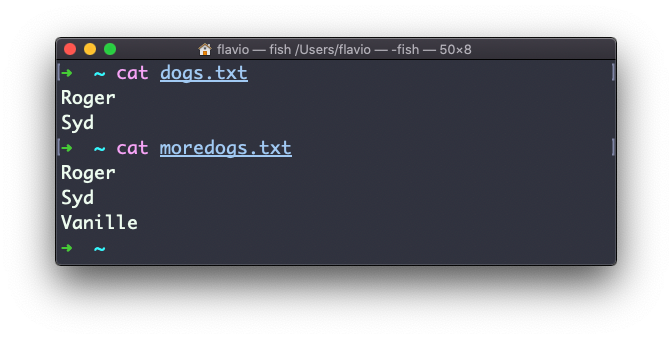
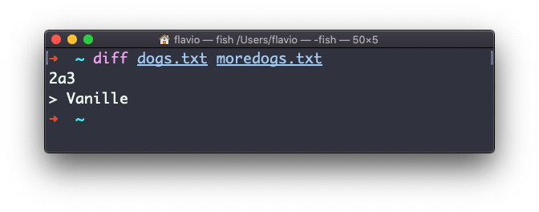
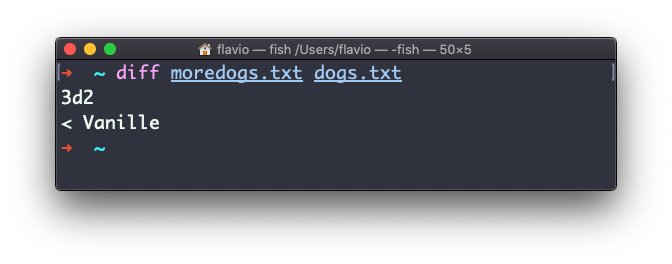
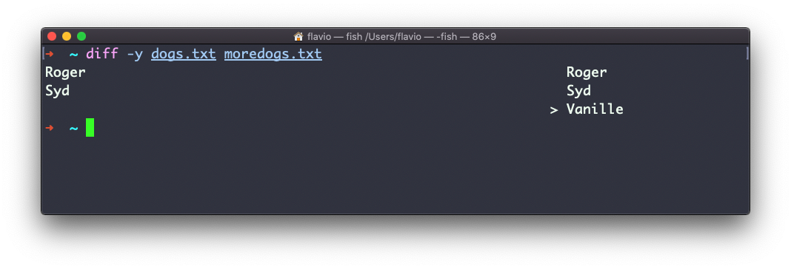
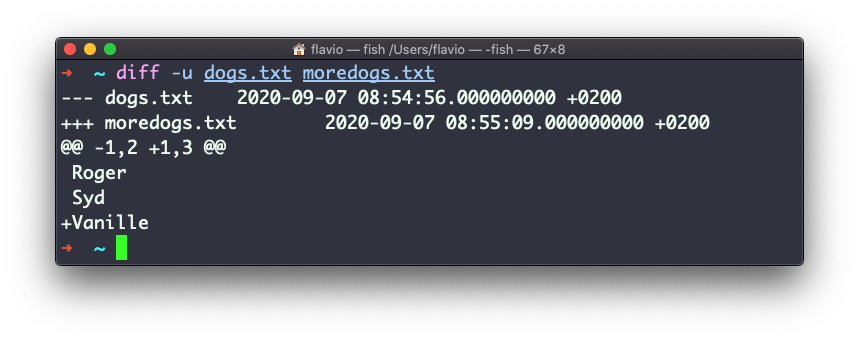
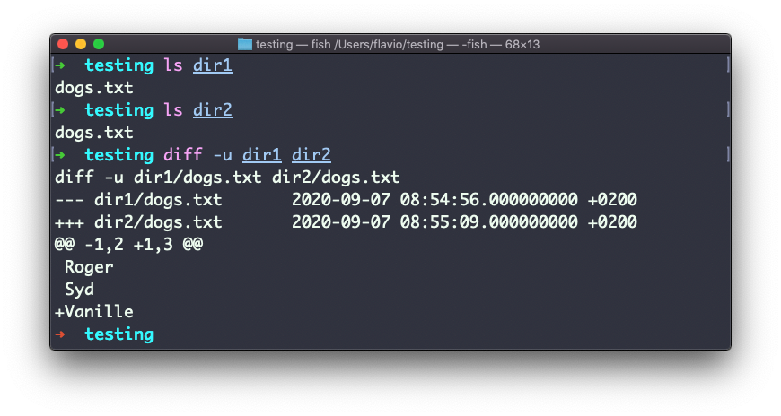
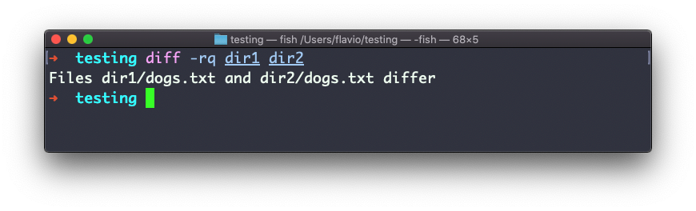
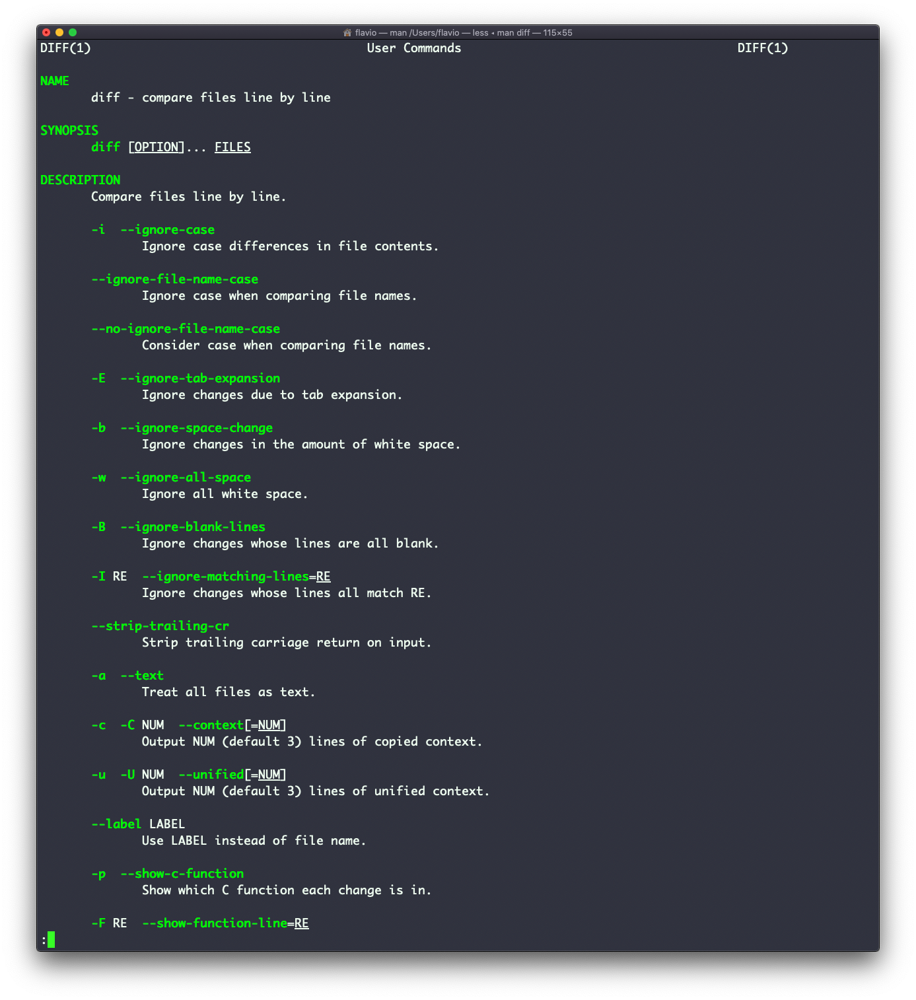

## Linux 中的  `diff`  命令

`diff`  是一个非常方便的命令。假定有两个文件，它们包含几乎相同的信息，你没有办法找出区别。

`diff`  会处理文件，然后告诉你有差异的地方。

假定有两个文件： `dogs.txt`  和  `moredogs.txt`。它们的区别是： `moredogs.txt`  比前者多了一条狗狗的名字：

`diff dogs.txt moredogs.txt`  会告诉你后者多了一行，在第 3 行有  `Vanille`  这一行：

如果你改变两个文件的顺序，它会告诉你后者的第三行丢失了，也就是  `Vanille`  那一行：

使用  `-y`  参数会逐行对比两个文件：

你可能更熟悉  `-u`  参数，因为在 Git 版本管理系统中，它一样是用来显示不同版本文件差异的：

对于目录，比较的方式是一样的。你必须使用  `-r`  选项来进行递归比较（进入子目录）：

如果你只对哪个文件存在差异感兴趣，而非关注文件的内容，可以使用  `r`  和  `q`  参数：

它还支持更多参数，你可以用 man 页面来探索，只需键入  `man diff`：

