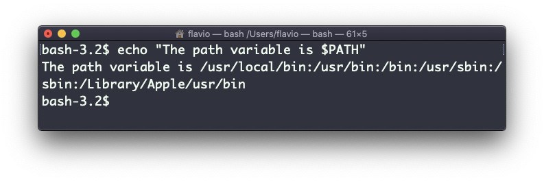
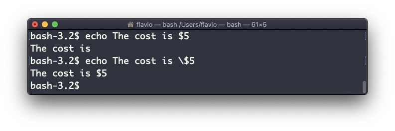
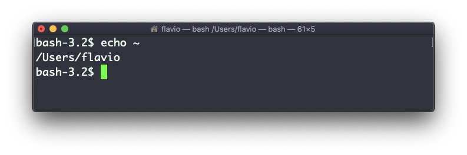
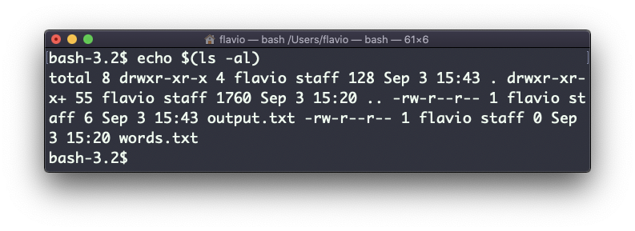
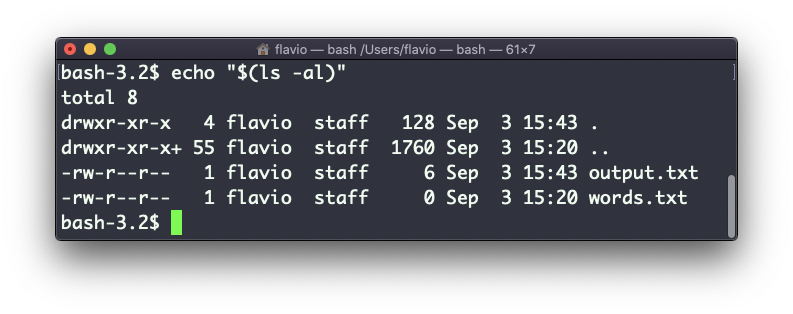

## Linux 中的  `echo`  命令

`echo`  命令会做一件简单的事情：它将传递给自身的参数打印输出。

以下示例：

```
echo "hello"
```

会将  `hello`  输出到终端。

我们可以将输出追加到文件中：

```
echo "hello" >> output.txt
```

我们可以对环境变量进行插值：

```
echo "The path variable is $PATH"
```



注意，特殊字符需要用反斜杠进行转义。以  `$`  为例：



这只是个开始。当与 Shell 功能交互时，我们可以用它来做一些很棒的事情。

我们可以输出当前文件夹中的文件：

```
echo *
```

我们还可以输出当前文件夹中所有以字母  `o`  开头的文件：

```
echo o*
```

任何有效的 Bash（或者是你使用的其他 Shell）命令和功能可以在此使用。

你可以输出你的主文件夹（home）的路径：

```
echo ~
```


你还可以执行命令，并且将执行结果打印到标准输出（或者是文件，正如你看到的）：

```
echo $(ls -al)
```



注意，输出在默认情况下不保留空白。如需留白，必须用双引号来包裹命令：



你可以用它生成字符串列表，例如指定一个范围：

```
echo {1..5}
```


