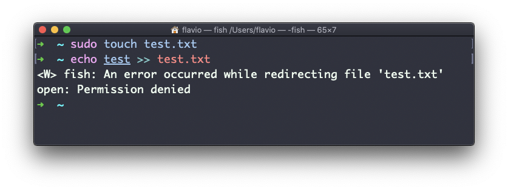
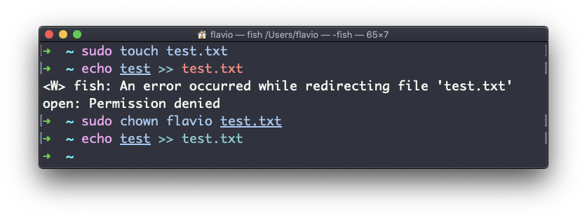

## Linux 中的  `chown`  命令

在 Linux 或 macOS 操作系统（或是任一 UNIX 系统）中，每个文件或目录都有**所有者**。

所有者可以对文件做任何事情。它可以决定文件的命运。

使用  `chown`  命令，所有者（以及  `root`  用户）也可以将文件所有权转移给另一个用户：

```
chown <所有者> <文件>
```

像这样：

```
chown flavio test.txt
```

例如，假设有一个为  `root`  所拥有的文件，作为其他用户，你无法对它进行写入：



你可以使用  `chown`  将文件所有权转移到你：

一种需求十分常见：改变目录的所有权，同时遍历修改其中包含的文件、子目录以及子目录中的文件的所有权。

你可以使用  `-R`  参数来完成：

```
chown -R <所有者> <文件>
```

文件和目录不仅属于所有者，同时还属于**用户组**。使用以下命令，你可以在变更所有者的同时，更改其所属用户组：

```
chown <所有者>:<用户组> <文件>
```

举例：

```
chown flavio:users test.txt
```

你还可以使用  `chgrp`  命令，只更改文件的所属用户组：

```
chgrp <用户组> <文件名>
```
