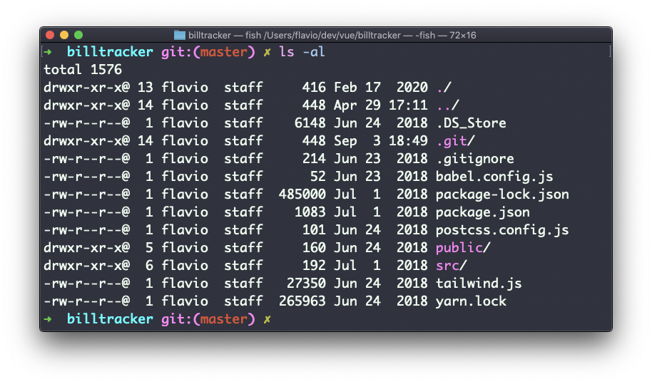

## Linux 中的  `chmod`  命令

在 Linux 或 macOS 操作系统（或是任一 UNIX 系统）中，每个文件都有三种权限：读取、写入和执行。

进入一个文件夹，并运行  `ls -al`  命令。


你在文件列表每一行见到的，像是  `drwxr-xr-x`  这样的奇怪字符串，定义了文件或文件夹的权限。

让我们来剖析一下。

第一个字母表示文件的类型：

- `-`  表示这是一个常规的文件
- `d`  表示这是一个目录
- `l`  表示这是一个链接

之后你就有了三组值：

- 第一组代表文件**所有者**拥有的权限
- 第二组代表文件所关联的**用户组**成员拥有的权限
- 第三组代表**其他人**拥有的权限

这些组由三个值组成。`rwx`  代表特定  *角色*  拥有读取、写入和执行访问权限。任何被移除的权限会被替换为  `-` ，因此你可以将不同的值，及其代表的相关权限进行组合：例如  `rw-`、`r--`、`r-x`  等等。

你可以使用  `chmod`  命令来改变一个文件的权限。

`chmod`  有两种用法。其一是使用符号参数，其二是使用数字参数。首先来试试更为直观的符号参数。

终端输入  `chmod` ，空格，之后加上一个字母：

- `a`  表示  *all*，即全体
- `u`  表示  *user*，即用户
- `g`  表示  *group*，即用户组
- `o`  表示  *others*，即其他人

然后输入  `+`  或  `-`  并加上一个或多个权限符号（`r`、`w`、`x`），来添加或删除任意权限。

键入以上所有命令和参数之后，都要加上文件或文件夹名称。

以下是一些例子：

```
chmod a+r filename #每个人都可以读取
chmod a+rw filename #每个人都可以读取和写入
chmod o-rwx filename #其他人（非文件所有者，也不在文件所属用户组中的用户）无法读取、写入或执行文件
```

只需要在  `+`/`-`  前添加多个字母，即可将相同的权限批量应用到不同的身份：

```
chmod og-r filename #其他人，和用户组无法读取文件。
```

如果你正在编辑一个文件夹，你可以使用  `-r`（递归）参数将权限应用到该文件夹中的每个文件。

使用数字参数速度更快，但我认为当你不是每天都使用的话，是很难记住它们的。数字在此代表任一角色的权限。这个数字值最大可以是 7，它是这样计算的：

- 拥有执行权限，记为  `1`
- 拥有写入权限，记为  `2`
- 拥有读取权限，记为  `4`

这又给我们带来四种组合：

- `0`  代表无权限
- `1`  代表可以执行
- `2`  代表可以写入
- `3`  代表可以写入和执行
- `4`  代表可以读取
- `5`  代表可以读取和执行
- `6`  代表可以读取和写入
- `7`  代表可以读取、执行和写入

我们使用三组数字，来同时设置所有 3 个用户身份的全部权限：

```
chmod 777 filename
chmod 755 filename
chmod 644 filename
```
