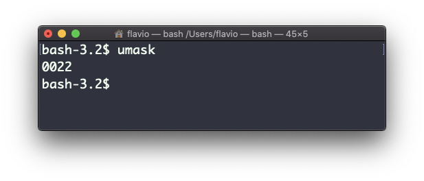

## Linux 中的  `umask`  命令

创建一个文件时，不需要事先决定权限。权限有默认值。

这些默认值可以使用  `umask`  命令来控制和修改。

不带参数输入  `umask` ，它会显示当前的 umask 值，本例中为  `0022`：


`0022`  是什么意思？ 这是一个代表权限的八进制数值。

另一个常见的数值是  `0002`.

使用  `umask -S`  查看更具可读性的注释：

在这里，用户（`u`），也就是文件的所有者，拥有对文件的读取、写入和执行的权限。

和所有者位于同一用户组的用户（`g`）拥有对文件的读取和执行权限，除此之外的其他用户（`o`）也一样。

在数字符号中，我们通常会改变最后 3 位数字。

以下列表给出了这些数字的含义：

- `0`  代表读取、写入与执行
- `1`  代表读取与写入
- `2`  代表读取与执行
- `3`  代表只读
- `4`  代表写入与执行
- `5`  代表仅写入
- `6`  代表仅执行
- `7`  代表没有权限

注意，这里的数字含义与前述  `chmod`  命令中用到的并不同。

可以用数值格式，为权限掩码设置一个新的值：

```
umask 002
```

也可以更改特定角色的权限：

```
umask g+r
```
