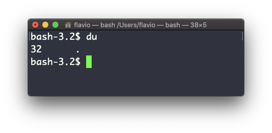
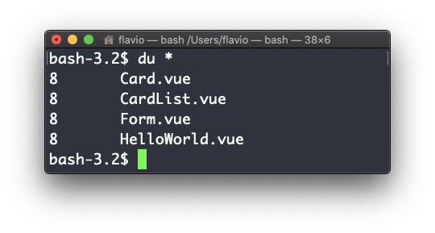
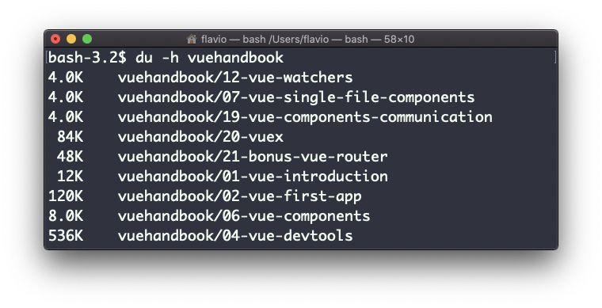
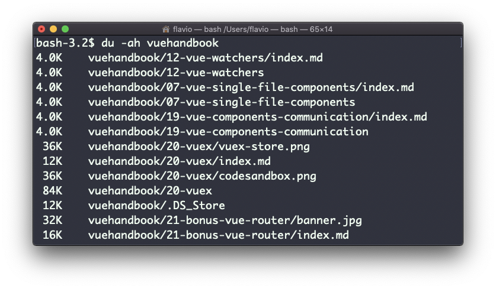
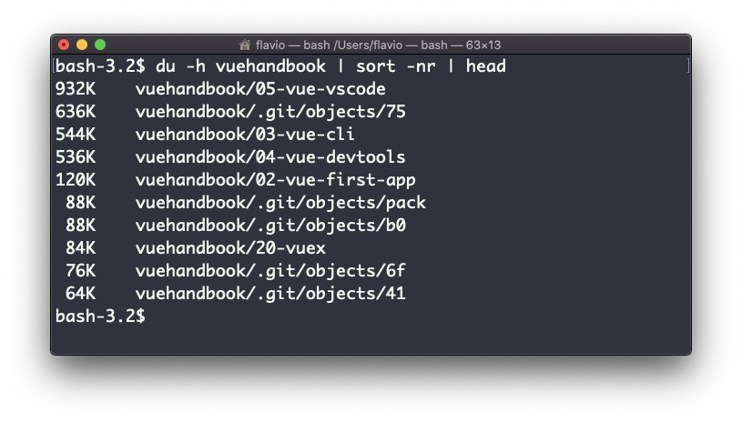

## Linux 中的  `du`  命令

`du`  命令会计算整个目录的大小：

```
du
```



这里的  `32`  是一个单位为字节（Byte）的值。

运行  `du *`  会单独计算每个文件的大小：



你也可以执行  `du -m`  或  `du -g`，以兆字节（MB）或千兆字节（GB）为单位显示文件大小。

使用  `-h`  选项，会显示更为可读的，适应大小的数值：



添加  `-a`  选项同样会输出文件夹中每一个文件的大小：



一个方便的做法是按大小对目录进行排序：

```
du -h <directory> | sort -nr
```

然后通过管道输出到  `head` ，从而仅获取前 10 个结果：

