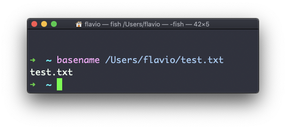
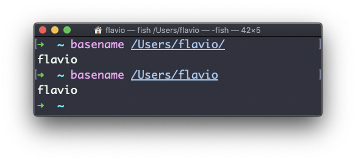

## Linux 中的  `basename`  命令

假设有一个文件路径，比如  `/Users/flavio/test.txt`。

执行

```
basename /Users/flavio/test.txt
```

会返回  `text.txt`  字符串：



如果你在任一指向目录的路径字符串上执行  `basename` ，你会得到路径的最后一节。在以下例子中，`/Users/flavio`  是一个目录：

