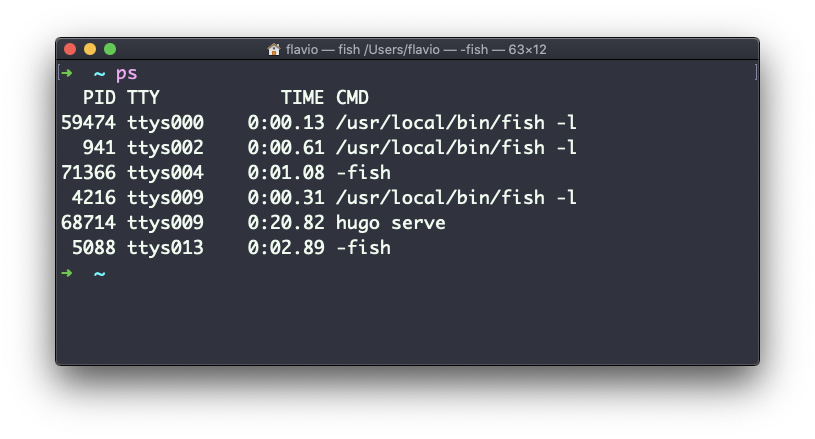
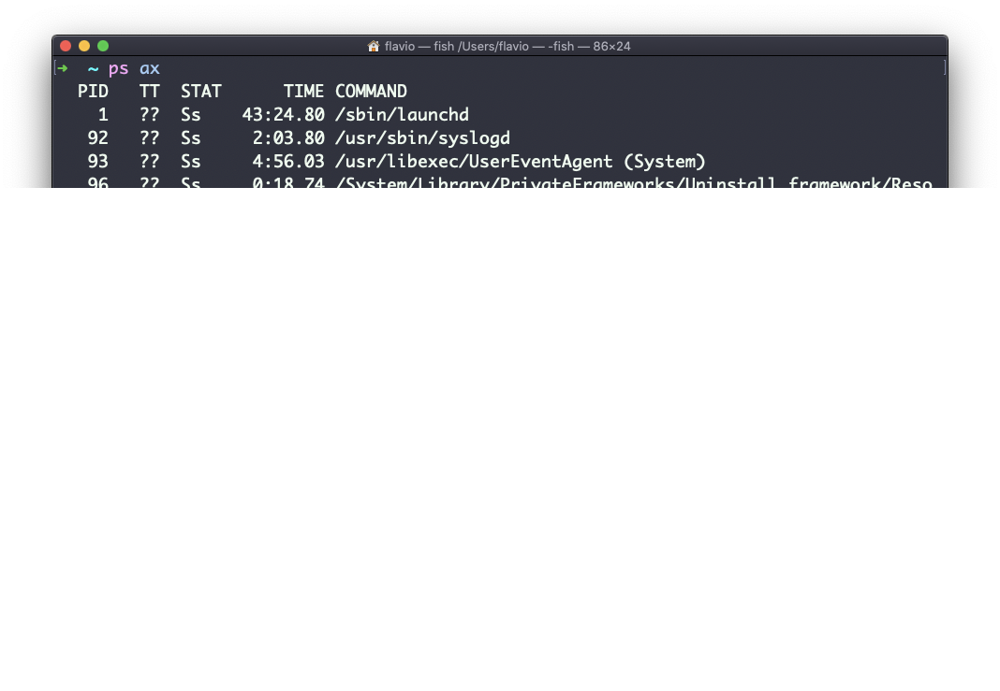
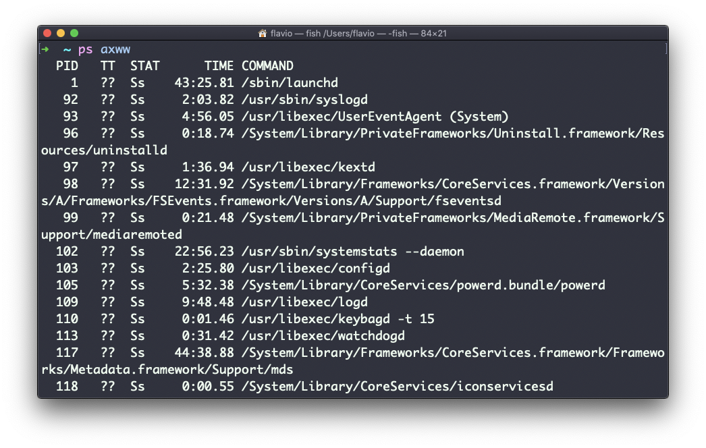
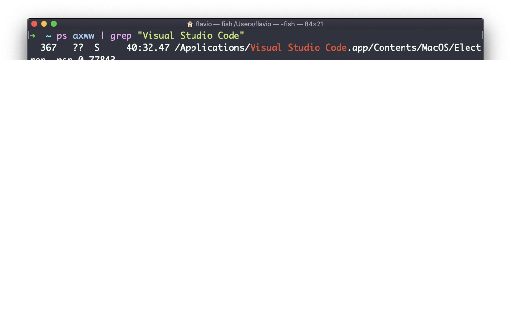

## Linux 中的  `ps`  命令

电脑每时每刻都在运行大量不同的进程。

你可以用  `ps`  命令检查它们：


这是当前会话中运行的，由用户发起的进程列表。

此处我打开了一些  `fish` Shell 实例，大多数是在 VS Code 编辑器内部启动的，还运行了一个 Hugo 实例，用来生成网站的开发预览。

这些只是分配给当前用户的命令。要列出**所有**进程，我们需要给  `ps`  传递一些参数。

我最常使用的命令是  `ps ax`：



> `a`  参数用来同时列出其他用户的进程。`x`  显示那些未与终端相连的进程（不是由用户通过终端发起的）。

如你所见，较长的命令被截断了。使用  `ps axww`  继续在新的行上列出命令，而非截断。



> 我们需要输入  `w`  两次来应用这个设置（这不是笔误）。

你可以配合使用  `grep`  和管道符来搜索特定的进程，比如像这样：

```
ps axww | grep "Visual Studio Code"
```


`ps`  返回的列表达了一些重要信息。

第一个信息是  `PID`，也就是进程 ID。当你想在另一个命令中引用这个进程时，比如说要杀死它，这是关键的。

然后是  `TT`，它告诉我们进程所使用的终端 ID。

接下来  `STAT`  告诉我们进程的状态：

`I`  代表闲置的进程（睡眠时间超过约 20 秒）  
`R`  代表可运行的进程  
`S`  代表睡眠时间少于 20 秒的进程  
`T`  代表已停止的进程  
`U`  代表处于不间断等待中的进程  
`Z`  代表已死亡的进程（_zombie_，即僵尸进程）

如果出现一个以上的字母，那么第二个字母代表进一步的、可能非常有技术性的信息。

常见的是  `+` ，它代表相应进程在终端中处于前台。而  `s`  代表相应进程是一个  [会话领头进程（session leader）](https://unix.stackexchange.com/questions/18166/what-are-session-leaders-in-ps).

`TIME`  则告诉我们进程已经运行了多长时间。
