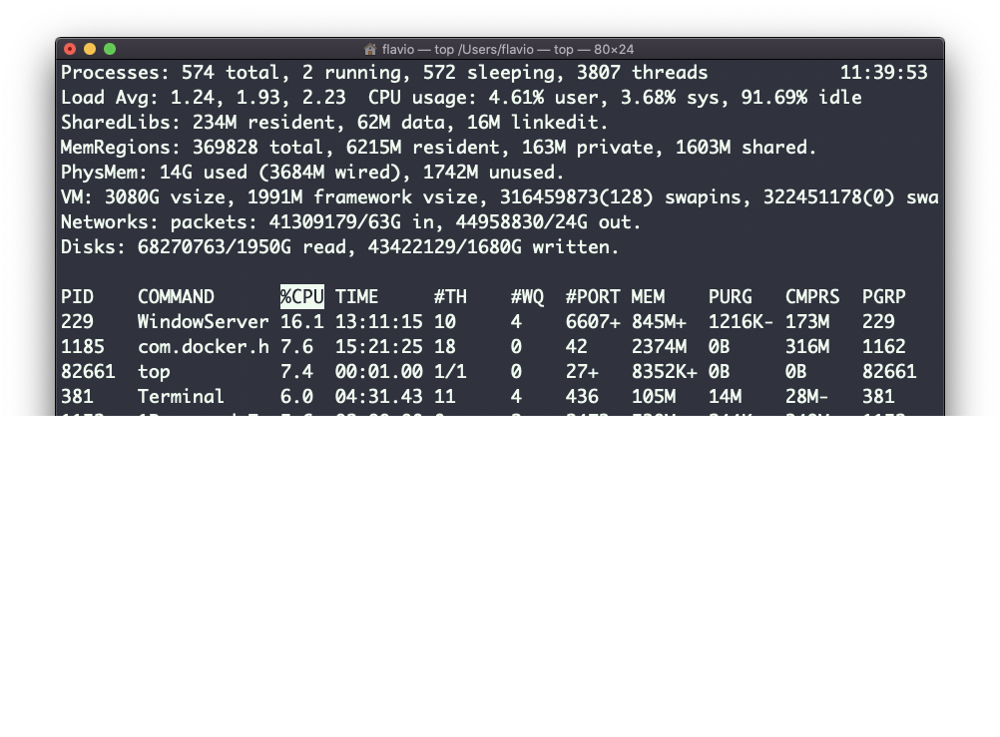

## Linux 中的  `top`  命令

`top`  命令用来显示系统中正在运行的进程的动态实时信息。

如果要了解系统发生了什么，这条命令真的很方便。

它的用法很简单。你只需要输入  `top` ，终端会完全沉浸到新的视图中：


这个进程是持续运行的。要退出，你可以输入字母  `q`  或按下  `ctrl-C`。

它给出了很多信息：进程数量、有多少进程在运行或休眠、系统负载、CPU 使用率，还有更多信息。

在下方，占用 CPU 和内存资源最多的进程列表不断刷新。

默认情况下，进程按 CPU 使用率排列，正如你在高亮标记的  `%CPU`  列中看到的那样。

你可以添加一个参数，要求进程列表按内存利用率排列：

```
top -o mem
```
