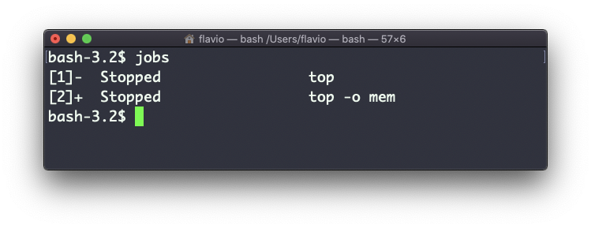

## Linux 中的  `jobs`  命令

当我们在 Linux / macOS 中运行命令时，我们可以在末尾加入  `&`  符号，使其在后台运行。

例如，让  `top`  命令在后台运行：

```
top &
```

这对于需要长时间运行的程序来说很方便。

要返回切入后台的程序，可以使用  `fg`  命令。如果后台只有一个作业进程，那么直接使用就好；否则要在后面加上作业进程的号码，如： `fg 1`、`fg 2` ，以此类推。

要获取作业进程号，我们可以使用  `jobs`  命令。

假设我们运行了  `top &`，之后再运行  `top -o mem &` ，因而我们有两个 top 实例在运行。此时  `jobs`  命令会这样告诉我们：


现在我们可以利用  `fg <作业号>`  切回任意一个实例。要再次终止程序，可以按下  `cmd-Z` 。

运行  `jobs -l`  也会列出每一个作业的进程 ID。
