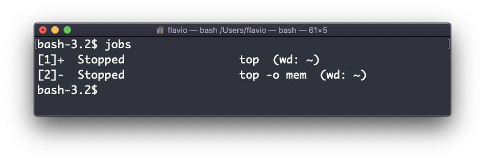

## Linux 中的  `bg`  命令

当命令执行时，你可以按下  `ctrl-Z`  暂停它。

按下后，命令会即刻停止，并将你带回到 Shell 终端。

你可以恢复命令在后台的执行，这样既可以使命令保持运行，同时又不会妨碍你在终端中做其他工作。

在这一例子中，有 2 个命令停止了：

运行  `bg 1`  即可在后台恢复作业 #1 的执行。

我也可以不带任何参数执行  `bg`  命令，它会默认选取作业列表中的 #1 项。
