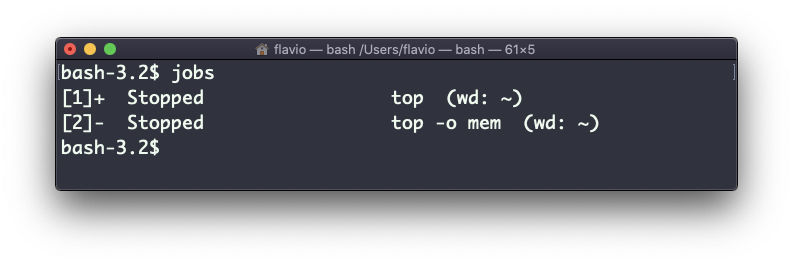
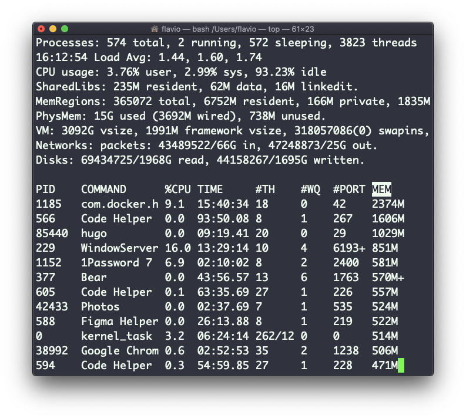

## Linux 中的  `fg`  命令

当命令在后台运行时，由于此前你已经在命令末尾加上了  `&` （例如  `top &` ，或是使用了  `bg`  命令将命令放到后台），此时你可以用  `fg`  命令将其切换回前台。

执行

```
fg
```

它将在前台恢复最后被暂停的作业。

你也可以加上作业号，即可指定任一你想在前台恢复的作业，作业号可以使用  `jobs`  命令获得。



执行  `fg 2`  将恢复作业 #2：


