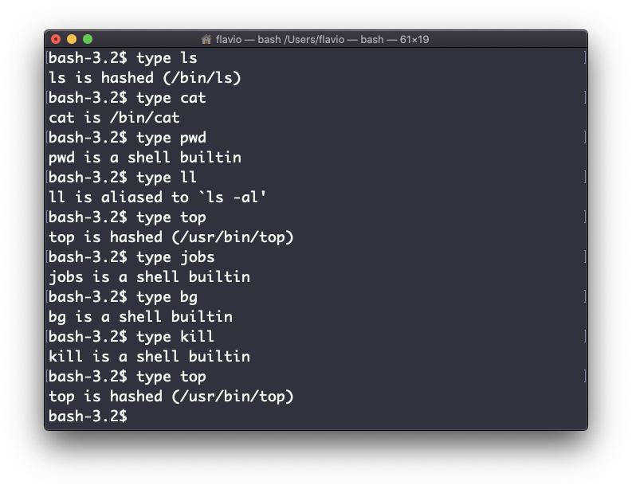
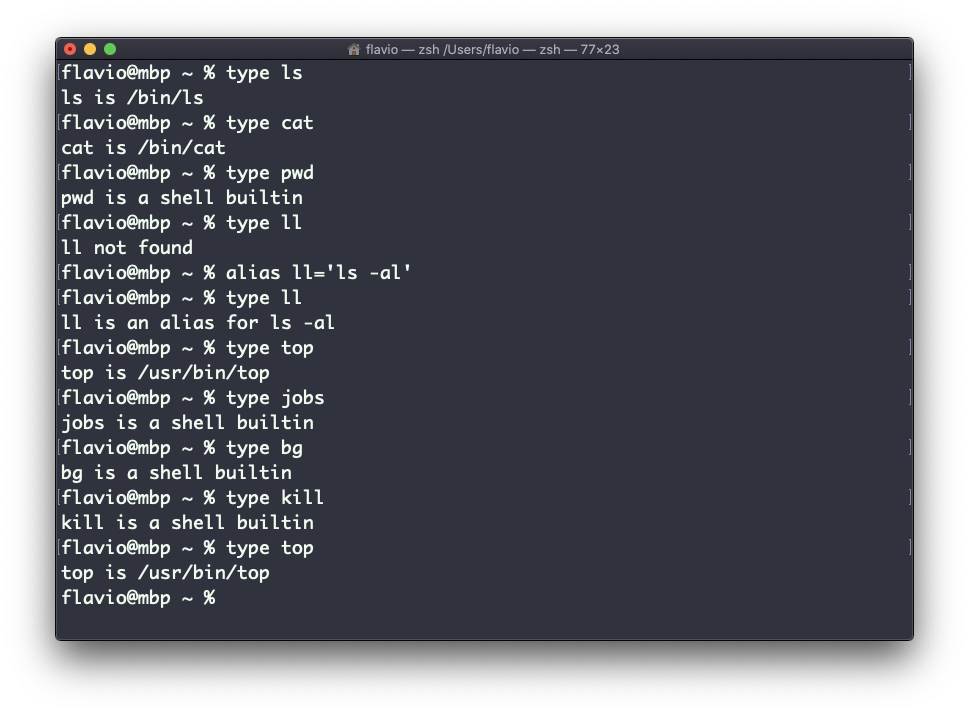
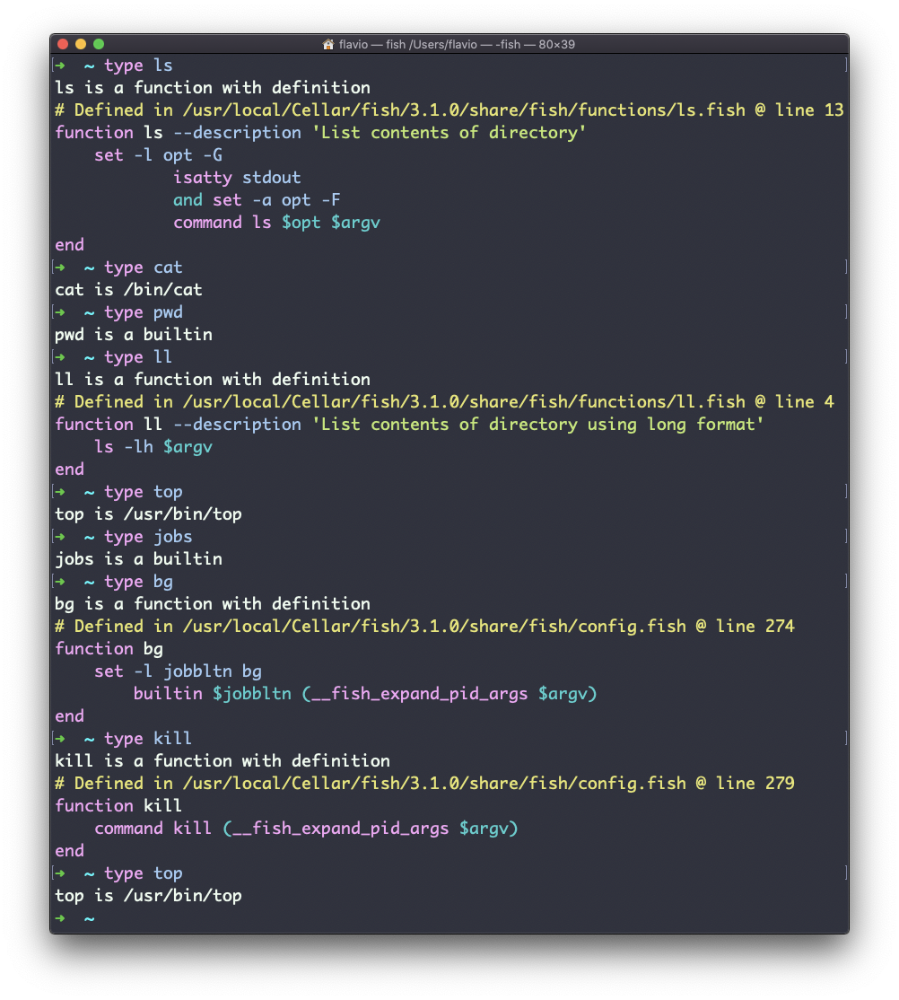

## Linux 中的  `type`  命令

命令可分为以下四种类型：

- 可执行程序
- Shell 内置程序
- Shell 功能
- 命令别名

如果你很想知道或只是很好奇，`type`  命令可以帮你分清这些。它会告诉你某一命令如何被解析。

输出根据 Shell 的类型而有所不同，这是在 Bash 中的样子：

这是在 Zsh 中的样子：

这是在 Fish 中的样子：

其中一个有趣的现象是：对于别名，它会告诉你某个别名将被解析到何处。例如，在 Bash 和 Zsh 中， `ll`  显示为一个别名，而在 Fish 中，由于  `ll`  是默认提供的，所以它会告诉你这是内置的 Shell 功能。
