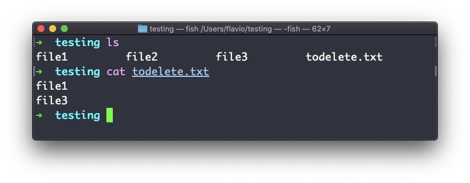
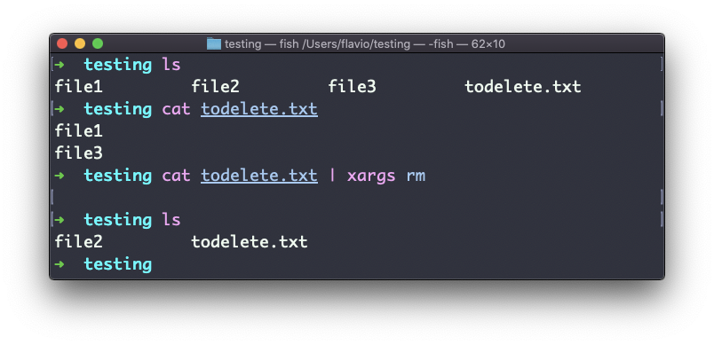
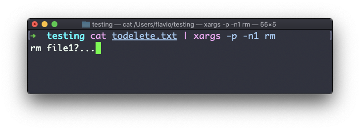
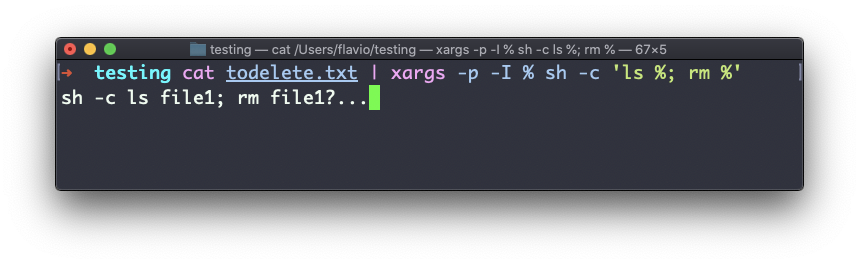

## Linux 中的  `xargs`  命令

在 UNIX Shell 中，`xargs`  命令用来将标准输入的数据转换成命令的参数。

换句话说，使用  `xargs` ，可以将一条命令的输出，用作另一条命令的输入。

下面是你将会用到的语法：

```
command1 | xargs command2
```

我们使用管道符（`|`）将输出传递给  `xargs`。它将负责运行  `command2`  命令，使用  `command1`  的输出作为参数。

我们来做个简单的例子。假设你要删除某个目录下的一些特定文件。这些文件列在一个文本文件中。

我们有三个文件： `file1`、 `file2`、 `file3`。

在  `todelete.txt`  中，我们有一份想要删除的文件列表，在这一例子中是  `file1`  和  `file3`：



我们将通过  `xargs`  把  `cat todelete.txt`  的输出引向  `rm`  命令。

就像这样：

```
cat todelete.txt | xargs rm
```

以下是执行结果，我们列出的文件现在已经被删除：



它的工作方式是：`xargs`  会运行  `rm` 2 次，为  `cat`  返回的每一行运行一次。

这是  `xargs`  最简单的用法。我们还可以使用以下的一些参数。

在我看来，其中最有用的是  `-p`（特别是刚开始学习  `xargs`  时）。使用这个选项将使  `xargs`  打印出一个确认提示，说明它要采取的行动：


`-n`  选项令  `xargs`  每次执行若干个迭代，因此你可以用  `-p`  单独确认它们。这里我们用  `-n1`  告诉  `xargs`  一次执行一个迭代:



另一个广泛应用的参数是  `-I`。它可以将输出内容放入占位符，之后你可以用来做各种事。

其中一件事是同时运行多个命令，例如：

```
command1 | xargs -I % /bin/bash -c 'command2 %; command3 %'
```



> 你可以将上方的  `%`  符号换成其他任何东西——它只是个变量。
