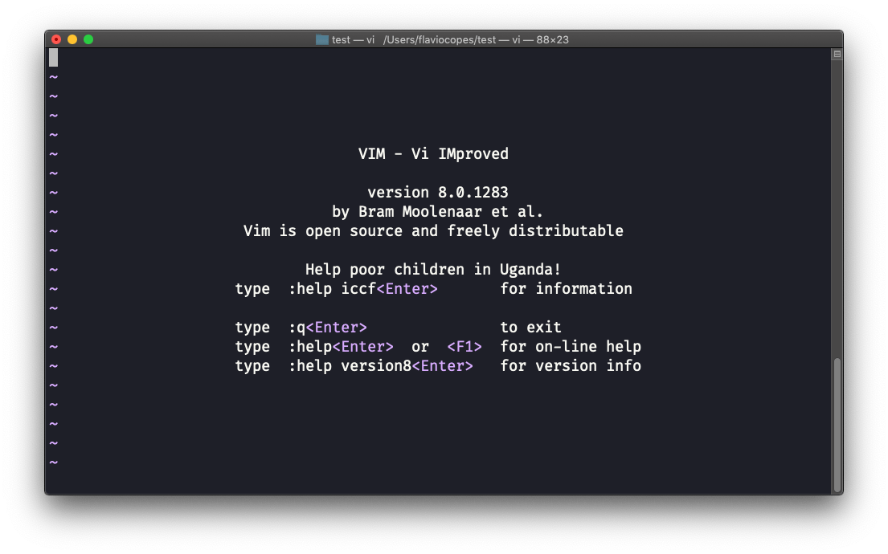
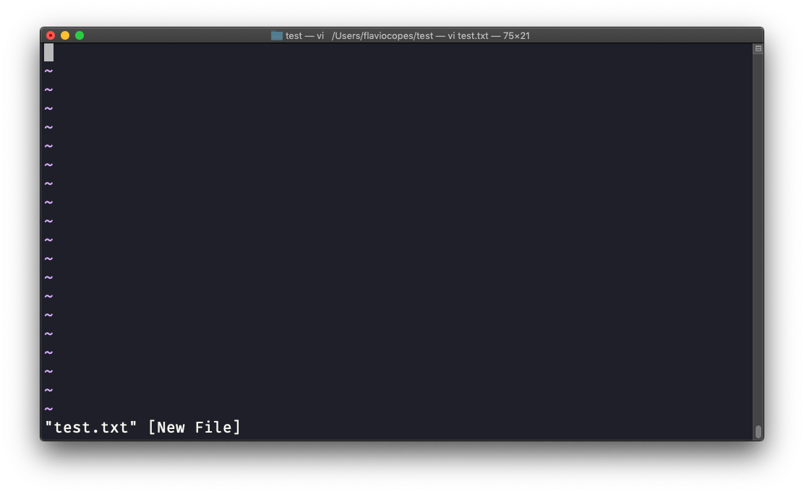
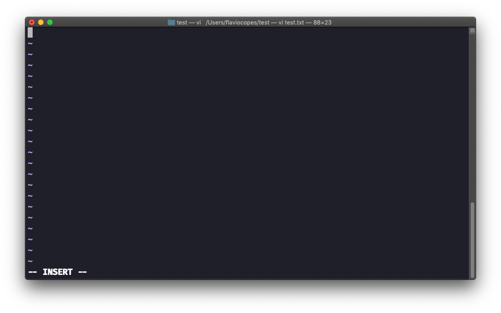
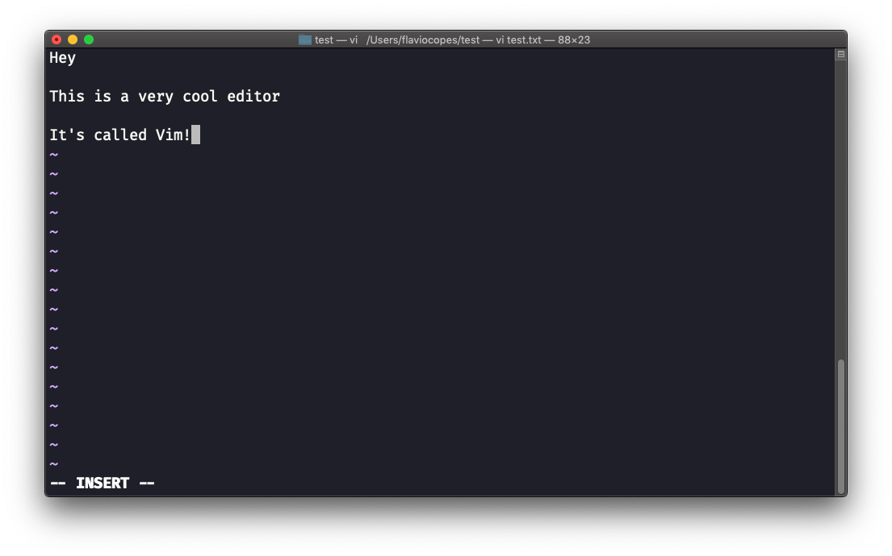
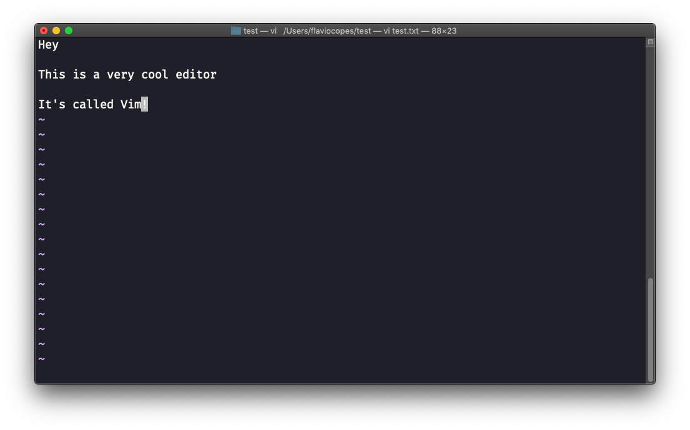

## Linux 中的  `vim`  编辑器命令

`vim`  是一个**非常**流行的文件编辑器，特别是在程序员中。 它被积极开发且经常更新，且有巨大的社区力量围绕着。甚至还有一个  [Vim 会议](https://vimconf.org/)！

在现代系统中，`vi`  只是  `vim`  的一个别名，意思是“改进的  `vi`”（即 “`vi` i`m`proved”）。

你可以在命令行运行  `vi`  启动它。



调用时指定一个文件名，你就可以编辑对应的文件：

```
vi test.txt
```



你需要了解的是，Vim 有两个主要的模式：

- _命令（command）_   模式，也称为  *普通（normal）*   模式
- _插入（insert）_   模式

当你启动编辑器时，默认处于命令模式。这时你无法像期望的那样，在基于图形界面的编辑器中输入文本。你需要进入**插入模式**。

可以按下  `i`  键进入插入模式。当你这样做之后， 在编辑器下方会出现  `-- 插入 --` （或 INSERT）字样：



现在你可以开始输入了，用文件内容来填充终端屏幕：



你可以用方向键在文件中移动光标，或者使用  `h` - `j` - `k` - `l`  四个键。 `h-l`  代表左和右，`j-k`  代表上和下。

当完成编辑时，按下  `esc`  键即可退出插入模式，回到**命令模式**。


此时你可以浏览文件，但无法向其添加内容（要注意按下了哪个键，某些键可能是编辑器的命令）。

现在你可能想知道如何**保存文件**。可以按下  `:` （冒号），然后输入  `w`，即  `:w`

要**保存并退出**，可以按下  `:`  然后输入  `w`  和  `q`，即  `:wq`

要**退出但不保存文件**，可以按下  `:`  然后输入  `q`  和  `!`，即  `:q!`

要**撤销**某一个更改并再次编辑，可以在命令模式中按下  `u`。 如果要**重做** （取消上次的撤销操作），可以按下  `ctrl-r`。

以上是使用 Vim 工作的基本操作。接下来是一个无底洞，这篇简短的介绍是无法讲完的。

下面我只会提到那些能让你入门 Vim 编辑的命令：

- 按下  `x`  键，删除当前光标高亮的字符
- 按下  `A`  跳转到当前选择行的末尾
- 按下  `0`  跳转到行的开头
- 定位到任一单词的首字母，按下  `d` ，然后按  `w`  即可删除相应单词。如果输入  `e`  而非  `w`，后一个单词前的空白处将被保留
- 在  `d`  和  `w`  之间加入一个数字，即可删除多个单词，例如使用  `d3w`  来向前删除 3 个单词
- 按下  `d`  然后再按一次  `d` ，即可删除整行。按下  `d`  然后再按  `$` ，即可删除以光标为开头，直至当前行末尾的整行内容。

如需了解更多 Vim 的内容，我推荐参阅  [Vim 常见问题](https://vimhelp.org/vim_faq.txt.html)。你还可以运行  `vimtutor`  命令，它应该已经安装到系统中，可以对你开始探索  `vim`  有很大帮助。
