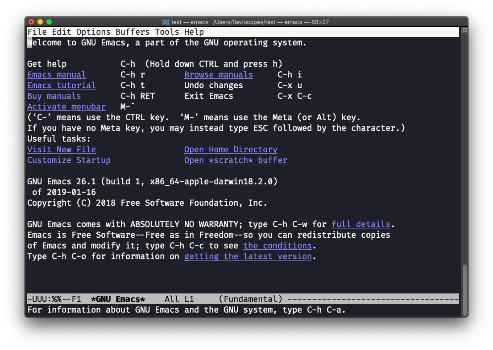
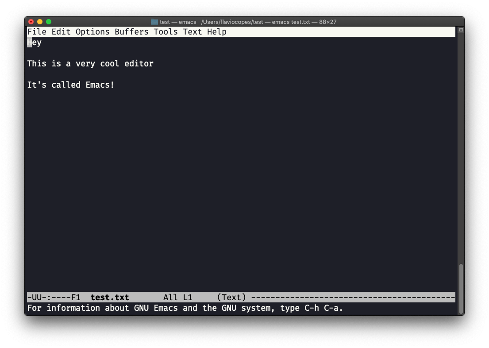
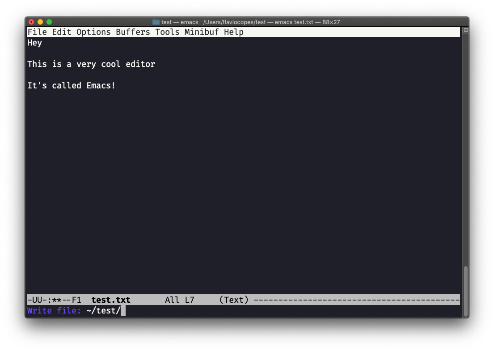
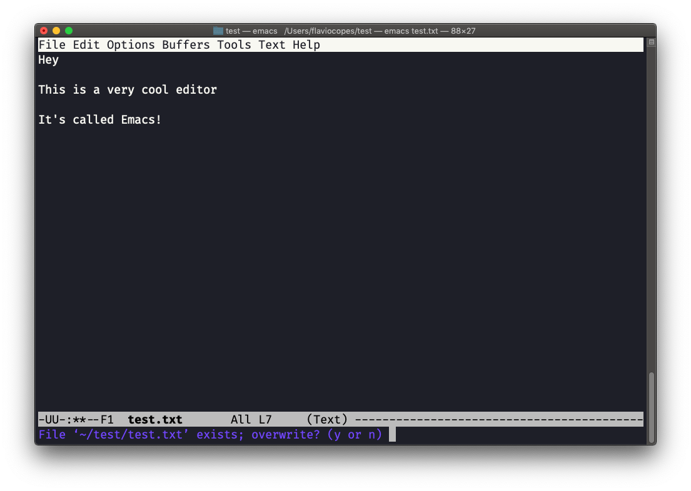
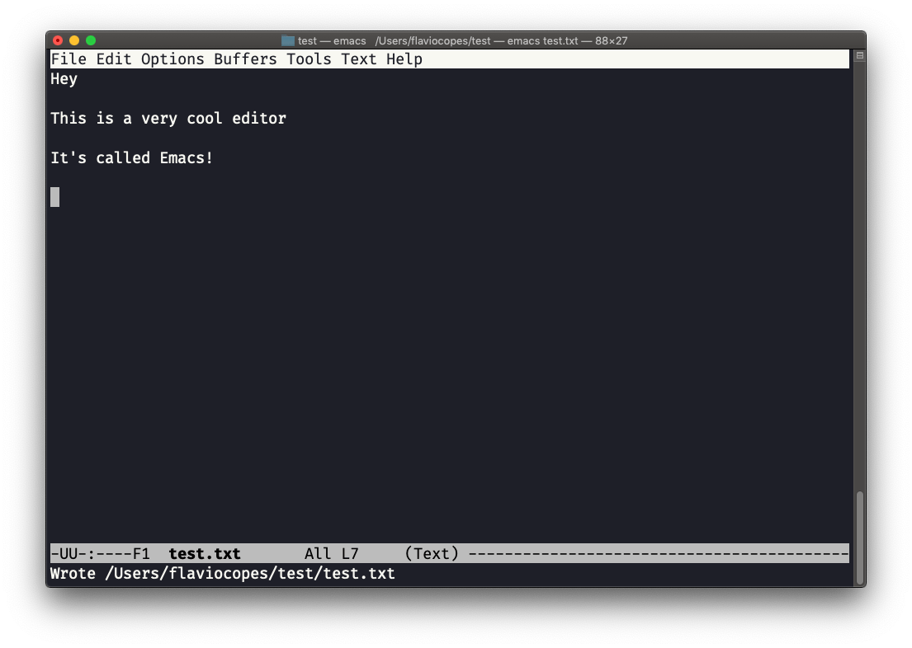

## Linux 中的  `emacs`  编辑器命令

`emacs`  是一个很棒的编辑器，它在历史上被认作是专为 UNIX 系统而生的。更著名的是：围绕  `vi`  与  `emacs`  之间的火热纷争与激烈论战曾给全世界的开发者带来许多无益的时光。

`emacs`  非常强大。一些人将其当作一种操作系统，全天候都在使用它 （<https://news.ycombinator.com/item?id=19127258>）。我们在此处只谈及一些基础的用法。

你可以调用  `emacs`  来开启新的 emacs 会话：

macOS 用户们，现在请停一下。如果你当前在使用 Linux，那就没有什么问题，但 macOS 并未搭载使用 GPLv3 协议的应用程序，且每个内置的 UNIX 命令也没有更新到 GPLv3 版本。

虽然这对于我以上已经列出的命令来说，只是个小问题，但就本例而言，使用 2007 年的 emacs 版本与使用经过十余年改进和变化的版本，体验并不完全相同。

对于时常更新的 Vim 来说，这也不算什么。但想要解决 emacs 的问题，你需要运行  `brew install emacs` ，之后再运行  `emacs`，即可使用 Homebrew 提供的新版本（确保  [Homebrew](https://flaviocopes.com/homebrew/)  已安装）。

与 Vim 类似，你也可以调用  `emacs <文件名>`  来编辑已有的文件：

现在你可以开始编辑。当你完成编辑，先按下  `ctrl-x`，然后按下  `ctrl-w`。先确认文件夹：

而 Emacs 会告诉你这个文件已存在，并询问是否要覆盖它：

回答  `y`，你会得到一条操作成功的确认信息：

要退出 Emacs ，可以按下  `ctrl-x` ，然后再按  `ctrl-c`。  
或者先按下  `ctrl-x`  之后再按  `c` （期间按住  `ctrl`  不放）。

Emacs 还有很多要了解的地方，限于篇幅，我在这篇简短教程中不便展开。我鼓励诸位按下  `ctrl-h` `r`  打开内置参考手册，或按下  `ctrl-h` `t`  打开官方教程以继续学习。
