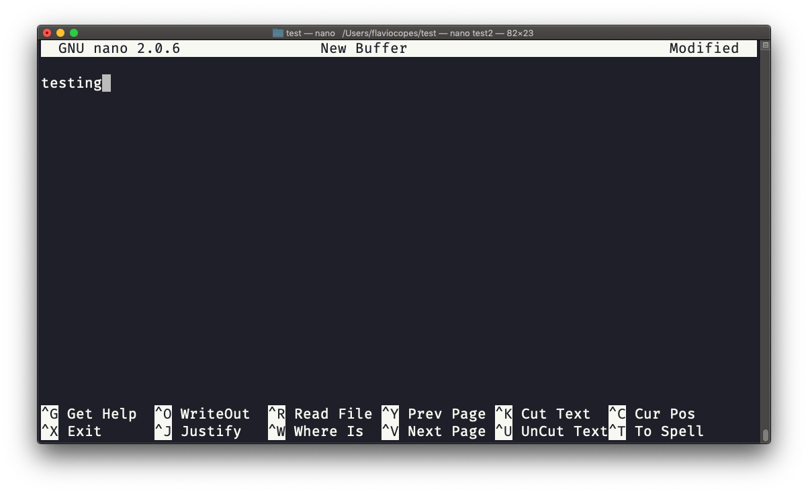

## Linux 中的  `nano`  编辑器命令

`nano`  是一个对初学者友好的编辑器。

输入  `nano <文件名>`  即可运行。

你可以直接向文件中输入字符，而不必担心所在的模式。

想退出而不修改，你可以直接按下  `ctrl-X`。如果你已经编辑了文件缓冲区，编辑器会弹出确认提示，你可以选择保存或放弃更改。

底部的帮助栏为你显示了一部分用于处理文件的键盘命令：

另一条命令  `pico`  与它大致相同，不过  `nano`  其实是  `pico`  的 GNU 版本，后者在一段历史时期内并未开源。 于是人们克隆出  `nano`  以满足 GNU 操作系统的许可要求。
