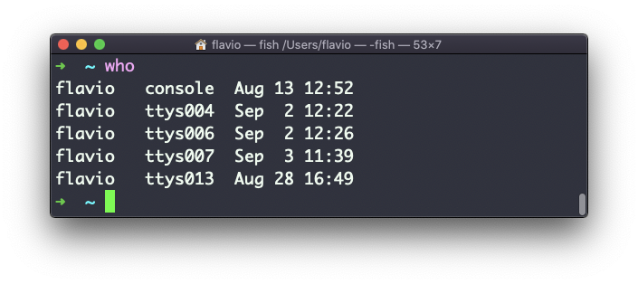
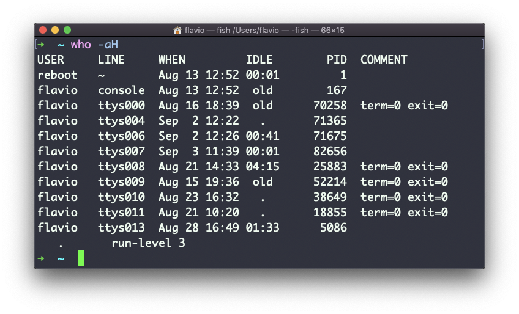
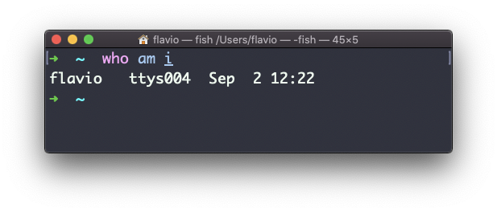
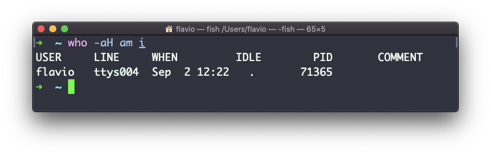

## Linux 中的  `who`  命令

`who`  命令显示当前已登录系统的用户。

除非你在使用多人访问的服务器，否则你可能是唯一的登录用户，并且登录了多次：

为什么说是多次呢？因为每打开一次 Shell，都会被算作一次访问。

你可以在此看到使用的终端名，以及会话的起始时间/日期。

参数  `-aH`  将使  `who`  显示更多的信息，包括空载的时间与终端的进程 ID：

特殊的  `who am i`  命令会列出当前终端会话的详情：

