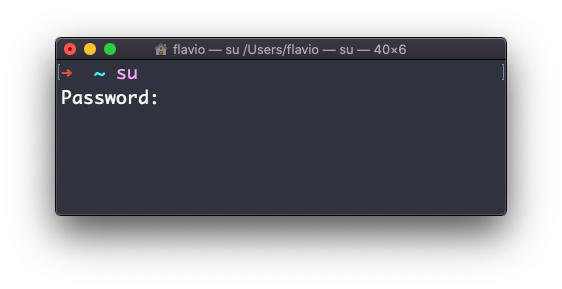

## Linux 中的  `su`  命令

当你用一个用户登录到终端 Shell 时，可能需要切换到另一个用户。

例如，你以 root 身份登录，进行了维护工作，但之后你想切换到别的用户账户。

你可以用  `su`  命令来完成：

```
su <用户名>
```

例如： `su flavio`.

如果你以用户身份登录，且不带参数运行  `su`  命令，它会遵从默认行为——提示你输入  `root`  用户的密码。


`su`  会以另一个用户的身份，开启新的 Shell。

当你完成操作，执行  `exit`即可关闭新开的 Shell，并回到当前用户的 Shell。
