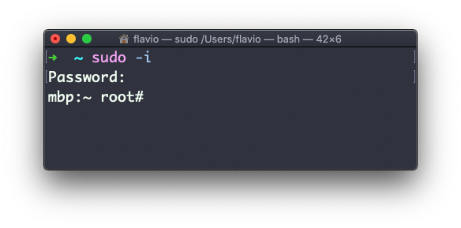

## Linux 中的  `sudo`  命令

`sudo`  通常用来以 root 身份运行命令。

你必须先启用当前身份才能使用  `sudo`，启用之后，你可以直接输入你自己的登录密码（ *而非* root 用户的密码）来以 root 身份运行命令。

这种权限是高度可配置的，在多用户的服务器环境中尤其有用。一些用户可以通过  `sudo`  被授予运行特定命令的权限。

例如，你可以用它编辑任一系统配置文件：

```
sudo nano /etc/hosts
```

这在普通模式下是无法实现的，因为你没有相应的权限。

你可以执行  `sudo -i` ，以 root 身份启动一个 Shell：



还可以使用  `sudo`  以其他任何用户身份运行命令。 默认情况是  `root` ， 但加上  `-u`  参数即可指定使用其他用户：

```
sudo -u flavio ls /Users/flavio
```
