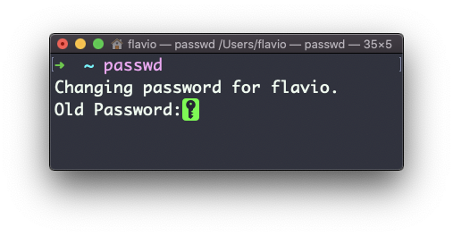

## Linux 中的  `passwd`  命令

在 Linux 中，用户都有一个指定的密码。你可以使用  `passwd`  命令修改这个密码。

这里有两种情况。

第一种情况是：你想要修改自己的密码，此时你可以输入：

```
passwd
```

交互式提示会先询问你的旧密码，之后要求你输入新密码：



当你处于  `root`  身份（或是其他具有超级用户权限的用户）时，你可以设置你想要更改密码的用户名：

```
passwd <username> <new password>
```

此时你无需输入旧密码。
