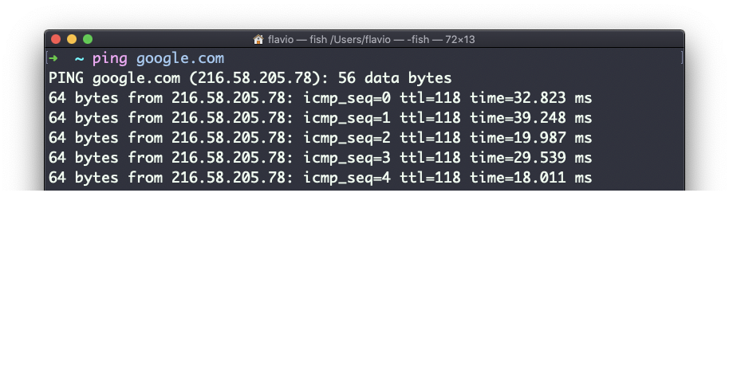
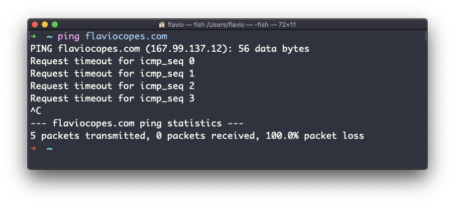

## Linux 中的  `ping`  命令

`ping`  命令可以在本地网络或互联网上探测一个特定的网络主机。

它的语法是  `ping <host>`，其中  `<host>`  可以是域名或 IP 地址。

以下是探测  `google.com`  的例子：

这个命令向服务器发送一个请求，服务器则返回其响应信息。

`ping`  在默认情况下，每秒持续发送请求，只有按下  `ctrl-C`  时才会停止。你可以用  `-c`  参数指定想要的尝试次数：`ping -c 2 google.com`。

一旦  `ping`  结束运行，它将输出一些结果：例如数据包丢失的百分比，以及其他关于网络性能的统计数据。

你可以看到，屏幕上输出了主机的 IP 地址，以及得到响应所花的时间。

并不是所有的服务器都可以探测，此时会出现请求超时：

有时这是为了“隐藏”服务器，或是减低服务器负载而故意设置的。为了探测所发送的数据包也可以被防火墙过滤。

`ping`  使用  **ICMP 协议** （全称  *Internet Control Message Protocol* ，互联网控制报文协议）工作。ICMP 与 TCP 和 UDP 一样，是网络层协议。

探测请求向服务器发送一个含有  `ECHO_REQUEST`  信息的数据包，服务器则会返回  `ECHO_REPLY`  信息。此处我将不展开讲述，但这是最基本的概念。

用 Ping 探测，在测试主机是否可以访问时非常有用（此处假设主机支持探测），还可以从主机返回信息的时长，获知它的距离有多远。

通常，服务器在地理上离你越近，它向你返回信息的时间就越短。简单的物理规律则告诉我们：电缆越长，数据延迟越高。
