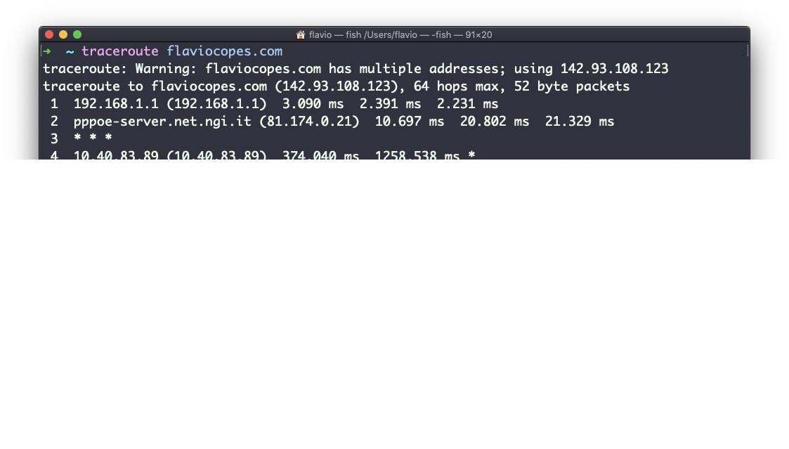
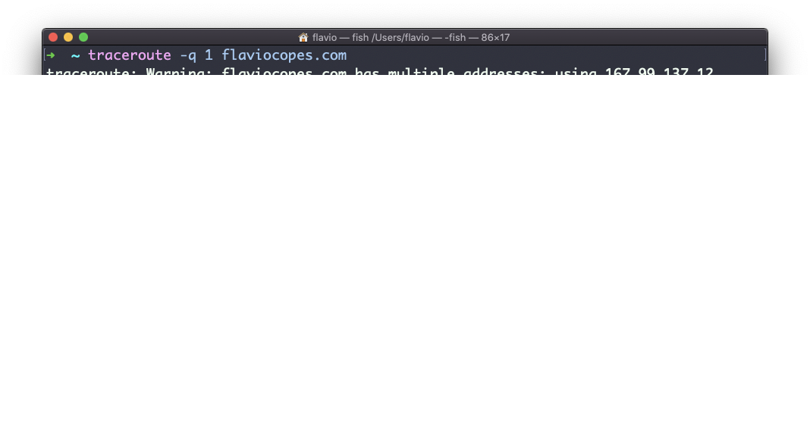

## Linux 中的  `traceroute`  命令

当你想要在互联网上到访某个主机时，数据首先会经过家庭路由器，然后到达你的运营商网络，再穿过上层的网络路由器，以此类推，直到最终连通主机。

你是否曾想过：数据包需要经过哪些步骤才能做到这一点？

`traceroute`  命令就是为此而生的。

你可以调用

```
traceroute <host>
```

它将会（缓慢地）在数据包旅行时收集所有相关信息。

以下的例子中，我将尝试用  `traceroute flaviocopes.com`  到访我的博客：



通常，我们可以看到主机名、IP 地址以及一些性能指标。但并不是所有经过的路由器都会向我们返回信息，此时，`traceroute`  会输出  `* * *`。

每个路由器都可以看到 3 个样本，这意味着 traceroute 默认尝试了 3 次，让你很好地了解到达主机所需的时间。

这就是对服务器执行  `traceroute`  比简单地执行  `ping`  要花更多时间的原因。

你可以用  `-q`  参数自定义尝试的次数：

```
traceroute -q 1 flaviocopes.com
```


