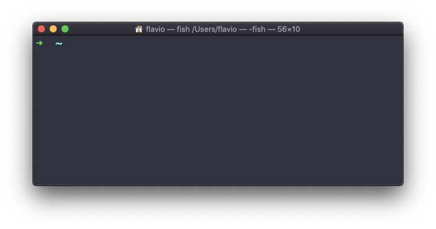

## Linux 中的  `clear`  命令

输入  `clear`  来清除当前终端之前执行的所有命令。

此时屏幕会被清理，你将只看到顶部的提示：

> 提示：这个命令有个好用的快捷键： `ctrl-L`

不过，一旦使用了这个命令，你将不能用鼠标滚轮查看此前输入的命令。

因此你可能更想使用  `clear -x`，这个参数可以在清理屏幕的同时，保留之前的终端输入，向上滚动鼠标即可回溯查看。
