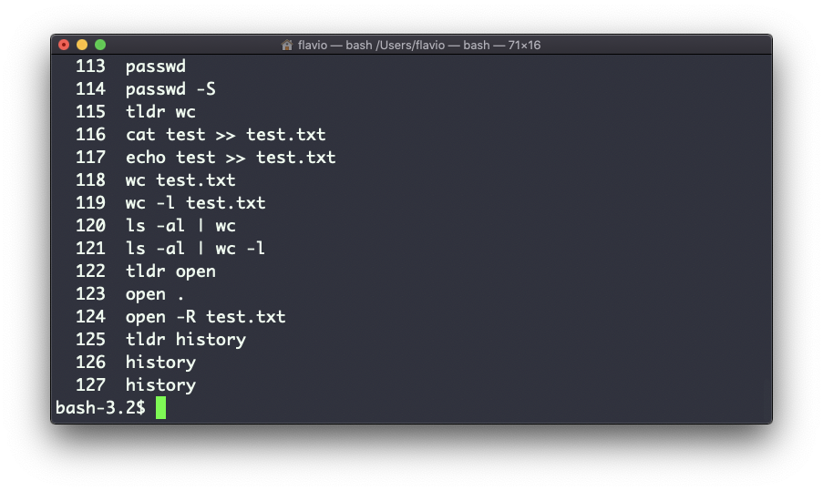
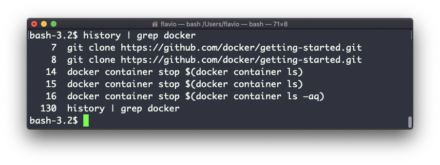

## Linux 中的  `history`  命令

每次运行命令，都会在历史中保存一条记录。

你可以输入下面的命令来查看所有历史记录：

```
history
```

这会显示带有序号的历史记录：



你可以使用  `!<命令序号>`  重现已经储存在历史记录中的命令。以上的例子中，输入  `!121`  会重现  `ls -al | wc -l`  命令。

通常，历史记录会保留最后执行的 500 条命令。

你可以将这个命令与  `grep`  结合使用，以找到之前运行的命令：

```
history | grep docker
```


如果要清除历史记录，运行  `history -c`  即可。
